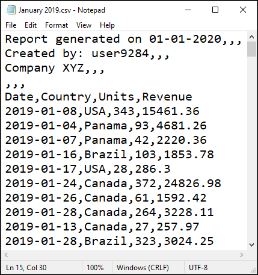
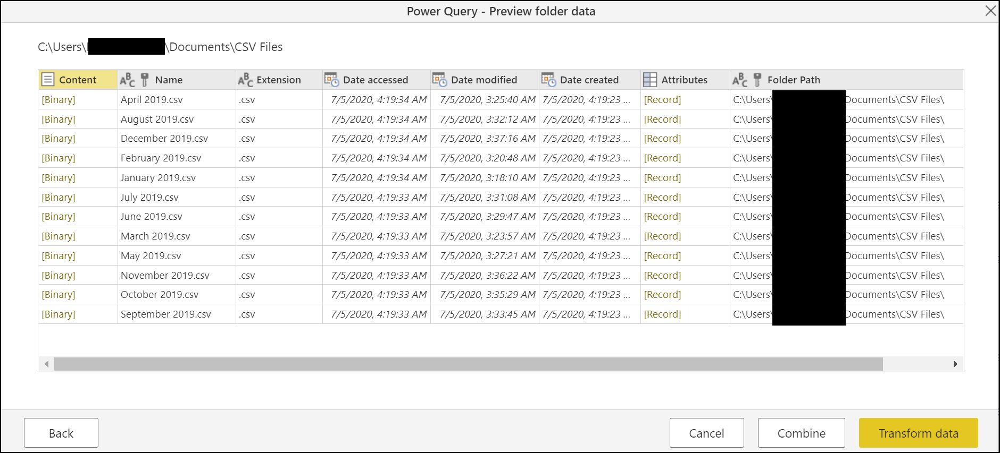
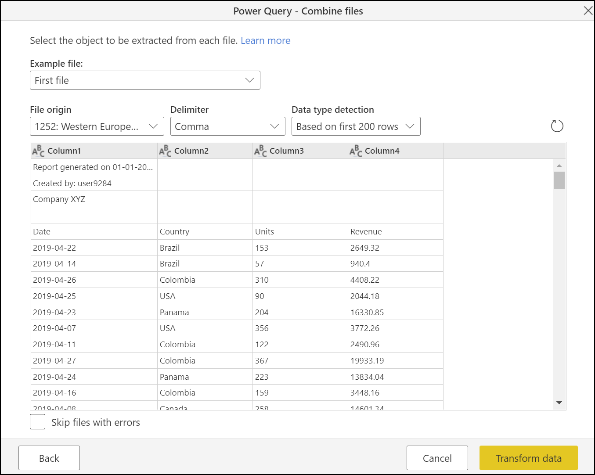
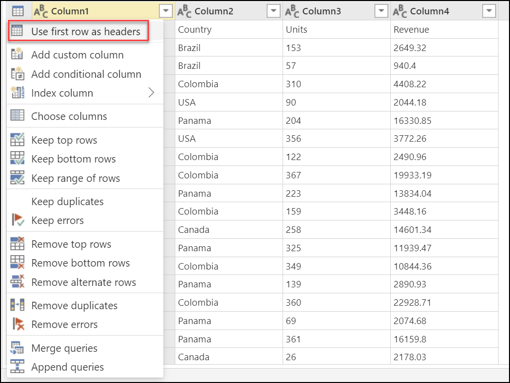
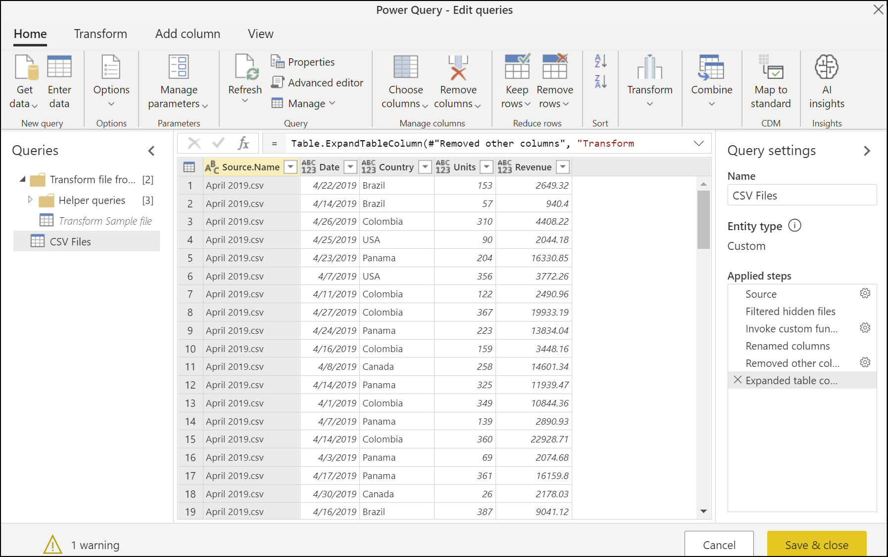

# Combine CSV files

In Power Query, you can combine multiple files from a given data source. This article describes how the experience works when the files that you want to combine are CSV files. More information: [Combine files overview](combine-files-overview.md)

> [!TIP]
> You can follow along with this example by downloading the sample files used in this article from [this download link](https://aka.ms/PQCombineFilesSample). You can place those files in the data source of your choice, such as a local folder, SharePoint folder, Azure Blob storage, Azure Data Lake Storage, or other data source that provides the file system view.

For simplicity, the example in this article uses the Folder connector. More information: [Folder](connectors/folder.md)

## About the sample files used

To combine files, it's imperative that they all have the same structure and the same extension. All the files used in this example have the same structure and extension (.csv).

There are 12 CSV files, one for each month of the calendar year 2019. The following image shows the first 15 rows of the file for the month of January.

The number of rows varies from file to file, but all files have a header section in the first four rows. They have column headers in the fifth row, and the data for the table begins in the sixth row and continues through all subsequent rows.

The goal is to combine all 12 files into a single table. This combined table contains the header row at the top of the table, and includes the source name, date, country, units, and revenue data for the entire year in separate columns after the header row.

## Table preview

When connecting to the folder that hosts the files that you want to combine&mdash;in this example, the name of that folder is **CSV Files**&mdash;you're shown the table preview dialog box, which displays your folder path in the upper-left corner. The data preview shows the file system view.

For this example, select **Combine**.

>[!NOTE]
>In a different situation, you might select **Transform data** to further filter and transform your data before combining the files. Selecting **Combine** is only recommended when you're certain that the folder contains only the files that you want to combine.

## Combine files dialog box

After you select **Combine** in the table preview, the **Combine files** dialog box appears.

>[!NOTE]
>Power Query automatically detects what connector to use based on the first file found in the list. To learn more about the CSV connector, see [Text/CSV](connectors/textcsv.md).

For this example, leave all the default settings (**Example file** set to **First file**, and the default values for **File origin**, **Delimiter**, and **Data type detection**).

Now select **Transform data** in the lower-right corner to go to the output query.

## Output query

After selecting **Transform data** in the **Combine files** dialog box, you'll be taken back to the Power Query Editor in the query that you initially created from the connection to the local folder. The output query now contains the source file name in the left-most column, along with the data from each of the source files in the remaining columns.

However, the data isn't in the correct shape. You need to remove the top four rows from each file before combining them. To make this change in each file before you combine them, select the **Transform Sample file** query in the **Queries** pane on the left side of your screen.

### Modify the Transform Sample file query

In this **Transform Sample file** query, the values in the **Date** column indicate that the data is for the month of April, which has the year-month-day (YYYY-MM-DD) format. April 2019.csv is the first file that's displayed in the table preview.

You now need to apply a new set of transformations to clean the data. Each transformation will be automatically converted to a function inside the **Helper queries** group that will be applied to every file in the folder before combining the data from each file.

The transformations that need to be added to the **Transform Sample file** query are:

1. **Remove top rows**: To perform this operation, select the table icon menu in the upper-left corner of the table, and then select **Remove top rows**. 

   

   In the **Remove top rows** dialog box, enter **4**, and then select **OK**.

   

   After selecting **OK**, your table will no longer have the top four rows.

   

2. **Use first row as headers**: Select the table icon again, and then select **Use first row as headers**.

   

   The result of that operation will promote the first row of the table to the new column headers. 

   

After this operation is completed, Power Query by default will try to automatically detect the data types of the columns and add a new **Changed column type** step.

### Revising the output query

When you go back to the **CSV Files** query, you'll notice that the last step is giving you an error that reads "The column 'Column1' of the table wasn't found." The reason behind this error is that the previous state of the query was doing an operation against a column named **Column1**. But because of the changes made to the **Transform Sample file** query, this column no longer exists. More information: [Dealing with errors in Power Query](dealing-with-errors.md)

You can remove this last step of the query from the **Applied steps** pane by selecting the X delete icon on the left side of the name of the step. After deleting this step, your query will show the correct results.

However, notice that none of the columns derived from the files (Date, Country, Units, Revenue) have a specific data type assigned to them. Assign the correct data type to each column by using the following table.

| Column name | Data type|
| ------------|----------|
| Date| Date |
| Country | Text |
| Units| Whole number |
| Revenue| Currency |

After defining the data types for each column, you'll be ready to load the table.

>[!NOTE]
>To learn how to define or change column data types, see [Data types](data-types.md).

### Verification

To validate that all files have been combined, you can select the filter icon on the **Source.Name** column heading, which will display all the names of the files that have been combined. If you get the warning "List may be incomplete," select **Load more** at the bottom of the menu to display more available values in the column.

After you select **Load more**, all available file names will be displayed.

