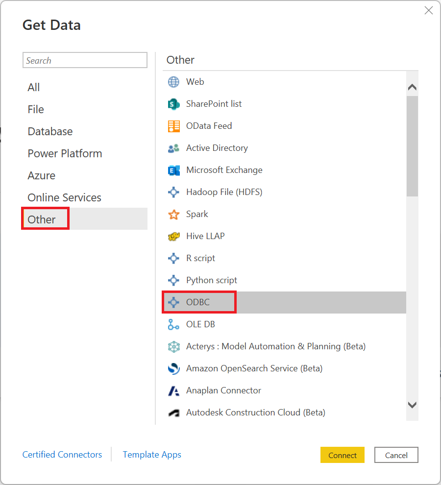
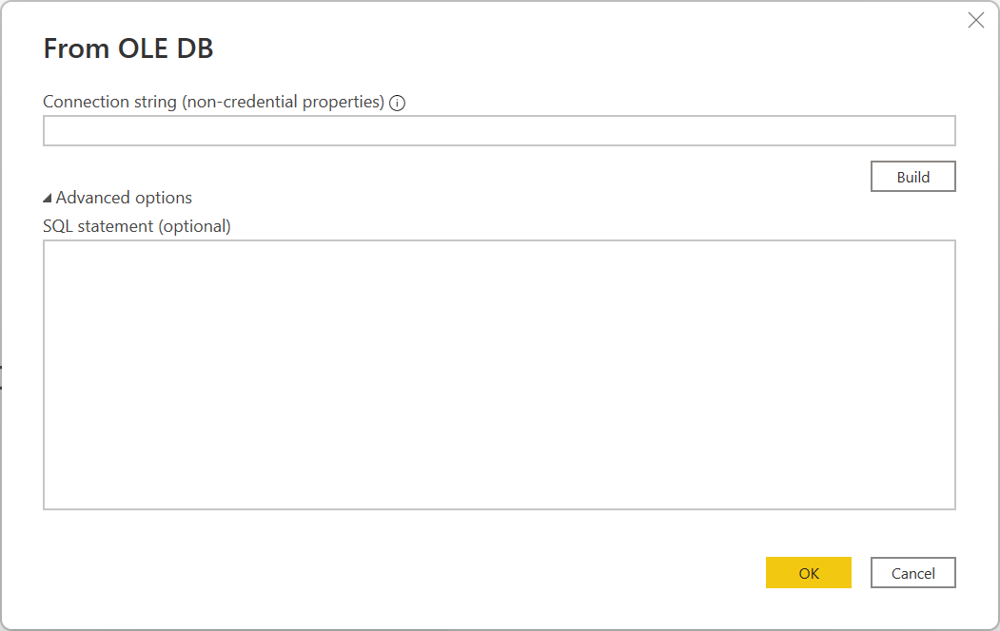
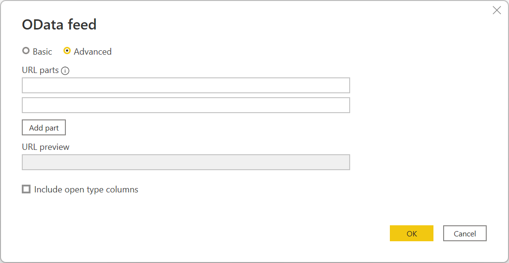
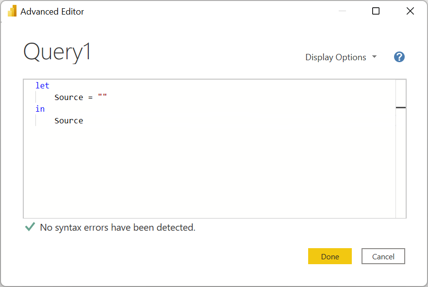

# Connect to data using generic interfaces

You can connect to a multitude of different data sources using built-in connectors that range from Access databases to Zendesk resources. You can also connect to all sorts of *other* data sources to further expand your connectivity options, by using the generic interfaces (such as ODBC or REST APIs) built into Power Query Desktop and Power Query Online.

## Power Query data interfaces

Power Query includes an ever-growing collection of connectors that are built to connect to a specific data source. For example, the [SharePoint list](connectors/SharePointList.md) connector provides specific fields and supporting information during the connection sequence that are designed for SharePoint lists. Other data sources found in the window that appears when you choose to get data (in Power Query Desktop) or choose a data source (in Power Query Online) work in the same way.

In addition, you can also connect to data sources that aren't identified in the get data and choose data source lists by using one of the following generic data interfaces:

* ODBC
* OLE DB
* OData
* REST APIs
* R Scripts

By providing the appropriate parameters in the connection windows that these generic interfaces provide, the world of data sources you can access and use in Power Query grows significantly.

In the following sections, you can find lists of data sources that can be accessed by these generic interfaces.

## Data sources accessible through ODBC

The [ODBC](connectors/ODBC.md) connector in Power Query lets you import data from any third-party ODBC driver simply by specifying a Data Source Name (DSN) or a connection string. As an option, you can also specify a SQL statement to execute against the ODBC driver.

The following list details a few examples of data sources that Power Query can connect to using the generic ODBC interface.

| Power Query generic connector | External data source | Link for more information |
| --- | --- | --- |
| ODBC |Cassandra |[Cassandra ODBC driver](https://www.magnitude.com/drivers/cassandra-odbc-jdbc) |
| ODBC |Couchbase DB |[Couchbase and Power BI](https://powerbi.microsoft.com/blog/visualizing-data-from-couchbase-server-v4-using-power-bi/) |
| ODBC |DynamoDB |[DynamoDB ODBC driver](https://www.simba.com/drivers/dynamodb-odbc-jdbc/) |
| ODBC |Google BigQuery |[BigQuery ODBC driver](https://www.simba.com/drivers/bigquery-odbc-jdbc/) |
| ODBC |HBase |[HBase ODBC driver](https://www.simba.com/drivers/hbase-odbc-jdbc/) |
| ODBC |Hive |[Hive ODBC driver](https://www.magnitude.com/drivers/hive-odbc-jdbc) |
| ODBC |IBM Netezza |[IBM Netezza information](https://www.ibm.com/support/knowledgecenter/SSULQD_7.2.1/com.ibm.nz.datacon.doc/c_datacon_plg_overview.html) |
| ODBC |Presto |[Presto ODBC driver](https://www.simba.com/drivers/presto-odbc-jdbc/) |
| ODBC |Project Online |[Project Online article](/power-bi/connect-data/desktop-project-online-connect-to-data) |
| ODBC |Progress OpenEdge |[Progress OpenEdge ODBC driver blog post](https://www.progress.com/blogs/connect-microsoft-power-bi-to-openedge-via-odbc-driver) |
| ODBC |Salesforce |[Devart ODBC Driver for Salesforce](https://www.devart.com/odbc/salesforce/) |

## Data sources accessible through OLE DB

The OLE DB connector in Power Query lets you import data from any third-party OLE DB driver simply by specifying a connection string. As an option, you can also specify a SQL statement to execute against the OLE DB driver.

The following list details a few examples of the data sources that Power Query can connect to using the generic OLE DB interface.

| Power Query generic connector | External data source | Link for more information |
| --- | --- | --- |
| OLE DB |SAS OLE DB |[SAS provider for OLE DB](https://support.sas.com/downloads/package.htm?pid=648) |
| OLE DB |Sybase OLE DB |[Sybase provider for OLE DB](http://infocenter.sybase.com/help/index.jsp?topic=/com.sybase.infocenter.dc35888.1550/doc/html/jon1256941734395.html) |

## Data sources accessible through OData

The [OData feed](connectors/ODataFeed.md) connector in Power Query lets you import data from any OData URL simply by typing in or pasting the OData URL. You can add multiple URL parts by typing or pasting those links in the text boxes provided in the **OData feed** window.

The following list details a few examples of the data sources that Power Query can connect to using the generic OData interface.

| Power Query generic connector | External data source | Link for more information |
| --- | --- | --- |
| OData |Coming soon |Check back soon for OData data sources |

## Data sources accessible through REST APIs

You can connect to data sources using the REST APIs and thereby use data from all sorts of data sources that support REST.

The following list details a few examples of the data sources that Power BI Desktop can connect to using the generic REST APIs interface.

| Power BI Desktop generic connector | External data source | Link for more information |
| --- | --- | --- |
| REST APIs |Couchbase DB |[Couchbase REST API information](https://powerbi.microsoft.com/blog/visualizing-data-from-couchbase-server-v4-using-power-bi/) |

## Data sources accessible through R Script

You can use R scripts to access data sources, and use that data in Power BI Desktop.

The following list details a few examples of the data sources that Power BI Desktop can connect to using the generic R scripts interface.

| Power BI Desktop generic connector | External data source | Link for more information |
| --- | --- | --- |
| R Script |SAS Files |[R script guidance from CRAN](https://cran.r-project.org/doc/manuals/R-data.html) |
| R Script |SPSS Files |[R script guidance from CRAN](https://cran.r-project.org/doc/manuals/R-data.html) |
| R Script |R Statistical Files |[R script guidance from CRAN](https://cran.r-project.org/doc/manuals/R-data.html) |
