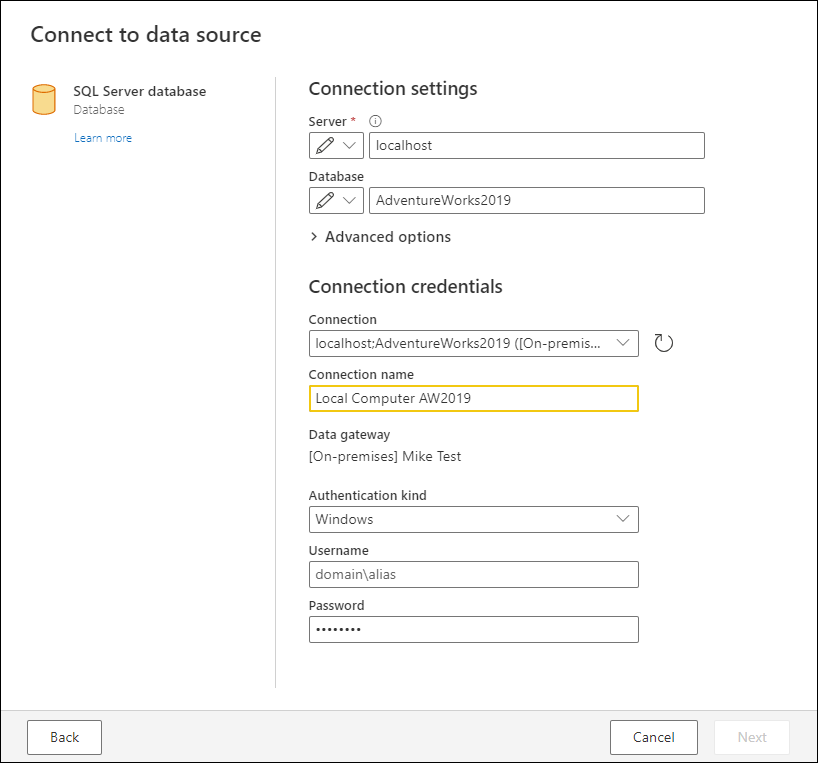
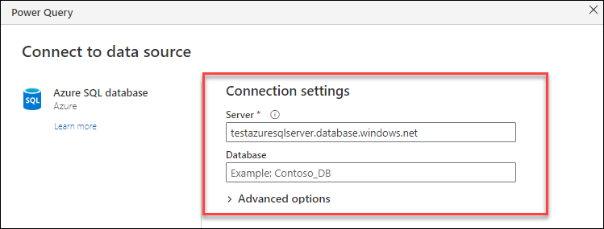
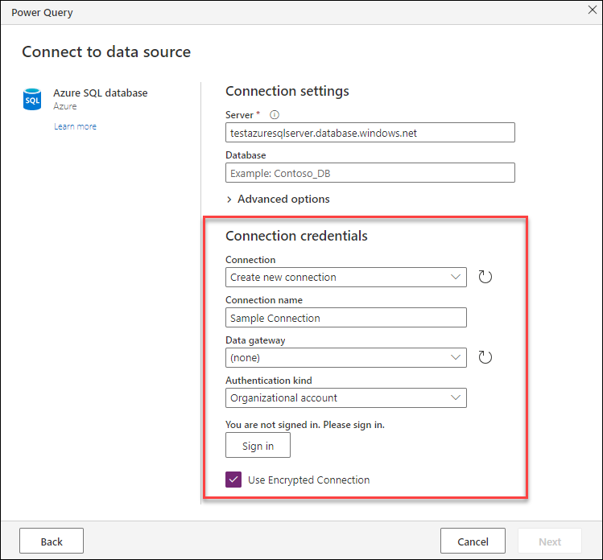
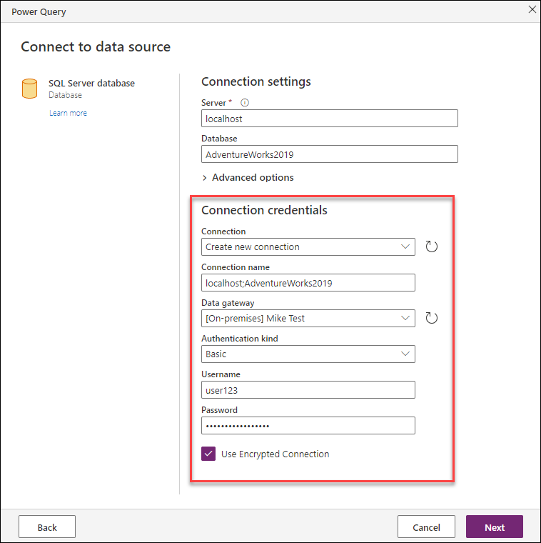

# Connections and authentication in Power Query Online

In Power Query Online, named connections provide you with a more flexible approach to create and manage connections. A named connection is the definition of a set of components to establish a connection to a particular data source. You can create multiple connections against the same data source with the only differentiation being the name you choose to assign.

There are two categories of connections:

|Connection Category Name|Icon|Description|
|-------------|-----|-----------|
|**Cloud**| |Any connection for data source that is cloud-based and does not use a gateway|
|**On-Premise**| |Any connection that requires a gateway|

## Creating a named connection

During the [Get Data experience in Power Query Online](/powerquery-docs/get-data-experience.md#1-connection-settings-and-authentication), you will find a dialog where you can enter a set of information in order to create and establish a connection to your data source. The process is standard for all connectors in Power Query, but some connectors might require more information in order to create such connection.

### Creating a cloud connection

Using the Azure SQL Server Database connector as an example, you can the enter the connector parameters in order to establish a connection. For the Azure SQL Server connector, the required parameter is just the server, but you can also input the name of the database and any other advanced parameters available for the connector.

After entering the values for the parameters of the connector in the *Connection settings* section, you can proceed with the *Connection credentials* section where you have the ability to create a connection specific to the connection settings previously entered.

Below you will find a table with the fields and values used in the *Connection settings* section:

|Field|Description|Sample value|
|-----|------|--------|
| **Connection Name**| You can enter a name to your new connection.|Sample Connection|
| **Data Gateway**| An optional field that lets you bind a gateway to your connection. For cloud connections, there is no gateway binding to the connection| none|
| **Authentication Kind**| You can select what authentication kind to use that is supported by the connector.|Organizational account|
| **Credentials**| Depending on the authentication kind selected, you will be available to see a contextual set of fields to input your credentials, a button to launch an OAuth2 flow or even no fields at all for an authentication kind such as *Anonymous*.|Derived from OAuth2 flow, but is shown as a **Sign in** button in the image|

>[!NOTE]
>By default, the field for the connection name will try to provide a default name when creating a connection using the information from the connection settings

After finishing the *Connection settings* section, you can click the **Next** button to move forward within the [*Get Data*](/powerquery-docs/get-data-experience.md#2-data-preview) experience.

>[!TIP]
> Some connectors provide an auto-login experience. You can learn more about this feature from the article on [auto-login](/powerquery-docs/auto-login-aad.md).

### Creating an On-Premise connection

As an alternative, you can also bind a gateway to your connection and therefore converting your connection from a cloud connection to an On-Premise connection.

>[!NOTE]
> To create a gateway you can read the article on [using an on-premises data gateway in dataflows](/powerquery-docs/dataflows/using-dataflows-with-on-premises-data.md).

Using now a local SQL Server Database as an example, you can the enter the connector parameters in order to establish a connection. For the SQL Server connector, the required parameter is just the server, but you can also input the name of the database and any other advanced parameters available for the connector. For demonstration purposes, both the Server and Database have been entered. 

After entering the values for the parameters of the connector in the *Connection settings* section, you can proceed with the *Connection credentials* section where you have the ability to create a connection specific to the connection settings previously entered.

Below you will find a table with the fields and values used in the *Connection settings* section:

|Field|Description|Sample value|
|-----|------|--------|
| **Connection Name**| You can enter a name to your new connection|localhost;AdventureWorks2019|
| **Data Gateway**| An optional field that lets you bind a gateway to your connection.| Mike Test|
| **Authentication Kind**| You can select what authentication kind to use that is supported by the connector.|Basic|
| **Credentials**| Depending on the authentication kind selected, you will be available to see a contextual set of fields to input your credentials, a button to launch an OAuth2 flow or even no fields at all for an authentication kind such as *Anonymous*.|Username and password|

After finishing the *Connection settings* section, you can click the **Next** button to move forward within the [*Get Data*](/powerquery-docs/get-data-experience.md#2-data-preview) experience.

## Components of a connection

Each connection is made up of a set of components. Below you will find a table with more information for each component.

|Component name|Required or optional|Description|Sample|
|----------|-------|-----|-----|
|**Data Source kind**|Required|The data source for which the connection is being established to| SQL Server, File, Folder, Azure Data Lake Storage|
|**Data Source path**|Required|This is a string that represents the values or parameters used to establish a connection to your data source.|Server Name, Database Name|
| **Authentication**|Required|This encompasses both the authentication method and the credentials used for it|Windows, OAuth2, Anonymous|
|**Gateway**| Optional| Used when a gateway is needed to establish the connection and execute any query evaluation| Any gateway|
|**Privacy level**|Optional| By default it is set to none and it establishes the security for each connection which is taken into consideration when queries from different connections are combined| None, Public, Organizational, Private|

>[!IMPORTANT]
>At the moment, the privacy level will be set to *None* for any new connections created. When you try to combine multiple data sources, a new dialog will prompt you to define the data privacy levels of the data sources that you want to combine.

## Known connections

When Power Query recognizes a set of **connection settings**, it'll try to look up in its respective credentials storage to see if there's a connection that matches those settings to automatically select that connection.

image of the automatic connection lookup

To override this behavior, you can click the edit connection link to modify the existing connection or select **Create new connection** from the dropdown menu to create a new named connection.

image of the dropdown

## More resources

* [List of connectors in Power Query](/powerquery-docs/Connectors/index.md)
* [On-premises data gateways documentation](https://docs.microsoft.com/data-integration/gateway/)
* [Change the gateway used in a dataflow](/powerquery-docs/change-gateway-dataflow.md)
* [Troubleshooting dataflow issues: Connection to the data source](/powerquery-docs/dataflows/troubleshooting-dataflow-issues-connection-to-the-data-source.md)