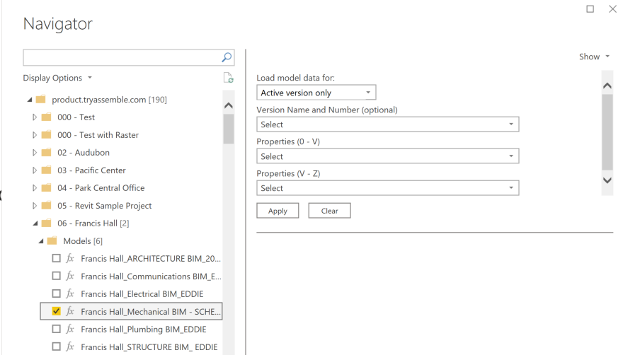
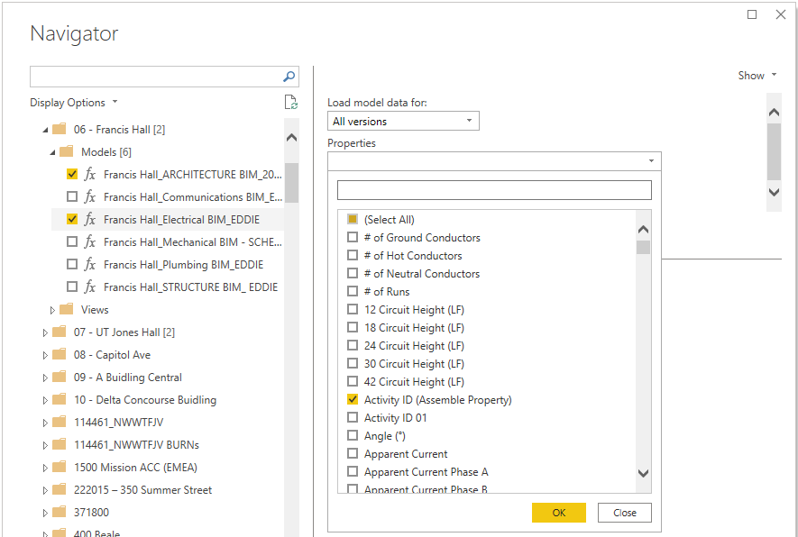
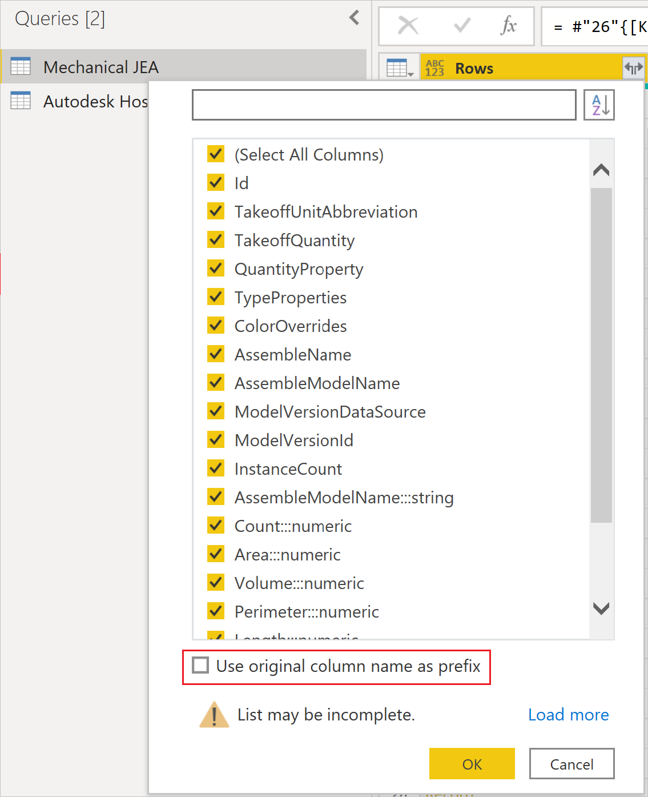

# Assemble Views

>[!Note]
>The following connector article is provided by Autodesk, the owner of this connector and a member of the Microsoft Power Query Connector Certification Program. If you have questions regarding the content of this article or have changes you would like to see made to this article, visit the Autodesk website and use the support channels there.

## Summary

| Item | Description |
| ---- | ----------- |
| Release State | General Availability |
| Products | Power BI (Datasets) Power BI (Dataflows) |
| Authentication Types Supported | Autodesk Account |
| Function Reference Documentation | &mdash; |

## Prerequisites

To use the Assemble Views connector, you must have an Autodesk account with a username and password, and be a member of at least one project in Assemble.

You'll also need at least one view associated with the Assemble project.

## Capabilities supported

* Import

## Connect to Assemble Views from Power Query Desktop

To connect to Assemble data:

1. Select **Assemble Views** from the **Get Data** experience under the **Online Services** category, and then select **Connect**.

2. In **Assemble Views**, enter your site's URL to sign in. For example, use **`https://example.tryassemble.com`**.

   a. (Optional) Select a date from which you want to load the data. Leaving this entry blank results in the latest data being pulled each time you refresh.

      

   b. Once you've entered the URL, select **OK** to continue.

3. Select **Sign in** to sign in to your Autodesk account.

   

   Once you've successfully signed in, select **Connect**.

4. In the **Navigator** dialog box, search for and expand the project that you want to load. For each project, there's a folder for **Models** and **Views**. 

   a. **Models** (New!) - fetches select properties from any or all versions of a model.

   b. **Views** - fetches all visible columns in a previously saved view.

   

## Loading data from Models

1. Expand the **Models** folder. Select each of the models you want to include. The settings outlined in the following steps must be completed for each selected model.

   

2. Select the versions you wish to load:

   a. **Active version only** – Loads only the active version of the model.

   b. **All versions** – Loads all versions of the model.

   c. **All except active version** – Loads all previous versions of the model without loading the active version (intended for advanced workflows when previous version data only needs to be loaded once and not included in a refresh).

   d. **Specific versions** – Loads all specific versions of the model that are selected (specific versions will be selected in the Version Name and Number drop down).

3. Select the properties you want to fetch by using the search filter or scrolling. By default, Model ID, Model Name, Version ID, Version Name, and Version Number will always be included in the result.

   

   >[!Note]
   >When using the search bar, be sure to clear the selection and select all properties before selecting OK, or previous selections will be overwritten.

4. If using "Specific versions", select the versions you want to load in the **Version Name and Number (optional)** dropdown, then select **Apply**. Selections in this dropdown will be ignored if any of the other "Load model data" settings are selected.

5. Once the data preview has been displayed, you can either select **Transform Data** to go to the Power Query editor, or **Load** to go straight to the dashboard.

6. If you want to load multiple models at once, be sure to select **Apply** after setting up each model per the aforementioned steps.

## Loading data from Views

1. Expand the **Views** folder. Select the view you want to include. Additionally select **[Your Project] View Thumbnails** if you want to include images in your report. Select **Transform Data** to continue to Power Query.

2. In Power Query, you'll see a single column named **Rows**. On the header of the column, select the button with two arrows pointing in opposite directions to expand your rows.

   

   a. Uncheck **Use original column name as prefix** and select **OK** for each view data query you've selected.

      

   b. Select **Close & Apply** to load the datasets.

3. (Optional) If you have chosen to load images, you'll need to update the **Data category** for the image field.

   a. Expand the **[Your Project] View Thumbnails** table, and then select the **Image** field.  This selection opens the **Column tools** tab.

   b. Open the **Data category** drop-down and select **Image URL**. You can now drag and drop the Image field into your report visuals.

   

## Known issues and limitations

* Views with greater than 100,000 rows may not load depending on the number of fields included in the view. To avoid this limitation, we suggest breaking large views into multiple smaller views and appending the queries in your report, or creating relationships in your data model.

* The **view images** feature currently only supports thumbnail sized images because of a row size limitation in Power BI.

* When creating a query using **Models** data, a maximum of 200 properties can be selected.
