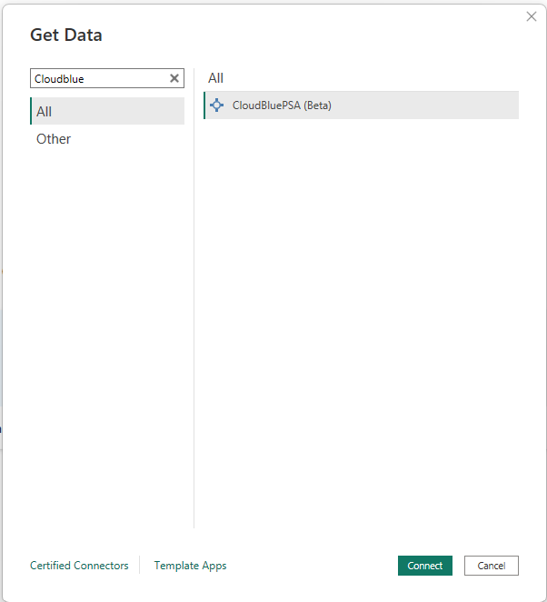
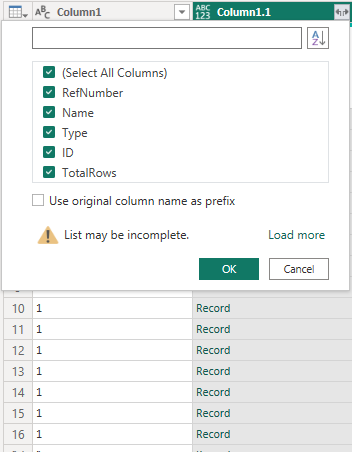

# CloudBluePSA

>[!Note]
The following connector article is provided by CloudBluePSA, the owner of this connector and a member of the Microsoft Power Query Connector Certification Program. If you have questions regarding the content of this article or have changes you would like to see made to this article, visit the CloudBluePSA website and use the support channels there.

## Summary

| Item | Description |
| ---- | ----------- |
| Release State | General Availability |
| Products | Power BI (datasets)
| Authentication Types Supported | API Key |
| Function Reference Documentation | [CloudBluePSA Connector.Help](https://help.harmonypsa.com/articles/#!cloudblue-psa-4-28-publication/using-the-power-bi-connector)
| | |
## Prerequisites
Before you can use the CloudBluePSA connector, you must have an CloudBlue PSA instance (username/password) and an API key.

## Capabilities
* Import

## Connect to CloudBlue PSA

To connect to CloudBlue PSA data:

1. Select **Get Data** from the **Home** ribbon in Power BI Desktop. 

2. Click in the **Search** box and start typing **CloudBluePSA**, then select **CloudBluePSA** from the list on the right, and select **Connect**.

    

3. In the **Retrieve all pages of data** window that appears, copy and paste the **URL** generated on the **GET** side of the API endpoint of your choice, and below on the **Filter** dialog box, copy and paste the constructed filter on the same API endpoint. For example:

    ### URL: ### 
    https://INSTANCE_URL/webapi/v1.3/tickets/getticketsreport
    
    ### Filter ### 
    {  "pageno": 1,  "pagesize": 10,  "filters": [{"field": "Type", "op": "cn", "data": "n"}], "filterop": "AND",  "sortcolumn": "Name",  "sortorder": "Asc",  "resulttype": "Json",  "includeccysymbols": true,  "gridcolumns": "RefNumber,Type,Name"}

    

3. Click **OK**.

4. Provide your **API key** generated in CloudBluePSA and select **Connect**.

5. Select **Transform Data**.

6. Expand the **Data** column, then selecting **OK**.

    

7. Expand the **Column1.1** column. This time, on the list of columns all the grid columns included in the filter are displayed. Select as many columns as required then select **OK**. 
All the selected data is now displayed, and can be reshaped and used to create reports as required.

    

8. Select **Close & Apply**. You can now start using your data.

 
  ## Next Steps
 You may also find the following CloudBlue PSA information useful:

 * [CloudBlue PSA Help Centre](https://help.harmonypsa.com/home/en-gb/)
 * [Connecting PowerBI to the API](https://help.harmonypsa.com/articles/#!cloudblue-psa-4-28-publication/connecting-powerbi-to-the-api)
 * [API](https://help.harmonypsa.com/articles/#!cloudblue-psa-4-28-publication/api)
    * [Creating an API Key](https://help.harmonypsa.com/articles/#!cloudblue-psa-4-28-publication/creating-an-api-key)
    * [Using the API](https://help.harmonypsa.com/articles/#!cloudblue-psa-4-28-publication/using-the-api)