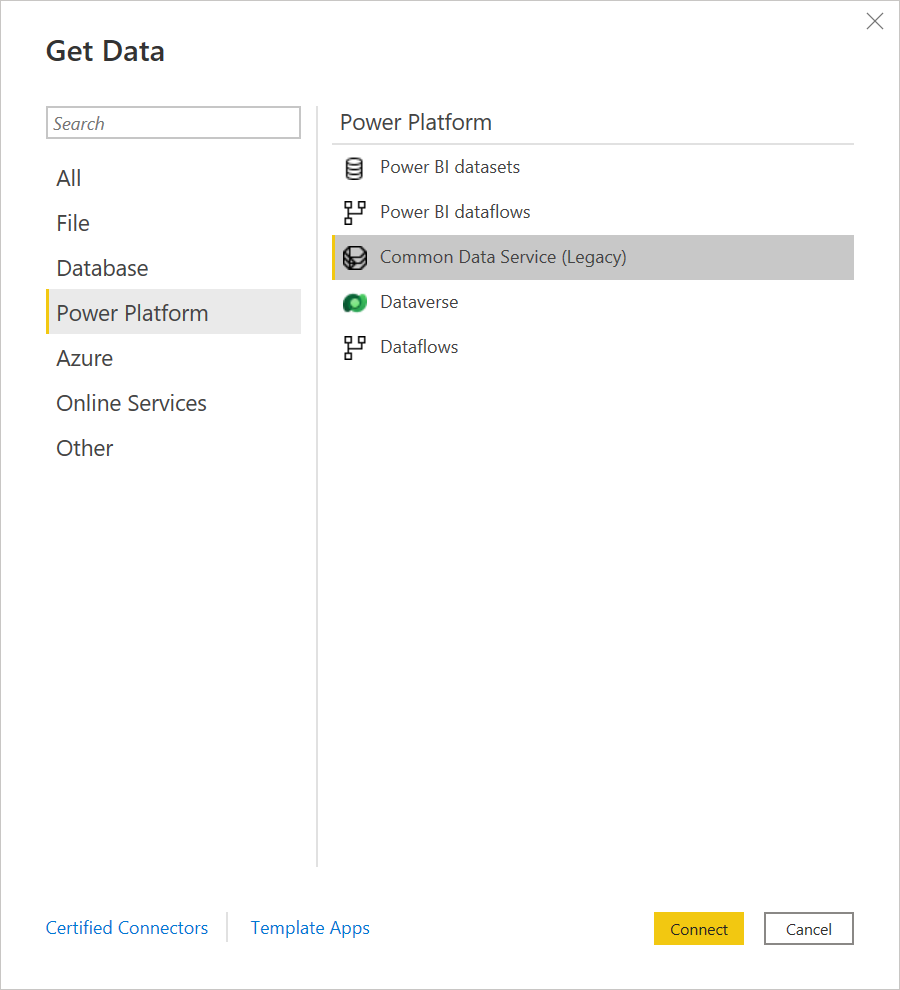
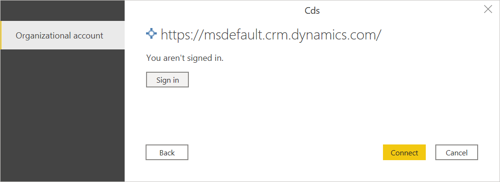
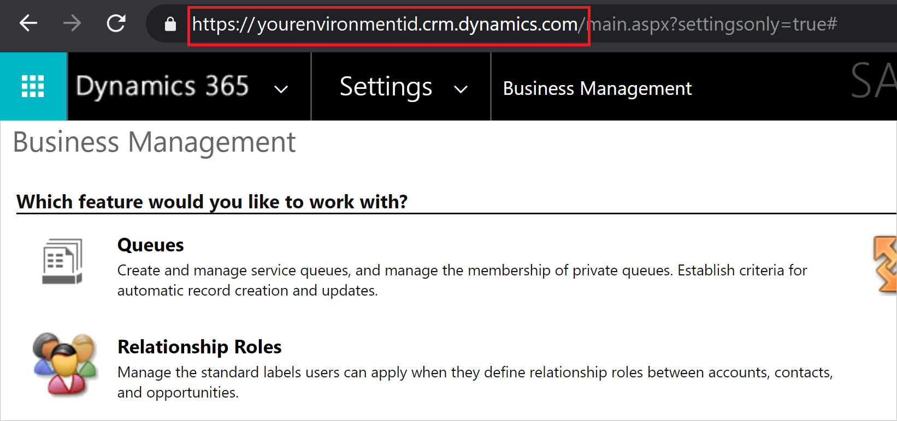

# Common Data Service (Legacy)

>[!Note]
>The Common Data Service (Legacy) connector has be superseded by the Power Query [Dataverse](dataverse.md) connector. In most cases, we recommend that you use the Dataverse connector instead of the Common Data Service (Legacy) connector. However, there may be limited cases where it's necessary to choose the Common Data Service (Legacy) connector. These cases are described in [When to use the Common Data Service (Legacy) connector](#when-to-use-the-common-data-service-legacy-connector).

## Summary

| Item | Description |
| ---- | ----------- |
| Release State | General Availability |
| Products | Power BI (Datasets)<br/>Power BI (Dataflows)<br/>Dynamics 365 Customer Insights |
| Authentication types | Organizational account |
| | |

>[!Note]
>Some capabilities may be present in one product but not others due to deployment schedules and host-specific capabilities.

## Prerequisites

You must have a Common Data Service (Legacy) environment with maker permissions to access the portal, and read permissions to access data within tables.

## Capabilities supported

* Server URL
* Advanced
  * Reorder columns
  * Add display column

## Connect to Common Data Service (Legacy) from Power BI Desktop

To connect to Common Data Service (Legacy) from Power BI Desktop:

1. Select **Get data** from the **Home** tab.

2. In the **Get Data** dialog box, select **Power Platform** > **Common Data Service (Legacy)**, and then select **Connect**.

   

3. Enter the Common Data Service (Legacy) environment URL of the data you want to load. Use the format https://\<_yourenvironmentid_>.crm.dynamics.com/. More information: [Finding your Dataverse environment URL](#finding-your-common-data-service-legacy-environment-url)

   

   When the table is loaded in the Navigator dialog box, by default the columns in the table are reordered in alphabetical order by the column names. If you don't want the columns reordered, in the advanced settings enter **false** in **Reorder columns**.

   Also when the table is loaded, by default if the table contains any picklist fields, a new column with the name of the picklist field with **_display** appended at the end of the name is added to the table. If you don't want the picklist field display column added, in the advanced settings enter **false** in **Add display column**.

   When you've finished filling in the information, select **OK**.

4. If this attempt is the first time you're connecting to this site, select **Sign in** and input your credentials. Then select **Connect**.

   

5. In **Navigator**, select the data you require, then either load or transform the data.

   

## Connect to Common Data Service (Legacy) from Power Query Online

To connect to Common Data Service (Legacy) from Power Query Online:

1. From the **Data sources** page, select **Common Data Service (Legacy)**.

   

2. Enter the server URL address of the data you want to load.

   

3. If necessary, enter an on-premises data gateway if you're going to be using on-premises data. For example, if you're going to combine data from Dataverse and an on-premises SQL Server database.

4. Sign in to your organizational account.

5. When you've successfully signed in, select **Next**.

6. In the navigation page, select the data you require, and then select **Transform Data**.

## Finding your Common Data Service (Legacy) environment URL

Open [Power Apps](https://make.powerapps.com/?utm_source=padocs&utm_medium=linkinadoc&utm_campaign=referralsfromdoc). In the upper right of the Power Apps page, select the environment you're going to connect to. Select the  settings icon, and then select **Advanced settings**.

In the new browser tab that opens, copy the root of the URL. This root URL is the unique URL for your environment. The URL will be in the format of https://\<*yourenvironmentid*>.crm.dynamics.com/. Keep this URL somewhere handy so you can use it later, for example, when you create Power BI reports.



### When to use the Common Data Service (Legacy) connector

Dataverse is the direct replacement for the Common Data Service connector. However, there may be times when it's necessary to choose the Common Data Service (Legacy) connector instead of the [Dataverse](dataverse.md) connector:

There are certain Tabular Data Stream (TDS) data types that are supported in OData when using Common Data Service (Legacy) that aren't supported in Dataverse. The supported and unsupported data types are listed in [How Dataverse SQL differs from Transact-SQL](/powerapps/developer/data-platform/how-dataverse-sql-differs-from-transact-sql?tabs=supported).

All of these features will be added to the Dataverse connector in the future, at which time the Common Data Service (Legacy) connector will be deprecated.

More information: [Accessing large datasets](#accessing-large-datasets)

## Limitations and issues

### Dataverse OData API performance and throttling limits

For information about OData API performance and throttling limits for Dataverse connections, go to [Requests limits and allocations](/power-platform/admin/api-request-limits-allocations). These limitations apply to both the Common Data Source (Legacy) connector (which uses the OData API as an implementation detail) and the [OData Feed](odata-feed.md) connector when accessing the same endpoint.

### Entity retrieval rate

As a guideline, most default entities will be retrieved at a rate of approximately 500 rows per second using the Common Data Service (Legacy) connector. Take this rate into account when deciding whether you want to connect to Dataverse or export to data lake. If you require faster retrieval rates, consider using the Export to data lake feature or the Dataverse connector. More information: [Alternative Dataverse connections](#alternative-dataverse-connections)

### Alternative Dataverse connections

There are several alternative ways of extracting and migrating data from Dataverse:

* Use the **Azure Synapse Link** feature in Power Apps to extract data from Dataverse into Azure Data Lake Storage Gen2, which can then be used to run analytics. For more information about the Azure Synapse Link feature, go to [What is Azure Synapse Link for Dataverse?](/powerapps/maker/data-platform/export-to-data-lake).

* Use the OData connector to move data in and out of Dataverse. For more information on how to migrate data between Dataverse environments using the dataflows OData connector, go to [Migrate data between Dataverse environments using the dataflows OData connector](/powerapps/developer/common-data-service/cds-odata-dataflows-migration).

* Use the Dataverse connector to access read-only data in Dataverse. For more information about this feature, go to [View table data in Power BI Desktop](/powerapps/maker/data-platform/view-entity-data-power-bi).

>[!Note]
> Both the Dataverse connector and the OData APIs are meant to serve analytical scenarios where data volumes are relatively small. The recommended approach for bulk data extraction is “Azure Synapse Link”.

### Querying display columns must include the field in the query

When using this connector, if you're including _\<field>_`display` columns, you must include _\<field>_ in the query as well, or the _\<field>_`_display` column might be null. For example:

```powerquery-m
Table.SelectColumns(#"Navigation 1", {"statuscode", "statuscode_display"})
```

If `statuscode` isn't included, `statuscode_display` might be null and error out.

### Accessing large datasets

Power BI datasets contained in Dataverse can be very large. If you're using the Power Query [Dataverse](dataverse.md) connector, any specific query that accesses the dataset must return less than 80 MB of data. So you might need to query the data multiple times to access all of the data in the dataset. Using multiple queries can take a considerable amount of time to return all the data.

If you're using the Common Data Service (Legacy) connector, you can use a single query to access all of the data in the dataset. This connector works differently and returns the result in “pages” of 5 K records. Although the Common Data Service (Legacy) connector is more efficient in returning large amounts of data, it can still take a significant amount of time to return the result.

Instead of using these connectors to access large datasets, we recommend that you use [Azure Synapse Link](/powerapps/maker/data-platform/export-to-data-lake) to access large datasets. Using Azure Synapse Link is even more efficient that either the Power Query Dataverse or Common Data Service (Legacy) connectors, and it is specifically designed around data integration scenarios.
