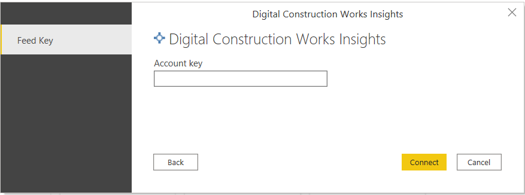

# Digital Construction Works Insights (Beta)

## Summary

| Item | Description |
| ------- | ------------|
|Release state | Beta |
| Products supported | Power BI (Datasets) Power BI (Dataflows) |
| Authentication types supported| Digital Construction Works JSON Web Token (JWT) |
| Function reference docs | &mdash; |

> [!NOTE]
> The following connector article is provided by Digital Construction Works (DCW), the owner of this connector and a member of the Microsoft Power Query Connector Certification Program. If you have questions regarding the content of this article or have changes you would like to see made to this article, visit the DCW website and use the support channels there.

## Prerequisites

Use of this connector requires a Digital Construction Works Integrations Platform subscription. To learn more, go to https://www.digitalconstructionworks.com/solutions/the-dcw-integrations-platform. Visit https://www.digitalconstructionworks.com for company information.

Users of the Digital Construction Works (DCW) Integrations Platform can request a JSON Web Token (JWT) from their project administrator in order to access data using the DCW Insights connector. Users can then follow the documentation for the OData API to connect to the datasets they want to use in Power BI.

## Capabilities supported

* Import

## Connect to DCW Insights OData API from Power Query Desktop

To connect to a DCW Insights project, take the following steps:

1. Under **Get Data** in Power BI Desktop, choose the **Digital Construction Works Insights** connector from the **Online Services**.

    

2. In **Insights Api Url**, provide the URL to the OData API you want to connect to. You need to use `https`, and you need your full project URL and product name included in the URL. You can also enter in query string parameters if the URL calls for it.

   

3. Select **OK**.

4. If this is the first time you're connecting to this endpoint, you'll be asked to enter in the [JWT](#prerequisites) used to authorize you for this project. Then select **Connect**.

   

   For more information about authentication methods, go to [Authentication with a data source](../connectorauthentication.md).

   >[!Note]
   >  If the connection isn't specified to use `https`, you'll be prompted to update your URL.

5. In **Navigator**, select the database information you want, then either select **Load** to load the data or **Transform Data** to continue transforming the data in Power Query editor.

   

## Troubleshooting

### Always Encrypted columns

Power Query doesn't support "Always Encrypted" columns.

### OData.Feed

We use the following default settings when using [OData.Feed](/powerquery-m/odata-feed):

Implementation = "2.0", MoreColumns = true, ODataVersion = 4
