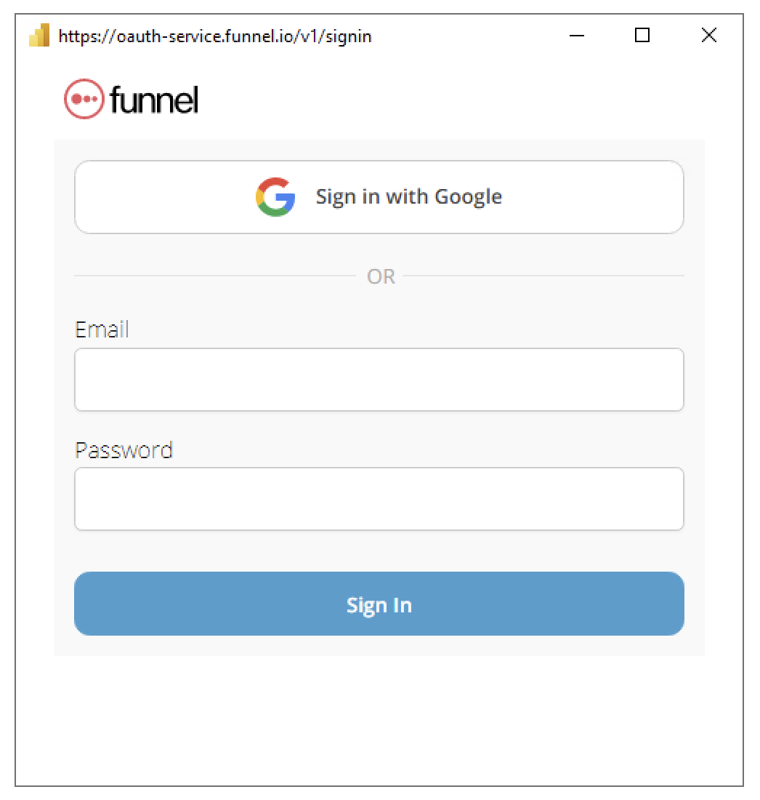
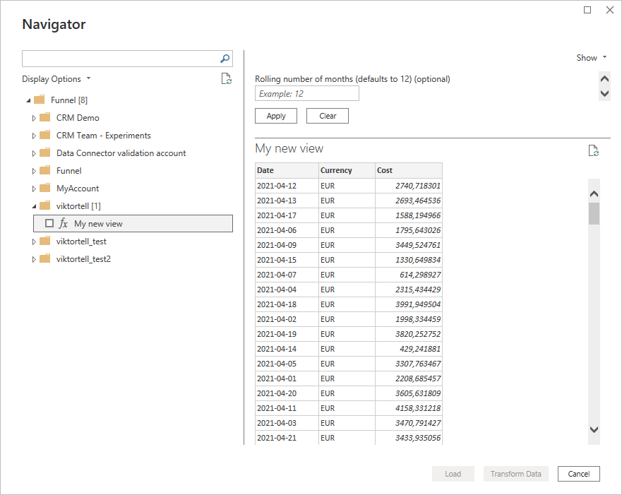

# Funnel

>[!Note]
>The following connector article is provided by Funnel, the owner of this connector and a member of the Microsoft Power Query Connector Certification Program. If you have questions regarding the content of this article or have changes you would like to see made to this article, visit the Funnel website and use the support channels there.

## Summary

| Item | Description |
| ---- | ----------- |
| Release State | General Availability |
| Products | Power BI (Datasets) Power BI (Dataflows) |
| Authentication Types Supported | Funnel Workspace |

## Prerequisites

To use the Funnel connector, you need a Funnel subscription. Funnel helps you collect data from all your marketing platforms, transform it, and send it to the destinations you want, like Power BI (<https://funnel.io/>).

In the Funnel App, go to your Workspace, navigate to the Microsoft Power BI page in the left navigation (if you can't see it, please contact us). Follow the instructions on the page. You need to create a "Data Share" that contains the fields you want to expose in Power BI.

## Capabilities Supported

* Import

## Connect to Funnel from Power Query Desktop

To connect to Funnel:

1. Select Online Services, find **Funnel** from the product-specific data connector list, and then select **Connect**.
   

1. Select **Sign in** to sign in to your Funnel Workspace.

   

1. Sign in with your Google user connected to Funnel or use your Funnel credentials.
   

1. Once you've successfully signed in select **Connect** to continue.
   

1. In the **Navigator** dialog box, choose one or more **Data Shares** from your **Workspaces** to import your data.
   

   For each Data Share you can enter number of rolling months of data you want.
   > [!NOTE]
   > The default number of months is 12. If today is 22.03.2022, then you'll get data for the period 01.04.2021 - 22.03.2022.

   You can then either select **Load** to load the data or select **Transform Data** to transform the data.

## Known issues and limitations

* If a Data Share contains too much data for one month, the connector will get a TOO_MANY_ROWS error.

For more information, read our [Power BI knowledge base articles](https://help.funnel.io/en/?q=powerbi).
