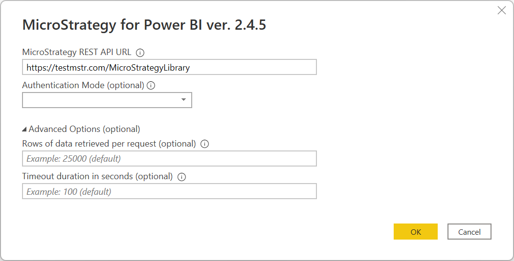
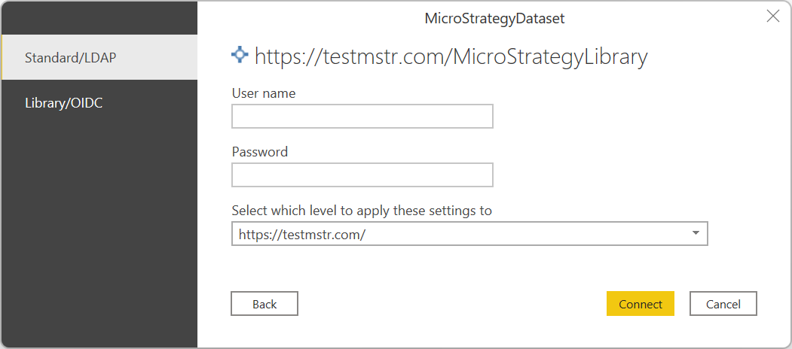

# MicroStrategy for Power BI

>[!Note]
>The following connector article is provided by MicroStrategy, the owner of this connector and a member of the Microsoft Power Query Connector Certification Program. If you have questions regarding the content of this article or need to modify it, visit the MicroStrategy website and use the support channels there.

## Summary

| Item | Description |
| ---- | ----------- |
| Release State | General Availability |
| Products | Power BI (Datasets) |
| Authentication Types Supported | Basic OAuth 2.0 |

## Prerequisites

Your organization must have a configured MicroStrategy environment. The user account on the MicroStrategy environment must have access to the Power BI connector.

## Capabilities Supported

* Import
* Data refresh

## Connect to MicroStrategy using Power BI Desktop

To connect to MicroStrategy using Power BI Desktop:

1. In Power BI Desktop, select **Home** > **Get Data**.

2. From the categories on the left, select **Other** > **MicroStrategy for Power BI**. Then select **Connect**.

3. If this is the first time you're connecting to the MicroStrategy for Power BI connector, a third-party notice appears. Select **Don't warn me again with this connector**, and then select **Continue**.

4. Enter a valid MicroStrategy Library URL, for example, `https://.../MicroStrategyLibrary`.

   

   >[!Note]
   >If you want to utilize OIDC authentication, you must add a **#OIDCMode** string to the end of the URL.
   >
   >OIDC authentication is available starting in version 2.4.5 of the connector.

   

5. (optional) Select the authentication mode. This option only affects basic authentication.

6. (optional) Fill out the advanced options, as necessary.

7. Select **OK**.

8. Select the authentication mode you want to use.

   

   1. Standard/LDAP

      1. Provide **user** and **password**.

      2. Select **Connect**.

   2. Library/OIDC

      >[!Important]
      >To utilize OIDC authentication, you must add the `https://oauth.powerbi.com/views/oauthredirect.html` URL to the list of reply URLs in your IdP settings.

      1. Select **Sign in**. A popup appears with the external sign-in site (either MicroStrategyLibrary or OIDC provider).

      2. Follow the required steps to authenticate with the chosen method.

      3. After the popup closes, select **Connect**.

9. Choose the report or cube you want to import to Power BI by navigating through the **Navigation Table**.

## Refresh MicroStrategy data using Power BI Online

>[!Note]
>The scheduled refresh functionality isn't available for Library authentication.

To refresh MicroStrategy data using Power BI Online:

1. Publish the dataset imported with Power BI Desktop using the **MicroStrategy for Power BI** connector.

2. Open the **Settings** page for the published dataset.

3. If this is the first time you're connecting to this database, select the authentication type and enter your credentials.

4. If necessary, select the name of your on-premises data gateway.

Now follow the steps required to set up the scheduled refresh/refresh in Power BI Online.
