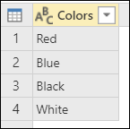

# Cross join

A *cross join* is a type of join that returns the Cartesian product of rows from the tables in the join. In other words, it combines each row from the first table with each row from the second table.

This article demonstrates, with a practical example, how to do a cross join in Power Query.

## Sample input and output tables

For this example, the sample source tables are:

* **Product**: A table with all the generic products that you sell.

   

* **Colors**: A table with all the product variations, as colors, that you can have in your inventory.

   

The goal is to perform a cross-join operation with these two tables to create a list of all unique products that you can have in your inventory, as shown in the following table. This operation is necessary because the **Product** table only contains the generic product name, and doesn't give the level of detail you need to see what product variations (such as color) there are.


## Perform a cross join

To do a cross-join operation in Power Query, first go to the **Product** table. From the **Add column** tab on the ribbon, select **Custom column**. More information: [Add a custom column](add-custom-column.md)


In the **Custom column** dialog box, enter whatever name you like in the **New column name** box, and enter `Colors` in the **Custom column formula** box.


>[!IMPORTANT]
>If your query name has spaces in it, such as **Product Colors**, the text that you need to enter in the **Custom column formula** section has to follow the syntax ```#"Query name"```. For **Product Colors**, you need to enter ```#"Product Colors"```<br>
<br>You can check the name of your queries in the **Query settings** pane on the right side of your screen or in the **Queries** pane on the left side.

After you select **OK** in the **Custom column** dialog box, a new column is added to the table. In the new column heading, select **Expand**  to expand the contents of this newly created column, and then select **OK**.


After you select **OK**, you'll reach your goal of creating a table with all possible combinations of **Product** and **Colors**. 

 each listed with four colors (red, blue, black, and white)")
