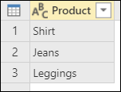

# Cross join

A cross join is a type of join that returns the Cartesian product of rows from the tables in the join. In other words, it will combine each row from the first table with each row from the second table.

This article demonstrates, with a practical example, how to do a cross join in Power Query.

## Sample input and output tables

For this example, the sample source tables are:
* **Products**&mdash;a table with all the generic products that you sell.

   

* **Colors**&mdash;a table with all the product variations, as colors, that you shall have in our inventory.

   

The goal is to perform a cross join operation with these two tables to create a list of all unique products that you could have in your inventory. This operation is necessary since the **Products** table only contains the generic product name and isn't at the detail level where you could see what product variations (such as color) it has.  


## Perform a Cross join

To do a cross join operation in Power Query, first go to the **Products** table. From the ribbon, select the **Add column** tab, and then select **Custom column**. To learn more about the custom column feature, see [Add a custom column](add-custom-column.md).


Inside the **Custom column** window, enter the name of the query for the cross join inside the **Custom column formula** section. In this case, it will be the **Colors** query. Enter the text of your choice for the **New column name**.


>[!IMPORTANT]
>If your query name has spaces in it, such as **Product Colors**, then the text that you need to enter in the **Custom column formula** section has to follow the syntax ```#"Query name"```. For **Product Colors**, you'd need to enter ```#"Product Colors"```. You can check the name of your queries in the **Query settings pane** on the right side of your screen or inside the **Queries pane** on the left side of your screen.

After you select **OK** in the **Custom column** window, a new column will be added to the table with table values in it. You can select the icon next to the column header of this new column to expand the contents of this newly created column.


After selecting the **OK** button to expand the column, you'll reach the desired goal with a table that has all the possible combinations of **Products** and **Colors**. 

