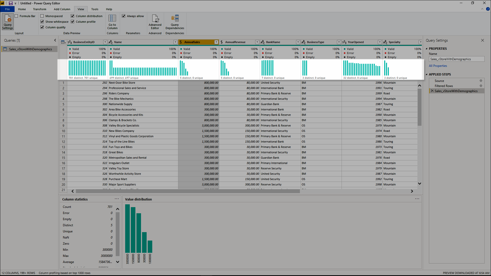
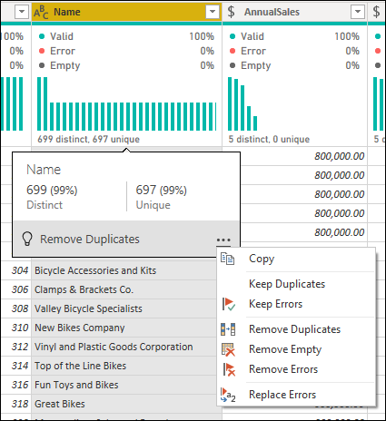
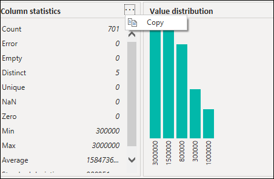

# Data Preview Tools

The main objective of the Data Preview tools is to provide the user with new and intuitive ways to clean, transform and understand their data within the Power Query Editor Window.

These Data Preview tools are:

* Column Quality

* Column Distribution

* Column Profile

To enable the data preview tools, select the **View** tab from the ribbon and navigate to the Data Preview section. Enable the desired options down below::

Once enabled, this is how they will be seen inside the Power Query Editor Window:

Each tool is independent from the other. This means that you can select which ones to enable and which ones you would like to keep as disabled.

>[!NOTE] 
>By default, Power Query will perform these Data Preview features over the first 1,000 rows of your data. To enable these, check the bottom left query of your editor window to change how the column profiling is performed.

## Column Quality
The column quality feature provides the user with a simple visual that labels values in rows with values in 3 categories:

* **Valid** - colored in green

* **Error** - colored in red

* **Empty** - colored in dark grey

These indicators are also displayed right underneath the name of the column as part of a small bar chart as shown below:

Furthermore, it also displays as a percentage the amount of records within each column quality category.

By hovering over either one of them we get some quick actions buttons for the operations that we can perform over the values in each category:

## Column Distribution

This feature provides a set of visuals underneath the names of the columns that showcases the frequency and distribution of the values in each of the columns. The data inside those visualizations is sorted in descending order from the value with the higher frequency.

Besides giving information on the overall data inside the column (with distinct count and unique values), mouseover operations are also available:

## Column Profile

This feature provides a more in-depth look at the data within a column. Apart from the Column Distribution chart, there is also a Column Statistics. This information is displayed underneath the data preview section as shown in the next image:

### Filter by value

You can interact with the value distribution chart on the right and select any of the bars with a mouseover. 

A right click to display a set of available transformations for that value.

### Copy data

On the top right-hand corner of both the Column statistics and value distribution sections there's a small icon of three dots. By clicking on these three dots a contextual menu is displayed and within this menu there is an option to copy the contents of the data displayed in such section to the clipboard.

### Group by value

On the top right-hand corner of the Value distribution chart there's a small icon of three dots. When clicking on this contextual three dots, you'll get the option to use the 'Group by' feature to group your values in the chart by a set of options available. 

In the image below, we are grouping a column of Product Names by the text length. Once the values have been grouped in the chart, you can interact with it and interact with it as showcased in the 'Filter by value' section of this article.

