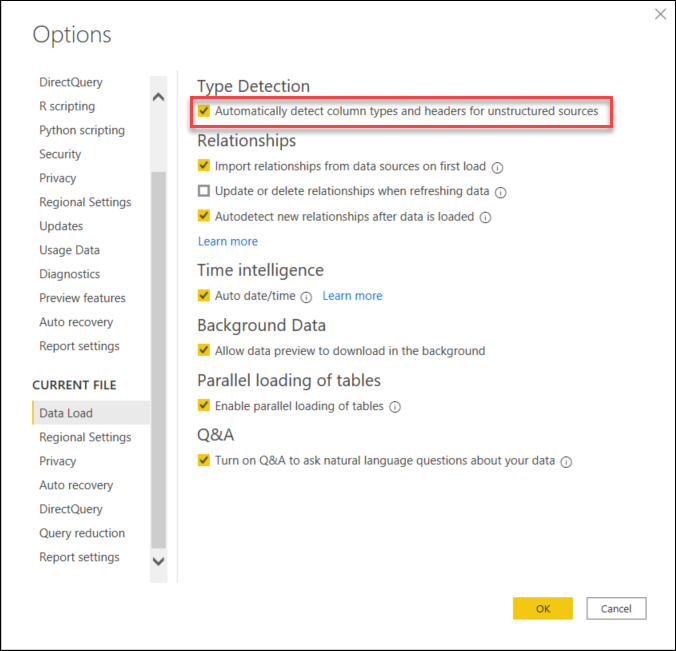
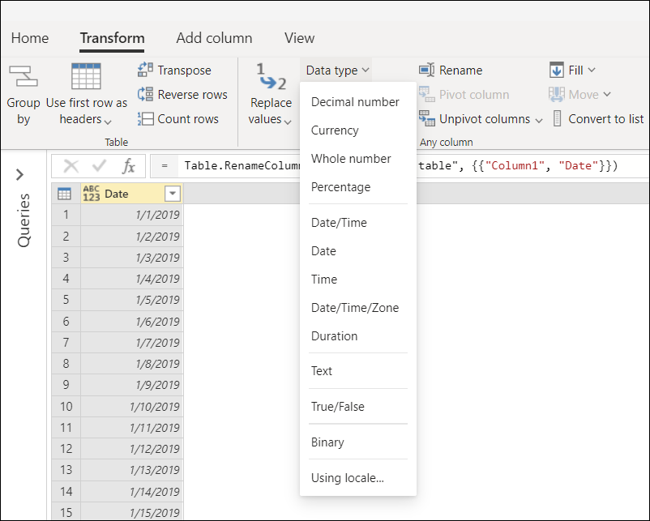
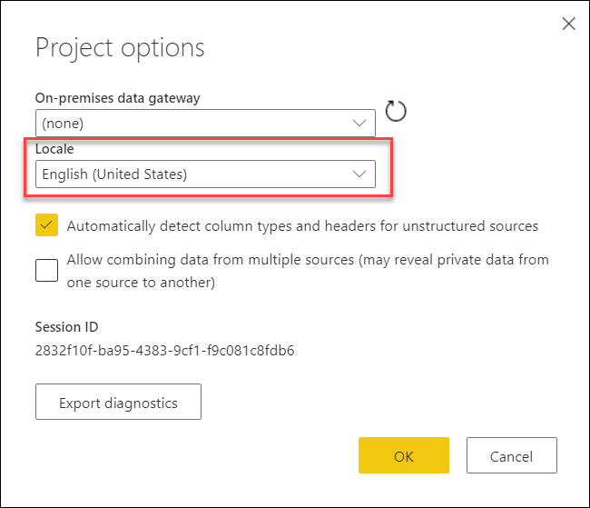
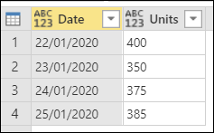
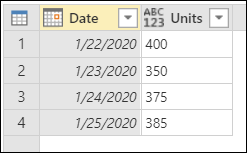

# Data types in Power Query

A data type in Power Query is a value that classifies other values. A value that is classified by a data type is said to ***conform*** to that data type. 

The data type of a column is displayed on the left hand side of the column header with an icon image that symbolizes the data type:

The most common data types used in Power Query are:
* **Decimal Number**- Represents a 64 bit (eight-byte) floating point number. It’s the most common number type and corresponds to numbers as you usually think of them. Although designed to handle numbers with fractional values, it also handles whole numbers. The Decimal Number type can handle negative values from -1.79E +308 through -2.23E -308, 0, and positive values from 2.23E -308 through 1.79E + 308. For example, numbers like 34, 34.01, and 34.000367063 are valid decimal numbers. The largest precision that can be represented in a Decimal Number type is 15 digits long. The decimal separator can occur anywhere in the number. The Decimal Number type corresponds to how Excel stores its numbers.
* **Fixed Decimal number**- Has a fixed location for the decimal separator. The decimal separator always has four digits to its right and allows for 19 digits of significance. The largest value it can represent is 922,337,203,685,477.5807 (positive or negative). The Fixed Decimal Number type is useful in cases where rounding might introduce errors. When you work with many numbers that have small fractional values, they can sometimes accumulate and force a number to be slightly off. Since the values past the four digits to the right of decimal separator are truncated, the Fixed Decimal type can help you avoid these kinds of errors. 
* **Whole Number** - Represents a 64 bit (eight-byte) integer value. Because it’s an integer, it has no digits to the right of the decimal place. It allows for 19 digits; positive or negative whole numbers between -9,223,372,036,854,775,807 (-2^63+1) and 9,223,372,036,854,775,806 (2^63-2). It can represent the largest possible precision of the various numeric data types. As with the Fixed Decimal type, the Whole Number type can be useful in cases where you need to control rounding.
* **Percentage** - fundamentally the same as a **Decimal Number** type, but it has a mask to format the values in the column as a percentage in the Power Query Editor Window.
* **Date/Time** - Represents both a date and time value. Underneath the covers, the Date/Time value is stored as a Decimal Number Type. So you can actually convert between the two. The time portion of a date is stored as a fraction to whole multiples of 1/300 seconds (3.33 ms). Dates between years 1900 and 9999 are supported.
* **Date** - Represents just a Date (no time portion). When converted into the model, a Date is the same as a Date/Time value with zero for the fractional value.
* **Time** - Represents just Time (no Date portion). When converted into the model, a Time value is the same as a Date/Time value with no digits to the left of the decimal place.
* **Date/Time/Timezone** - Represents a UTC Date/Time with a timezone offset. It’s converted into Date/Time when loaded into the model. 
* **Duration** - Represents a length of time. It’s converted into a Decimal Number Type when loaded into the model. As a Decimal Number type it can be added or subtracted from a Date/Time field with correct results. As a Decimal Number type, you can easily use it in visualizations that show magnitude.
* **Text** - A Unicode character data string. Can be strings, numbers, or dates represented in a text format. Maximum string length is 268,435,456 Unicode characters (256 mega characters) or 536,870,912 bytes.
* **True/False** - A Boolean value of either a True or False.
* **Binary** - The Binary data type can be used to represent any other data with a binary format.
* **Any** - The *any* data type is the status given to a column without a explicit data type definition. *Any* is the data type that classifies all values. It is recommended that you always explicitly define the column data types for your queries from unstructured sources and avoid columns with the *any* data type as the output of your query.

>[!Note]
>Power Query provides a set of contextual transformations and options based on the data types of the columns. When you select a column with a data type of Date, Date/Time, or Date/Time/Timezone, you get transformations and options that are contextual to that specific data type throughout the Power Query interface such as in the **Transform** and **Add Column** tab, as well as in the smart filter options. 

## Data Type Detection

**When connecting to structured data sources such as databases**, Power Query will read the table schema from the data source and automatically display the data with the correct data type for each column.

**When connecting to unstructured sources such as Excel, CSV and Text files**, Power Query can automatically detect data types by inspecting the values inside the table. By default, automatic data type detection is enabled in Power Query for unstructured sources.

### Automatic column data type and headers detection

This setting is specific for unstructured sources and it helps you by automatically detecting the column types and headers for your table. 

You can enable or disable this setting:

* **In Power Query Online**, going to the Options menu and selecting the *Project options*. Inside the *Project options* window you'll see the option to *Automatically detect column types and headers for unstructured sources*.

* **In Power Query for Desktop**,  going to the *Query Options* window, and selecting the *Data Load* item from the left side menu inside the *Current* section. From there, you'll have the option to select or deselect the option for *Automatically detect column types and headers for unstructured sources*.

**When this setting is enabled,** Power Query will automatically detect the column headers and data types of unstructured data sources. Power Query will do this by automatically adding two steps to your query:

* **Promote column headers** - promotes the first row of the table to be the column header
* **Changed Type** - converts the values from the *any* data type to a data type based on the inspection of the values from each columns.

## How to define a column data type
We can define or change the data type of a column from 4 places:
* **Home tab** - in the *Data Type* dropdown menu inside the *Transform* group.

* **Transform tab** - in the *Data Type* dropdown menu inside the *Any Column* group.

* **Column header icon** - left of the column header shown as an icon.

* **Column Right click** - as the *Change Type* option.

### Document or Project Locale

When Power Query defines a column data type or converts from one data type to another, it has to interpret the values to be converted before it can transform them to a different data type.

* **In Power Query Online**, this interpretation is defined inside the *Project options*, under the *Locale* option.

* **In Power Query for Desktop**, Power Query automatically recognizes your Operating System regional format and uses that to interpret the values for data type conversion. You can override this **Locale** configuration by going inside the *Query Options* window, inside the *Current* menu and selecting the *Regional Settings* option which will display the Locale being used which you can also change.

This **Locale** setting is important for importing text values as based on the chosen value, Power Query will interpret the value before defining a data type. 

For example, imagine that we have our Locale set as English (United States), but one of our columns from one of our csv files has dates in the UK format day/month/year as shown in the next image:

When we try setting the data type of the Date column to be **Date**, we only get error values:

This is because the **Locale** being used is trying to interpret the date under the English (United States) format which is month/date/year, but there is no month 22 in the calendar, so it yields an error.

Instead of trying to just select the Date data type, we can right click the column and select the Using Locale option from the Change type menu

Inside the Change column type with locale, we select the data type that we want to set, but we also select which Locale to use which for our case has to be English (United Kingdom):

Using this locale, Power Query will be able to interpret the values correctly and convert those to the desired data type:

### Data type conversion matrix

The following matrix is designed to give you a quick look at the feasibility of data type conversion of a value from one data type to another.

| Data Types         | Decimal Number | Currency | Whole Number | Percentage | Date/ Time | Date | Time | Date/ Time/ Timezone | Duration | Text | True/ False |
|--------------------|----------------|----------|--------------|------------|-----------|------|------|--------------------|----------|------|------------|
| Decimal Number     |                |         |             | 1          | 1         |     | 2    | 3                  | 1        | 1    | 1          |
| Currency           | 1              |          |             | 1          | 1         |     | 2    | 3                  | 1        | 1    | 1          |
| Whole Number       | 1              | 1        |              | 1          | 1         | 1   | 2    | 3                  | 1        | 1    | 1          |
| Percentage         | 1              |         |             |            | 1         | 1    | 2    | 3                  | 1        | 1    | 1          |
| Date/ Time          | 1              |         |             | 1          |           |     |     | 3                  | 2        | 1    | 2          |
| Date               | 1              | 1        | 1            | 1          | 1         |      | 2    | 3                  | 2        | 1    | 2          |
| Time               | 1              | 1        | 1            | 1          | 3         | 2    |      | 3                  | 2        | 1    | 2          |
| Date/ Time/ Timezone | 1              |         |             | 1          |          |     |     |                    | 2        | 1    | 2          |
| Duration           | 1              |         |             | 1          | 2         | 2    | 2    | 2                  |          | 1    | 2          |
| Text               | 1              | 1        | 1            | 1          | 1         | 1    | 1    | 1                  | 1        |      | 1          |
| True/ False         | 1              | 1        | 1            | 1          | 2         | 2    | 2    | 2                  | 2        | 1    |            |

>[!Note]
> Values in Power Query are immutable, meaning that once the values have been calculated they can not be changed. This is important as once a value is converted to a specific data type, the value is transformed from its original value into an immutable form that conforms to the new data type.
