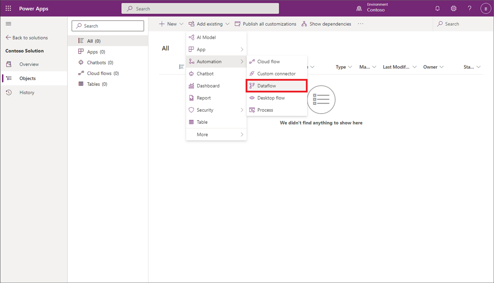
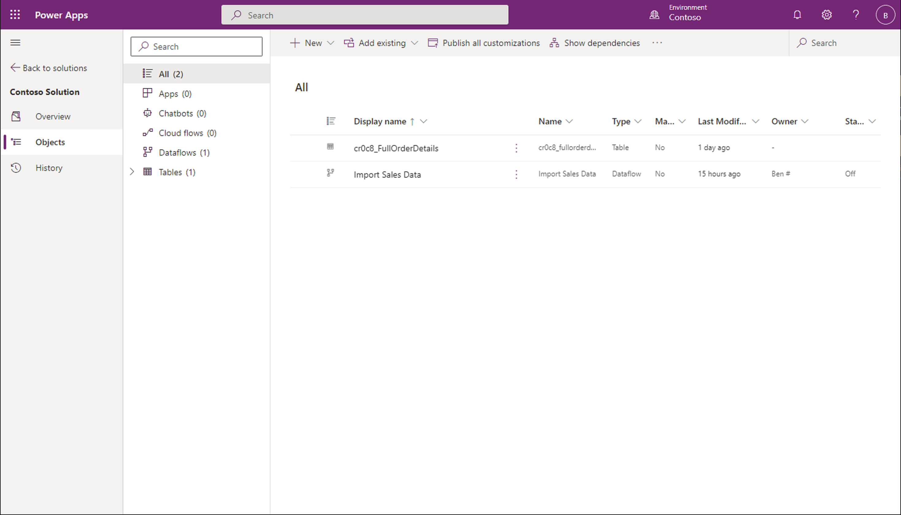
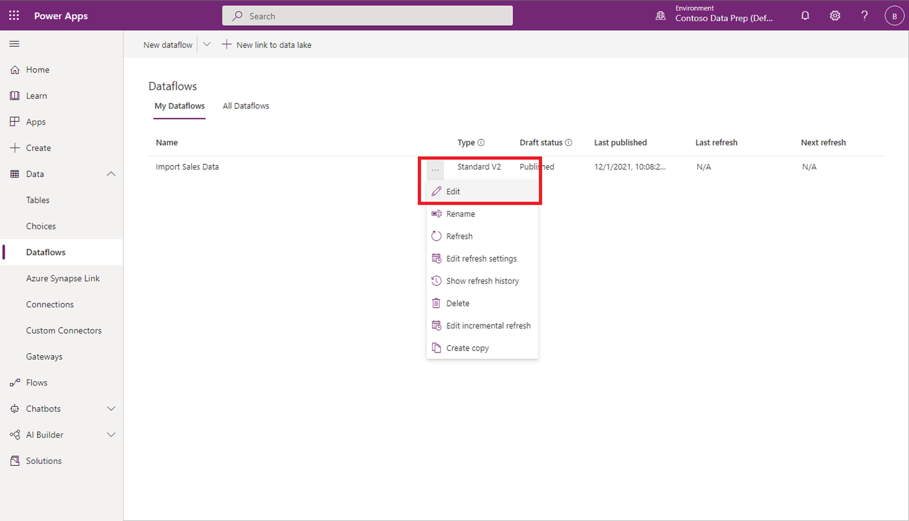
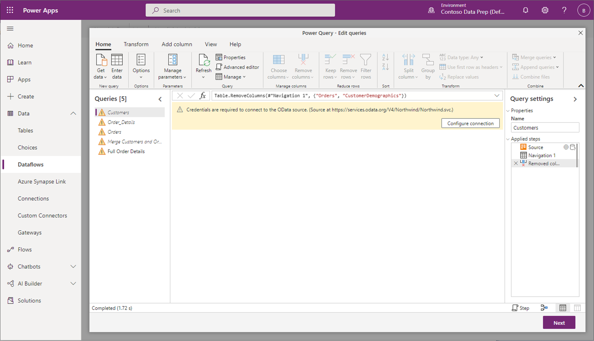
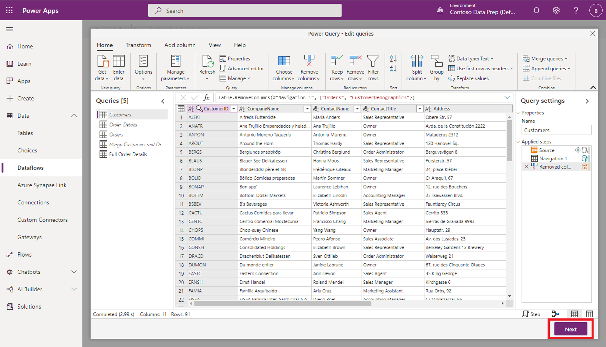
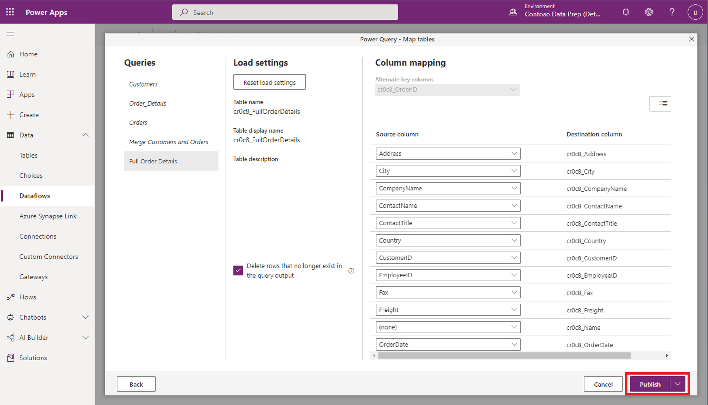

# Overview of solution-aware dataflows

When you include your dataflows in a solution, their definitions become portable, making it easier to move them from one environment to another, saving time required to author the dataflow.

A typical use case is for an independent software vendor (ISV) to develop a solution containing a dataflow, that extracts and transforms data from a data source into Dataverse tables, in a sandbox environment. The ISV would then move that dataflow and destination tables to a test environment to test with their test data source to validate the solution works well and ready for production. After testing completes, the ISV would provide the dataflow and tables to clients who will import them into their production environment to operate on Client’s data. This process is much easier when you add both the dataflows and tables they load data to into solutions, and then move the solutions and their contents between environments.

Dataflows added to a solution are known as *solution-aware* dataflows. You can add multiple dataflows in to a single solution.

> [!NOTE]
>
> * Only dataflows created in Power Platform environments can be solution-aware.
> * The data loaded by dataflows to their destination is not portable as part of solutions, only the dataflow definitions are. To recreate the data after a dataflow was deployed as part of a solution, you need to refresh the dataflow.

## Add an existing dataflow to a solution

Follow these steps to add a dataflow to a solution.

### Prerequisites

* You need to have created a solution before you can add a dataflow to it. More information: [Create solutions](/powerapps/maker/data-platform/create-solution)
* You need to be the owner of at least one dataflow in the environment. More information: [Create dataflows](/data-integration/dataflows/dataflows-integration-overview)

### Add the dataflow

1. Sign in to [Power Apps](https://powerapps.microsoft.com).
2. Select **Solutions** from the navigation bar.

   

3. Select the solution in which you'll add your dataflow to, and from the context menu select **Edit**.

   

4. Select **Add Exiting**, then **Automation** and finally, **Dataflow**.

   

5. Optional: If your dataflow loads data into a custom Dataverse Table, add the custom table to the solution as well.
   
   In this example, the dataflow we added to the solution loads data into a custom table called Full Order Details which we want to also include in the solution with the dataflow.

   Once both Dataflow and table it loads data to were added to the solution, it should appear like this:
    

   To save your work, be sure to publish all customizations. Now, the solution is ready for exporting from the source environment and importing to the destination environment.

## Exporting and Importing solutions containing dataflows

Exporting and importing solutions containing dataflows is identical to performing the same operations for other artifacts. For the most up-to-date instructions, see documentation on [exporting](/powerapps/maker/data-platform/export-solutions) and [importing](/powerapps/maker/data-platform/import-update-export-solutions) solutions.

## Updating a dataflow's connections after solution import

For security reasons, credentials of connections leveraged by dataflows are not persisted by solutions. Once a dataflow was deployed as part of a solution, you will need to edit its connections before it can be scheduled to run.

1. On the left navigation pane, select the down arrow next to **Dataverse** and select **Dataflows**. Identify the dataflow that was imported, and select **Edit** from the context menu:

   

2. In the Dataflow list, locate and double click on the dataflow that was added as part of the solution you’ve imported.

3. You will be asked to enter credentials required for the dataflow:

   

Once the credentials for the connection have been updated, all queries that leverage that connection should automatically load. 

4. If your dataflow loads data into Dataverse Tables, click next to review the mapping configuration.

   

5. The mapping configuration is also saved as part of the solution. Since we also added the destination table to the solutions, there is no need to re-create the table in this environment and you can publish the dataflow:

   
   
   Thats it. Your dataflow will now refresh and load data into the destiantion table.

## Knowns limitations

* Dataflows cannot be created from within solutions. To add a dataflow to a solution, follow the steps outlined in this article.
* Dataflows cannot be edited directly from within solutions. Instead, the dataflow should be edited in the Dataflows experience.
* Dataflows cannot use connection references for any connector.
* Environment Variables cannot be used by dataflows.
* Dataflows do not support adding required components such as custom tables they load data to. Instead, the custom table should be manually added to the solution.
* Dataflows cannot be deployed by application users (service principals).
