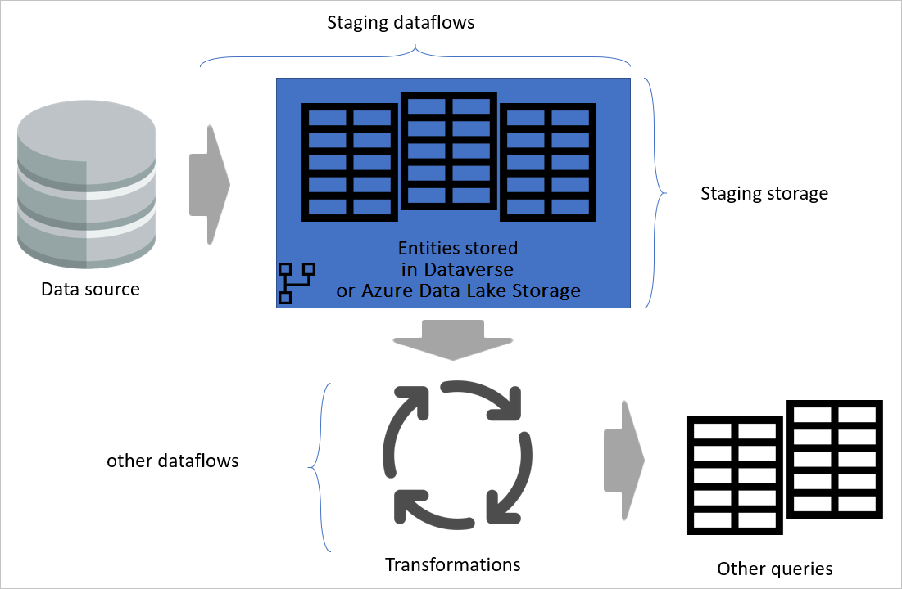
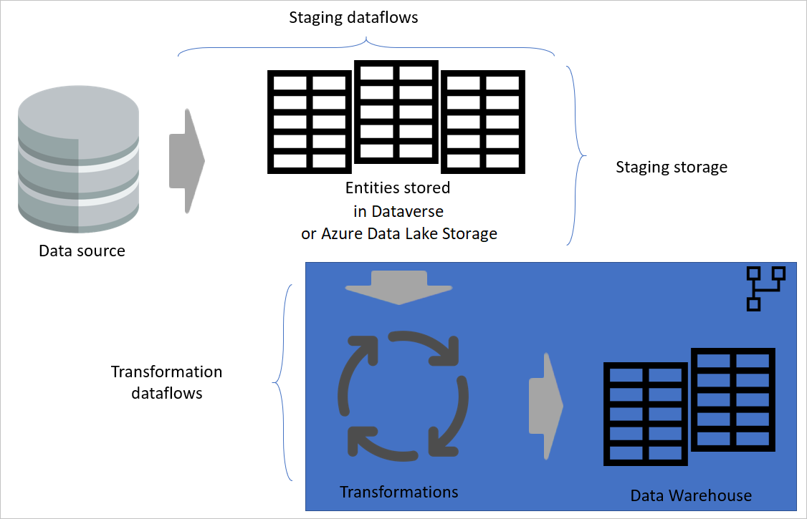
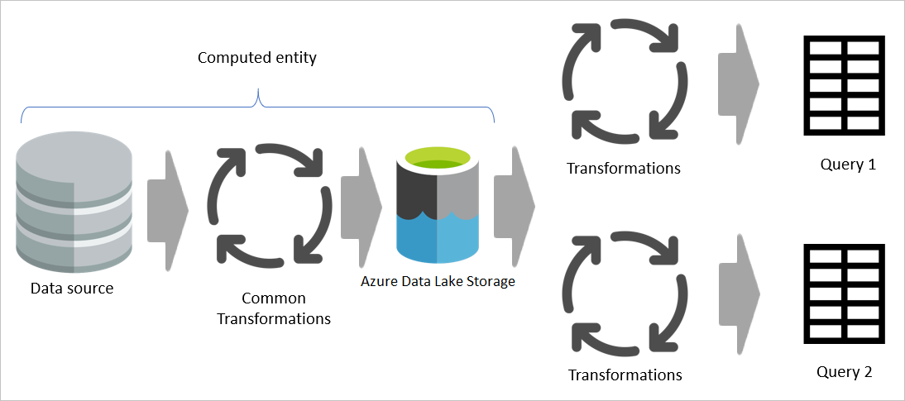
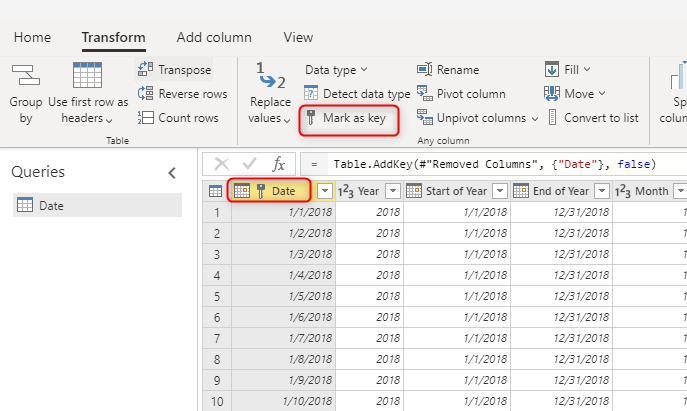
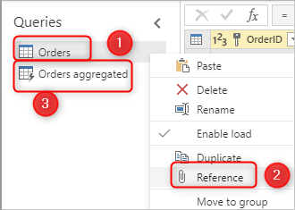

# Best practices for creating a data warehouse using dataflows

Designing a data warehouse is one of the most common tasks you can do with a dataflow. This article highlights some of the best practices for creating a data warehouse using a dataflow.

## Staging dataflows

One of the key points in any data integration system is to reduce the number of reads from the source operational system. In the traditional data warehouse architecture, this reduction is done by creating a new database called a staging database. The purpose of the staging database is to load data "as is" from the data source into the staging database on a scheduled basis.

The rest of the data integration will then use the staging database as the source for further transformation and converting it to the data warehouse model structure.

We recommended that you follow the same approach using dataflows. Create a set of dataflows that are responsible for just loading data "as is" from the source system (only for the tables that are needed). The result is then stored in the storage structure of the dataflow (either ADLS Gen2 or Common Data Services). This change ensures that the read operation from the source system is minimal.

Next, you can create other dataflows that source their data from staging dataflows. Benefits of this approach include:

- Reducing the number of read operations from the source system, and reducing the load on the source system as a result.
- Reducing the load on data gateways, if on-premise data sources is used
- Having an intermediate copy of the data for reconciliation purpose, in case the source system data changes.
- Making the transformation dataflows source-independent. 

## Transformation dataflows

When you have your transformation dataflows separate from the staging dataflows, the transformation will be independent from the source. This separation helps if there is migration of the source system to the new system. All you need to do in that case is to change the staging dataflows. The transformation dataflows should work without any problem, because they're sourced only from the staging dataflows.

This separation also helps in case the source system connection is slow. The transformation dataflow doesn't need to wait for long time to get records coming through the slow connection of the source system. The staging dataflow has already done that part and the data is ready for the transformation layer.

## Layered Architecture

A layered architecture is an architecture in which you perform actions in separate layers. The staging and transformation dataflows can be two layers of a multi-layered dataflow architecture. Trying to do actions in layers ensures the minimum maintenance required. When you want to change something, you just need to change it in the layer in which it's located. The other layers should all work perfectly fine.

The following image shows a multi-layered architecture for dataflows in which their entities are then used in Power BI datasets.

## Use a computed entity as much as possible

When you use the result of a dataflow in another dataflow you're using the concept of the computed entity, which means getting data from an "already-processed-and-stored" entity. The same thing can happen inside a dataflow. When you reference an entity from another entity, you can leverage the computed entity. This is essentially helpful when you have a set of transformations that needs to be done in multiple entities, or what is called a common transformation.

In the diagram above, the computed entity gets the data directly from the source. However, in the architecture of staging and transformation dataflows, it's likely the computed entities are sourced from the staging dataflows.

## Build a star schema

The best data warehouse model would be a star schema model that has dimensions and fact tables designed in a way to minimize the amount of time to query the data from the model, and also makes it easy to understand for the data visualizer.

It isn't ideal to bring data in the same layout of the operational system into a BI system. The data tables should be remodeled. Some of the tables should take the form of a dimension table, which is keeping the descriptive information. Some of the tables should take the form of a fact table, to keep the aggregable data. The layout that fact tables and dimension tables are designed is best to form a star schema. For more information about the star schema, see [Understand star schema and the importance for Power BI](https://docs.microsoft.com/power-bi/guidance/star-schema).

### Unique key value for dimensions

When building dimension tables, make sure you have a key for each dimension table. This ensures that no many-to-many (or in other terms, weak) relationship is needed between dimensions. You can create the key by applying some transformation to make sure a column or a combination of columns are returning unique rows in the dimension. Then that combination of columns can be marked as key in the entity in the dataflow.

### Incremental refresh for large fact tables

Fact tables are always the largest tables in the data warehouse. We recommend that you reduce the number of rows transferred for these tables. If you have a very large fact table, ensure that you use incremental refresh for that entity. An incremental refresh can be done in the Power BI dataset, and also the dataflow entities. 

Incremental refresh gives you options to only refresh part of the data, the part that has changed. There are multiple options to choose which part of the data to be refreshed and which part to be persisted. To learn more about incremental refresh in dataflows, see [Using incremental refresh with Power BI dataflows](https://docs.microsoft.com/power-bi/transform-model/service-dataflows-incremental-refresh).

## Referencing to create dimensions and fact tables

In the source system, you have often a table that you use for generating both fact and dimension tables in the data warehouse. These tables are good candidates for computed entities and also intermediate dataflows. The common part of the process, such as data cleaning, removing extra rows and columns, and so on, can be done once. Using a reference from the output of those actions, you can produce the dimension and fact tables. This approach will use the computed entity for the common transformations.

