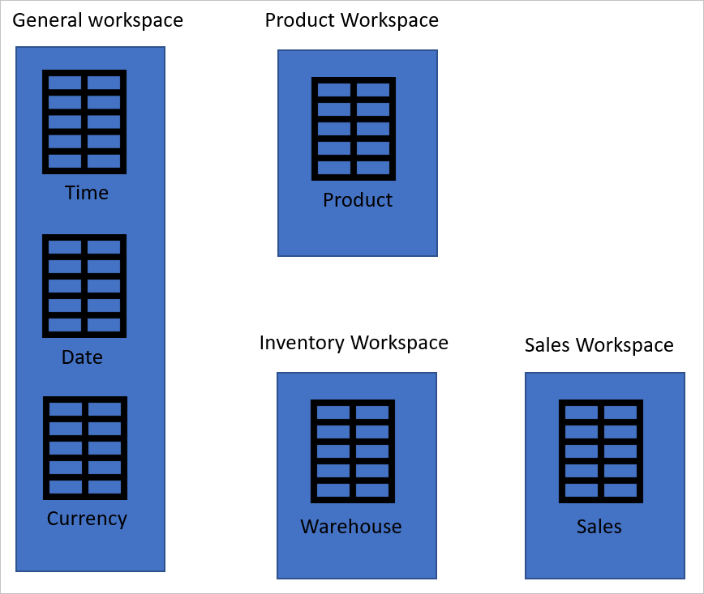

# Best practices for reusing dataflows across environments and workspaces

This article discusses a collection of best practices for reusing dataflows effectively and efficiently. Read this article to avoid design pitfalls and potential performance issues as you develop dataflows for reuse.

## Separate data transformation dataflows from staging/extraction dataflows
<!--Please see the editor's note in the "developing complex dataflows" best practices. These two articles have a lot of overlap, it would be good to add cross-references between them and really tighten them up so they're both focused on the subject of the article.-->
If a dataflow performs all actions, it's hard to reuse its entities in other dataflows or for other purposes. The best dataflows to reuse are those that perform only a few actions. Creating dataflows that specialize in one specific task is one of the best ways to reuse them. If you have a set of dataflows that you use as [staging dataflows](best-practices-for-data-warehouse-using-dataflows.md#staging-dataflows)<!--See note in the "developing complex dataflows" article.-->, their only action is to extract data as-is from the source system. These dataflows can be reused in multiple other dataflows.

If you have data transformation dataflows, you can split them into dataflows that perform common transformations. Each dataflow can perform a few actions. This ensures that the output of that dataflow is reusable by other dataflows.
<!--See notes about branding in this image in "developing complex dataflows" best practices.-->

## Use multiple workspaces

Each workspace (or environment) is available only for members of that workspace. If you build all your dataflows in one workspace, you're minimizing the reuse of your dataflows. You can have some generic workspaces for dataflows that are processing company-wide entities. You can also have some workspace for dataflows to process entities across multiple departments. And you can also have some workspaces for dataflows to be used only in specific departments.

## Set the correct access levels on workspaces

To give access to dataflows in other workspaces to use the output of a dataflow in a workspace, you just need to give them View access in the workspace. To learn more about other roles in a Power BI workspace, see [Roles in the new workspaces](https://docs.microsoft.com/power-bi/collaborate-share/service-new-workspaces#roles-in-the-new-workspaces).
<!--Is Megan Bowen a name from sample data? I don't see her in our list of approved names.-->

## Endorsement on the dataflow in Power BI

There can be many dataflows created in a tenant organization, and it can be hard for the users to know which dataflow is most reliable. Authors of a dataflow, or those who have edit access to it, can endorse the dataflow at three levels: no endorsement, promoted, or certified. 

These levels of endorsement help users find reliable dataflows easier and faster. The dataflow with a higher endorsement level appears first. The Power BI administrator can delegate the ability to endorse dataflows to the certified level to other people. More information: [Promote or certify dataflows (Preview)](https://docs.microsoft.com/power-bi/transform-model/service-dataflows-promote-certify)

