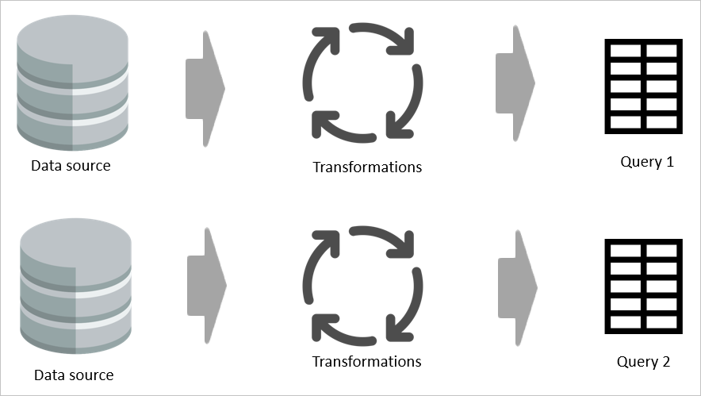

# Computed entities scenarios and use-cases

There's a great benefit in using the computed entity in the dataflow. This article explains uses cases and how they work behind the scenes in the transformation.

## What is computed entity?

A computed entity is an entity that is already processed through Power Query in the dataflow, and the result of that processing is saved in storage. In analytical dataflows, that means the data is stored in Azure Data Lake Storage Gen2. In other words, computed entities are intermediate entities used to pass the data to other entities. And the data of that intermediate entity is saved in storage too.

## Why is it good to use computed entity?

Doing all the transformation steps in one shot against the data source can sometimes be slow. There can be many reasons for that slowness&mdash;the data source might be slow, and some of the transformations that you're doing might need to be replicated in two or more queries. Having part of the transformations done and stored as a computed entity helps in the performance of the dataflow.

For example, if two entities are sharing even a part of their transformation logic, without a computed entity the transformation will have to be done twice.

However, if a computed entity is used, then the common (shared) part of the transformation will be processed once and stored in Azure Data Lake Storage Gen2. The remaining transformations will then be processed from the output of the common transformation. Overall, this processing is much faster.

A computed entity not only helps by having one place as the source code for the transformation. In addition, a computed entity will also speed up the transformation because the transformation will be done only once instead of multiple times. The load on the data source will also be reduced.

## Example scenario using a computed entity

If you're building an aggregated table in Power BI to speed up the data model, your aggregated table can be build with a reference to the original table and then doing some extra transformations on it. Using this approach, you don't replicate your transformation from the source (the part that is for the original table)

For example, the following figure shows an **Orders** entity.

Using a reference from this entity, you can build a computed entity.

The computed entity can have further transformations. For example, you can use **Group By** to aggregate the data at the customer level.

This means that the **Orders Aggregated** entity will be getting data from the **Order** entity (not from the data source again). Since some of the transformations that need to be done have already been done in the **Orders** entity, performance is better and data transformation is faster.

## Computed entity in other dataflows

You can also create a computed entity in Power Platform dataflows or Customer Insights dataflows. It's not called a computed entity in Power Platform dataflows. But it can be created by first creating one dataflow, and then creating a second dataflow by getting data from Power Platform dataflows.

The whole concept of a computed entity is to have a table persisted in storage, and other tables sourced from it, so that you can reduce the read time from the data source, and share some of the common transformations. This can be achieved by getting data from other dataflows in Power Apps portal, or by referencing another query in Power BI dataflows.

## Computed entity with transformations or without?

Now that you know that a computed entity is good for the performance of data transformation, a good question is whether you should be doing any data transformations in the computed entity? Or should the computed entity be merely a data ingestion from the data source? What are pros and cons?

### Load data without transform for Text/CSV files

If the data source doesn't support query folding (such as Text/CSV files), then there's little benefit in doing a transformation when getting data (inside the computed entity). The computed entity can only get data from the Text/CSV file without any transformations.

Other entities that are getting data from the computed entity can do the transformation on top of it.

A computed entity that loads raw data from the source without any transformation can be still helpful because it reduces the load on the data source. This can be beneficial, especially in scenarios where the data source is on a heavy load.

### Doing some of the common transformations for a SQL table

If your data source supports query folding, then it's a good idea to do some of the transformations in the computed entity. Performance will be improved because the query is folded to the data source, and only the transformed data is fetched from it. The set of transformations you apply in the computed entity can be those that are common between other entities, and can be folded.

