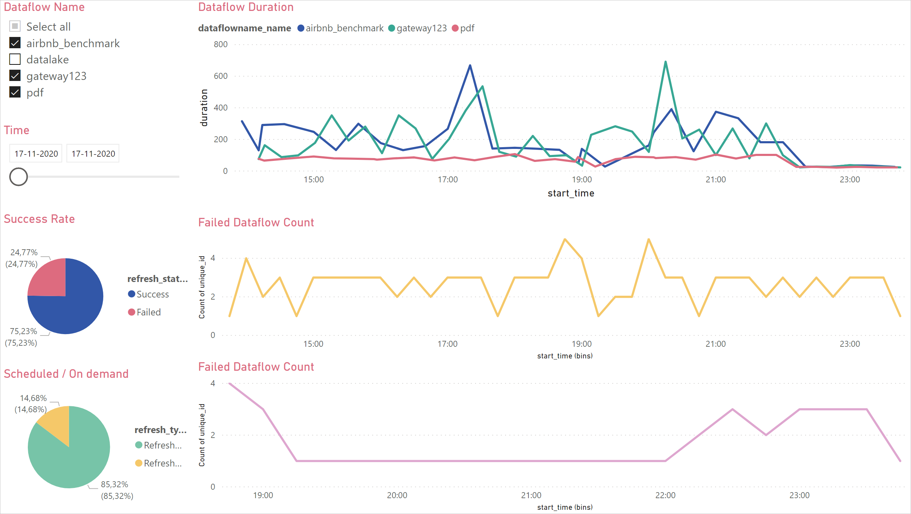

# Power Automate Templates for the Dataflows Connector

The dataflows Power Automate connector can:
* trigger a flow when a dataflows refresh completes, or
* take action to initiate a dataflows refresh.

In this article, we discuss some use cases with provided templates to help you quickstart the use of this connector:

[Send notifications](send-notification-when-dataflow-refresh-completes.md):
* When a dataflow refresh status changes, send an email notification.
* When a dataflow succeeds or fails, send an email notification.
* When a dataflow refresh status changes, send a Teams notification.

[Open support tickets](open-support-ticket-when-dataflow-refresh-completes.md):
* When a dataflow refresh fails, send a message to Azure Service Bus queue to open a support ticket. 

[Refresh dataflows and datasets sequentially](trigger-dataflows-and-power-bi-dataset-sequentially.md):
* When you click on a button, initiate a dataflow refresh.
* When an analytical dataflow refresh succeeds, initiate a standard dataflow refresh.
* When a dataflow refresh succeeds, initiate a Power BI dataset refresh.
* When a file in SharePoint is updated, initiate a dataflow refresh.

Save dataflow refresh metadata and build a dataflows monitoring dashboard:
* [When a dataflow refresh completes, save metadata to a Dataverse table](load-dataflow-metadata-into-dataverse-table.md)
* [When a dataflow refresh completes, save metadata to Excel online](load-dataflow-metadata-into-excel-online.md)
* [When a dataflow refresh completes, save metadata to a Power BI streaming dataset](load-dataflow-metadata-into-power-bi-dataset.md)

