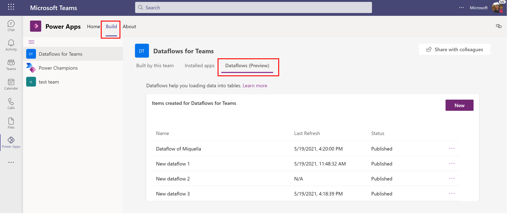
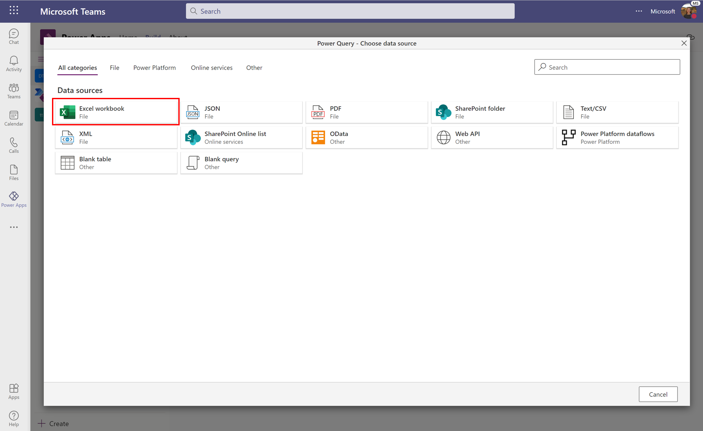
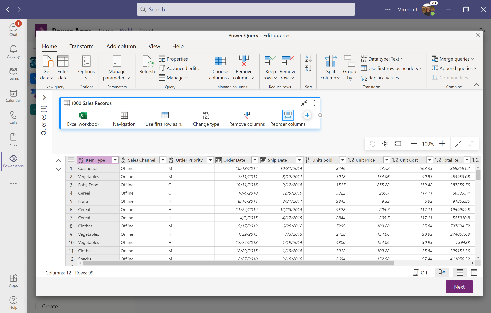
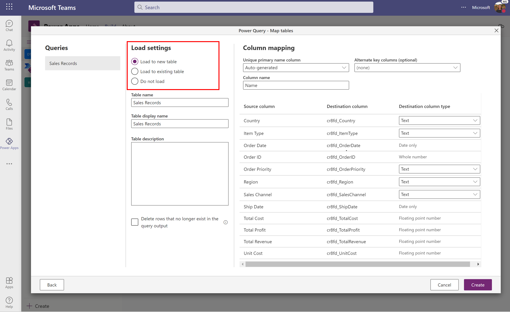

# Create and use dataflows in Microsoft Teams (Preview)

> [!NOTE]
> We are rolling out Dataflows for Teams gradually. This feature might not be avaiable in your region yet.

[Microsoft Dataverse for Teams](/powerapps/teams/overview-data-platform) delivers a built-in, low-code data platform for Microsoft Teams. It provides relational data storage, rich data types, enterprise-grade governance, and one-click solution deployment. Dataverse for Teams enables everyone to easily build and deploy apps.

Before today, the way to get data into Dataverse for Teams was by manually adding data directly into a table. This process can be prone to errors and isn't scalable.  But now, with self-service data prep you can find, clean, shape, and import your data into Dataverse for Teams.  

With your organizational data already sitting in a different location, you can use Power Query dataflows to directly access your data through the connectors and load the data into Dataverse for Teams. When you update in your organizational data, you can refresh your dataflows by just one click and the data in Dataverse for Teams is updated too. You can also use the Power Query data transformations to easily validate and clean your data and enforce data quality for your Apps.

[Dataflows](overview-dataflows-across-power-platform-dynamics-365.md) were introduced to help organizations retrieve data from disparate sources and prepare it for consumption. You can easily create dataflows using the familiar, [self-service Power Query](../power-query-what-is-power-query.md) experience  to ingest, transform, integrate, and enrich data. When creating a dataflow, you'll connect to data, transform the data, and load data into Dataverse for Teams tables.  Once the dataflow is created, it begins the process of importing data into the Dataverse table. Then you can start building apps to leverage that data.

## Create a dataflow from the dataflows page

In this example, you're going to load data from an Excel file that's located on OneDrive into Dataverse for Teams.

1. Sign in to [Teams web version](https://teams.microsoft.com/), and then select the link for **Power Apps**.

2. Select the **Build** tab, and then select **Dataflows (Preview)**.

   

3. To create a new dataflow, select the **New** button.

   

4. Select the **Excel workbook** connector.

   

5. Enter a URL address in **File path or URL**, or use the **Browse OneDrive** button to navigate through your OneDrive folders. Select the file you want, and then select the **Next** button. For more information about using the OneDrive connection or getting data, see [SharePoint and OneDrive for Business files import](../sharepoint-onedrive-files.md) or [Getting data](../get-data-experience.md) from other sources.

6. In **Navigator**, select the tables that are present in your Excel file. If your Excel file has multiple sheets and tables, select only the tables you're interested in. When you're done, select **Transform data**.

7. Clean and transform your data using Power Query. You can use the out-of-the box transformations to delete missing values, delete unnecessary columns, or to filter your data. With Power Query, you can apply more than 300 different transformations on your data. To learn more about Power Query transformations, see [Use Power Query to transform data](../power-query-ui.md). After you're finished with preparing your data, select **Next**.

   

8. In **Map tables**, select **Load to new table** to create a new table in Dataverse for Teams. You can also choose to load your data into an existing table. In the **Map tables** screen, you can also specify a **Unique primary name column** and an **Alternate key column (optional)**. In this example, leave these selections with the default values. To learn more about mapping your data and the different settings, see [Field mapping considerations for standard dataflows](get-best-of-standard-dataflows.md).

   

9. Select **Create** to finish your dataflow. Once you’ve created your dataflow, data begins loading into Dataverse for Teams. This process can take some time and you can use the management page to check the status. When a dataflow completes a run, its data is available to use.

## Managing your dataflows

You can manage any dataflow you created from the **Dataflows (Preview)** tab. Here, you can see the status of all dataflows, when your dataflow was last refreshed, and take action from the action bar.

In the **Last Refresh** column, you can see when your data was last refreshed. If your refresh failed, an error indication appears. If you select the error indication, the details of the error and recommended steps to address it appear.

In the **Status** column, you can see the current status of the dataflow. Possible states are:

* **Unpublished**: the dataflow is saved as a draft, and you can finish authoring your dataflow later.
* **Publishing in progress**: the dataflow is being published.
* **Published**: the dataflow is published and ready to load data into Dataverse. Only a published dataflow can be refreshed.
* **Refresh in progress**: the dataflow is extracting, transforming, and loading your data from the source to the Dataverse Tables. This process can take several minutes depending on the complexity of transformations and data source's performance. We recommend that you check the status of the dataflow frequently.

To navigate to the action bar, select the three dots “…” next to your dataflow.

Here you can:

* **Edit** your dataflow if you want to change your transformation logic or mapping.
* **Rename** your dataflow. At creation, an autogenerated name is assigned.
* **Refresh** your dataflow. When you refresh your dataflows, the data will be updated.
* **Delete** your dataflow.
* **Show refresh history**. This gives you the results from the last refresh.

Select **Show refresh history** to see information about the last refresh of your dataflow. When the dataflow refresh is successful, you can see how many rows were added or updated in Dataverse. When your dataflow refresh wasn't successful, you can investigate why with the help of the error message.

## Dataflows in Teams is a lightweight version

Dataflows in Teams are a lightweight version of dataflows in the maker portal and can only load data into Dataverse for Teams. Dataflows in Teams are optimized for a one-time import of data, but you can refresh your data manually through the refresh button in the dataflow management page. If you want full dataflows functionality, you can [upgrade your environment](/power-platform/admin/about-teams-environment).

Supported data sources in dataflows in Teams are:

* Excel (OneDrive)
* Text/CSV (OneDrive)
* PDF (OneDrive)
* SharePoint Online Folder
* SharePoint Online list
* XML (OneDrive)
* JSON (OneDrive)
* OData
* Web API

> [!NOTE]
> Dataflows in Teams don't support non-premises data sources, such as on premises file locations.

The following table lists the major feature differences between dataflows for Dataverse in Teams and dataflows for Dataverse.

| **Dataflow capability** | **Dataverse for Teams** | **Dataverse** |
| --- | --- | --- |
| Standard dataflows | Yes |  Yes |
| Analytical dataflows | No | Yes |
| Gateway support | No | Yes |
| Manual refresh | Yes | Yes |
| Scheduled refresh | No | Yes |
| Incremental refresh | No | Yes |
| Standard tables | No | Yes |
| Custom tables | Yes | Yes |
| Full PQ functionality | Yes | Yes |
| Supported connectors | [Subset of connectors](../Connectors/index.md)| [All connectors](../Connectors/index.md)|
| Small data volumes | Yes | Yes |
| Larger data volumes | No 1 | Yes |

1 Although there's no limitation on the amount of data you can load into Dataverse for Teams, for better performance in loading larger amounts of data, we recommend a Dataverse environment.
