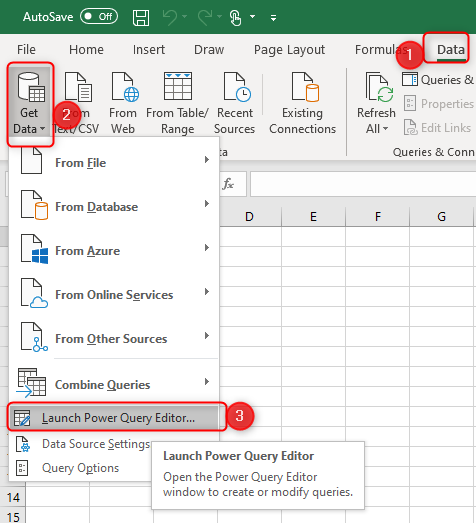
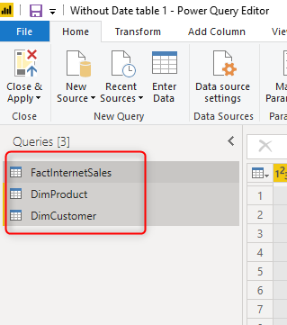
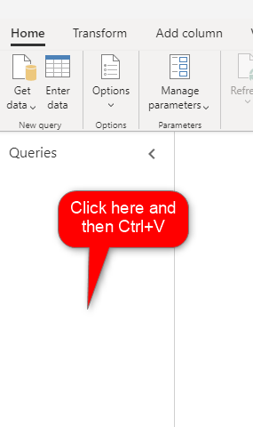

# How to migrate queries from Power Query in the desktop (Power BI and Excel) to dataflows

If you already have queries in Power Query, either in Power BI Desktop or in Excel, you might want to migrate the queries into dataflows. The migration process is simple and straightforward. In this article, you'll learn the steps to do so.

## Copy queries from the Desktop

Follow these steps to copy queries from Power Query in the desktop tools (such as Excel or Power BI): 

1. In Power BI Desktop, open Power Query Editor by selecting **Transform Data** in the **Home** ribbon.

2. In Excel, this option is under **Data > Get Data > Launch Power Query Editor**.

## If you have folders

If you've organized your queries into folders (which are called groups in Power Query), then copy them using the method below.

In the **Queries** pane, select the folders you want to migrate to the dataflow by holding the **Ctrl** key on the keyboard, and then the mouse-left-click. Once you've selected all the folders, copy them all using **Ctrl+C**.

## If you don't have folders

If you aren't using folders in the Power Query, then you can select queries using the same approach of holding the **Ctrl** key on the keyboard, and then the mouse-left click. Once you've selected all the queries, copy them all using **Ctrl+C**.

### Paste the copied queries into a dataflow

1. Create a dataflow if you don't have one already.

   

   The following articles will help you create the dataflow in Power BI or Power Platform:

   -   [Create and use dataflows in Power Platform](https://docs.microsoft.com/data-integration/dataflows/dataflows-integration-overview)
    
   -   [Creating and using dataflows in Power BI](https://docs.microsoft.com/power-bi/service-dataflows-create-use)

2. Paste the copied folders or queries in the **Queries** pane of the dataflow's Power Query Editor using **Ctrl+V**.

   

   The image below shows an example of copied folders.

   

### Connect the on-premises data gateway

If your data source is an on-premises source, then you need to perform an extra step. Examples of on-premises sources can be Excel files in a shared folder in a local domain, or a SQL Server database hosted in an on-premises server.

Dataflow, as a cloud-based service, requires the on-premises data gateway to connect to the on-premises data source. If the source is an on-premises source, you should [install and configure the gateway](https://docs.microsoft.com/data-integration/gateway/service-gateway-install) for that source system, and then add [the data source for it](https://docs.microsoft.com/data-integration/gateway/service-gateway-manage). Once you completed these steps, you can select the on-premises data gateway when creating the entity in the dataflow.

The gateway isn't needed for data sources residing in the cloud, such as an Azure SQL Database.

### Configure Connection

In the next step, configure the connection to the data source using the **Configure connection** option, enter credentials, or anything else needed to
connect to the data source at this stage.

### Verification

If you've done all the steps successfully, you should see a preview of the data in the Power Query Editor.

## Some Power Query Desktop functions aren't available in Power Query Online

Remember that although most of your queries can be migrated after setting up the connection or the gateway, if needed, there are a few that won't. Because not all the functions that are supported in Power Query in desktop are supported in Power Query Online, used by dataflows. If this happens, you might get an error message indicating which specific function isn't supported. The figure below shows an example of one of these scenarios.

If a scenario like this happens, you need to update the query in the dataflow's Power Query editor using a set of steps that are supported in the experience. The list of functions that aren't yet supported in the dataflow is minimal, and functions are getting supported gradually.

## Refresh the dataflow entities

After migrating your queries to the dataflow, You must refresh the dataflow to get data loaded into these entities. You can refresh a dataflow manually, or configure an automatic refresh based on a schedule of your choice.

## Get Data from Power Query Desktop

You can now get data from dataflow entities in Power BI Desktop using the dataflow or Common Data Services connectors (depending on what type of dataflow you're using, analytical or standard).

To learn more about how to get data from dataflow entities in Power Query Desktop, see [Connect to data created by Power Platform dataflows in Power BI Desktop](https://docs.microsoft.com/power-bi/desktop-connect-dataflows).
