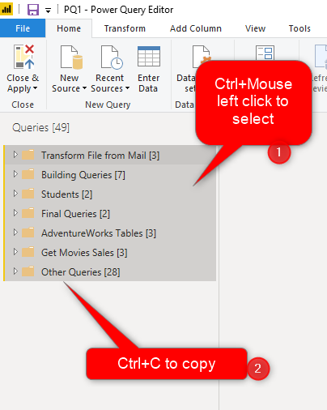

# How to migrate queries from Power Query in the desktop (Power BI and Excel) to dataflows

If you already have queries in Power Query, either in Power BI Desktop or in Excel; you might want to migrate the queries now into dataflows. Although there's no migration tool or service available at this stage, the migration process is pretty simple and straightforward. In this article, you'll learn steps to do so.

## Copy queries from the Desktop

To copy queries from the Power Query in the Desktop tools (such as Excel or Power BI): 

1. In Power BI Desktop Go to Power Query Editor, which can be done by clicking on **Transform Data** in the Power BI Desktop or Excel.

2. In Excel this option is under the Data tab, Get Data, and then **Launch Power Query Editor**

## If you have folders

If you have organized your queries into folders (which is called groups in Power Query), then copy them using the method below;

In the **Queries** pane, select the folders you want to migrate to the dataflow by holding the **Ctrl** key on the keyboard, and then the mouse-left-click, once you have selected all the folders, copy them all using **Ctrl+C**.

## If you don't have folders

If you are not using folders in the Power Query, then you can simply select queries using the same approach of holding the Ctrl key on the keyboard, and then the mouse-left click, once you have selected all the queries, copy them all using **Ctrl+C**.

### Paste the script into the dataflow

1. Create a dataflow if you don't have one already.

The following articles will help you create the dataflow in Power BI or Power Platform:

-   [Create and use dataflows in the Power Platform](https://docs.microsoft.com/data-integration/dataflows/dataflows-integration-overview)
    
-   [Creating and using dataflows in Power BI](https://docs.microsoft.com/power-bi/service-dataflows-create-use)

2. Paste the copied folders or queries in the **Queries** pane of the dataflow Power Query Editor using **Ctrl+V**

   

3. below is an example of copied folders;

   

### Connect the on-premises data gateway

If your data source in an on-premises source, then you need to do this extra step. On-premises sources can be Excel files in a shared folder in a local
domain, or a SQL Server database hosted in an on-premises server.

Dataflow, as a cloud-based service, requires the on-premises data gateway to connect to the on-premises data source. If the source is an on-premises source, you should [install and configure the gateway](https://docs.microsoft.com/data-integration/gateway/service-gateway-install) for that source system, and then add [the data source for it](https://docs.microsoft.com/data-integration/gateway/service-gateway-manage). Once these are all ready, you can select the on-premises data gateway when creating the entity in the dataflow.

The gateway is not needed if the data source is not an on-premises data source, such as the Azure SQL Database, for example.

### Configure Connection

In the next step, configure the connection to the data source using the **Configure connection** option, enter credentials, or anything else needed to
connect to the data source at this stage.

### Verification

If you've done all the steps successfully, you should see the data values in the dataflow entity. 

## Some Power Query functions are not available

Remember that although most of your queries will be working just fine after setting up the gateway and connection configuration, there are a few which won't. Because not all the functions that are supported in Power Query in desktop tools are yet fully supported in the Power Query in the dataflow, you might get an error message when you use specific functions. Below is an example of one of these scenarios;

If a scenario like this happens, you need to re-develop your query in the Power Query using a set of steps that are supported in the dataflow. The list of functions that are not yet supported in the dataflow is minimal, and functions are getting supported gradually. 

## Refresh the dataflow entities

After migrating your queries to the dataflow, set up a scheduled refresh for your dataflow. You have to refresh the dataflow to get data loaded into these
entities. You can also do it for the first time as a manual refresh.

## Get Data from Power Query Desktop

You can get data from the dataflow entity now in Power BI Desktop using Power BI dataflows, Power Platform dataflows, or Common Data Services (depends on what type of dataflow you're using).

To learn more about how to get data from dataflow entities in the Power Query Desktop, see [Connect to data created by Power Platform dataflows in Power BI Desktop](https://docs.microsoft.com/power-bi/desktop-connect-dataflows).
