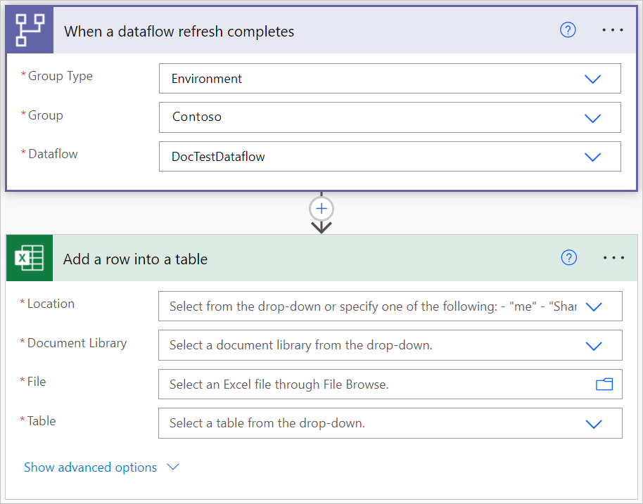
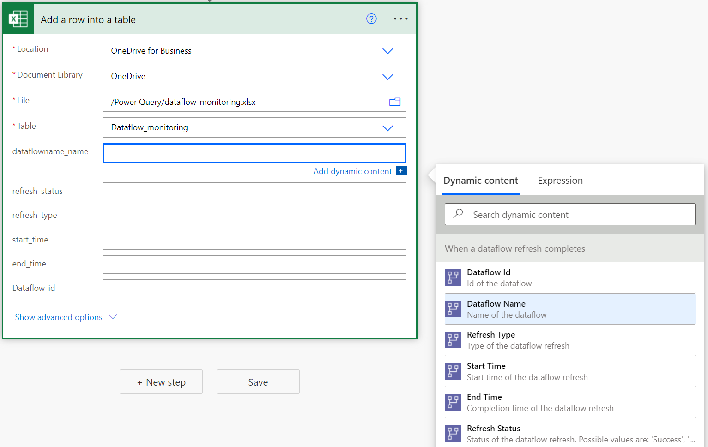

# Load Data into Excel Online and build a dataflows monitoring report with Power BI

In this step-by-step example we will show you how to set up your own monitoring dashboard for Power BI and/or Power Platform dataflows:

You can use this dashboard to monitor your Dataflows Duration and Failure count. This way you can easily track any issues with your dataflows performance and share with others.

First, we are going to download the `.xlsx` file from this reposotory and save it on our OneDrive for Business or SharePoint. Next, we are going to create a Power Automate connector that will load meta-data from Dataflows into the excel file on the Onedrive or Sharepoint. After that, we are going to connect the Power BI file to the Excel file, so we can visualize the meta-data and start monitoring our dataflows.

## Requirements

* Download and Install [Power BI Desktop](https://www.microsoft.com/download/details.aspx?id=58494)

* Dowload and Install [Microsoft Excel](https://www.microsoft.com/en/microsoft-365/excel)

* [OneDrive for Business](https://www.microsoft.com/en/microsoft-365/onedrive/onedrive-for-business)

* [Power Automate Premium Licence](https://docs.microsoft.com/power-platform/admin/pricing-billing-skus)

* A dataflow in [Power BI Dataflows](https://docs.microsoft.com/power-bi/transform-model/dataflows/dataflows-introduction-self-service) or [Power Platform Dataflows](https://docs.microsoft.com/powerapps/maker/common-data-service/create-and-use-dataflows#:~:text=Create%20a%20dataflow%201%20Sign%20in%20to%20Power,entities%20to%20be%20stored.%20...%20Mais%20itens...%20)

## Download the .pbit file

[Download excel .pbit file](https://download.microsoft.com/download/1/4/E/14EDED28-6C58-4055-A65C-23B4DA81C4DE/excel-template.pbit)

## Download the Excel file and Save to OneDrive
* [Dowload .xlsx file](https://download.microsoft.com/download/1/4/E/14EDED28-6C58-4055-A65C-23B4DA81C4DE/dataflow_monitoring.xlsx)
* Save the file to a location on OneDrive

## Create a dataflow
If you do not already have one, create a Dataflow. This can be done in either [Power BI Dataflows](https://docs.microsoft.com/power-bi/transform-model/dataflows/dataflows-introduction-self-service) or [Power Apps Dataflows](https://docs.microsoft.com/powerapps/maker/common-data-service/create-and-use-dataflows).

## Create a Power Automate Flow
* Navigate to [Power Automate Portal](https://flow.microsoft.com)
* Search for the template **When a dataflows refresh completes, output status into Excel**, by following these [instructions](https://docs.microsoft.com/power-automate/get-started-logic-template)

* Customize the flow
    Actions that require input from you will automatically be expanded.

   The **Dataflow Refresh** trigger is expanded because you need to enter *Dataflow*. You need to enter the following information:
   * **Group Type**: Choose *Environment* when connection to Power Apps and *Workspace* when connecting to Power BI
    * **Group**: Select the Power Apps environment or the Power BI workspace you dataflow is in
    * **Dataflow**: Select your dataflow by name

     The **Add a row into a table** action is expanded because you need to enter you *Location* of the excel file and the specific *Table* the data need to load to.
   * **Location**: The lcoation of the Excel file. Either *OneDrive for Business* or a *SharePoint Site*
    * **Document Library**: The lirary of the excel file
    * **File**: The exact location of the `.xlsx` file
    * **Table**: The name of the Table to load the data into. The table is called *Datflow-monitoring*.

* Add dynamic values to the required fields

    For every required field, we are going to add a dynamic value. This value is the ouput of the meta-data of the dataflow run. 
    * click on the field  next to **Dataflow_name** and then click on the *lightning* button.

    * Add the Dataflow Name as the dynamic content

    * Repeat this proces for all required fields
  

* `Save` the flow

## Create Power BI Report
* open the `.pbit` file
* connect to your Excel file

In this dashboard, you can monitor, for every dataflow, in your specified time interval:
* Dataflow duration
* Dataflow count
* Dataflow failure count

Note: The uniqueID for every dataflow is generated by a merge between Dataflow name and Start time.
