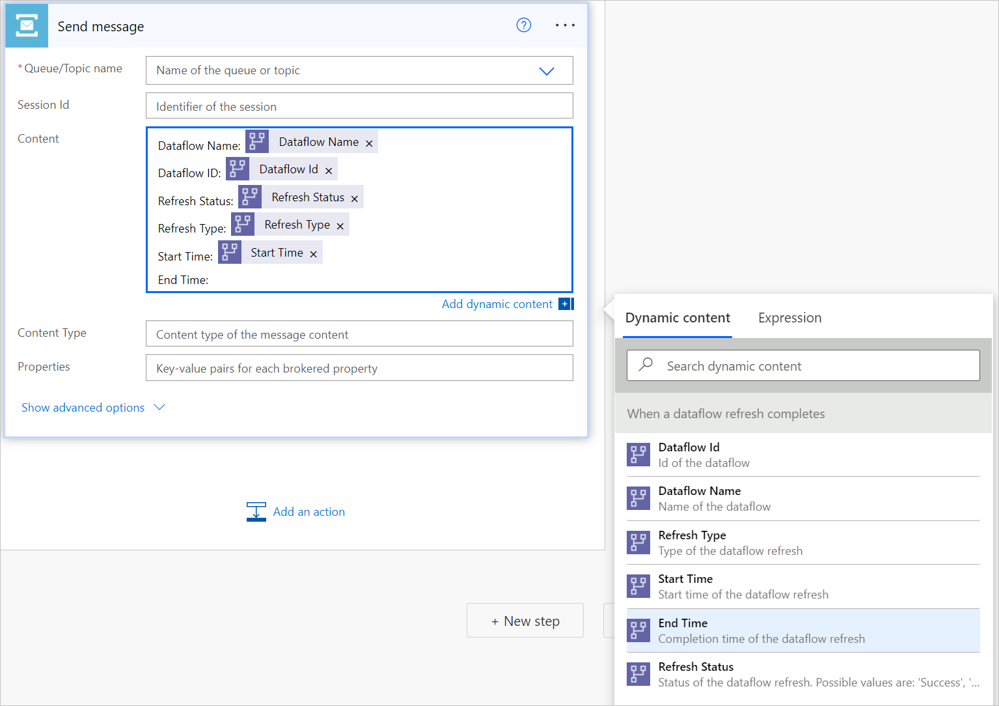

# Open a Ticket when a Dataflow Refresh Fails

## Introduction

When your dataflow refresh completes or has been taking longer than expected, you may want your support team to investigate. With this tutorial, you can automatically open a support ticket, create a message in a queue or Service Bus or add an item to Azure DevOps to notify your support team.

## Automatically Create a Queue in Azure Service Bus

In this template, we make use of Azure Service Bus. To set up an Azure Service Bus and create a queue, see these [instructions](/azure/service-bus-messaging/service-bus-quickstart-portal#create-a-namespace-in-the-azure-portal).

* Navigate to [Power Automate Portal](https://flow.microsoft.com)

* Search for the template "When a dataflow refresh fails, add a new message to the queue". If you encounter difficulty, see these [instructions](/power-automate/get-started-logic-template).

* Customize the flow. Actions that require input from you will automatically be expanded.

   The **Dataflow Refresh** trigger is expanded because you need to enter information on your dataflow:
    * **Group Type**: Select *Environment* when connecting to Power Apps and *Workspace* when connecting to Power BI.
    * **Group**: Select the Power Apps environment or the Power BI workspace your dataflow is in.
    * **Dataflow**: Select your dataflow by name.

* After the conditions, you can specify what happens after success or failure of the dataflow. In this template, in both cases an email is sent with the status of the dataflow refresh. You can also modify the flow or message content. 

