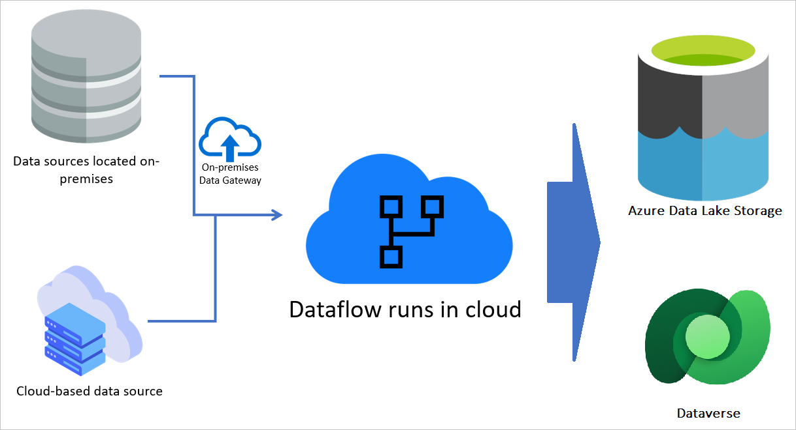
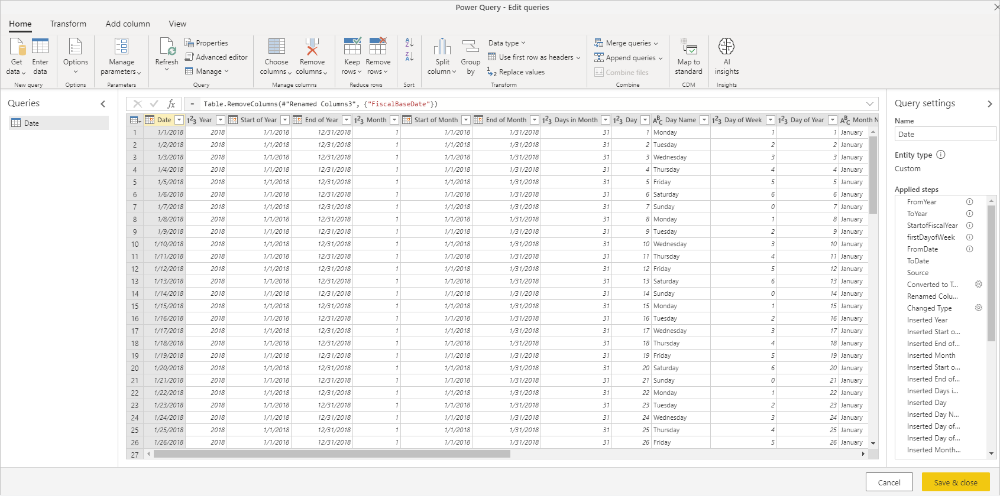

# An overview of dataflows across Power Platform and Dynamics 365

A dataflow is a data integration component that not only serves in Power BI solutions but also helps in Power Platform solutions and Dynamics implementations. In this article, you'll learn what a dataflow is, and how it can help in different platforms. This article is not about creating a dataflow. It is more about introducing dataflows and showcasing some of their use-cases in real-world scenarios.

## What is dataflow?

A dataflow is a data integration service. It populates data from one or multiple sources, applies some data transformations to it, and stores the result in a destination. In the traditional Data Warehousing terminologies, tools such as a dataflow are often called ETL tools (stands for Extract, Transform, Load). A dataflow uses the transformation engine of Power Query. Depending on which version of the dataflow you use, the destination can be different.

### How does the dataflow function?

The diagram above shows an overall view of how a dataflow functions. A dataflow gets data from different data sources (there more than 80 data sources supported already). Dataflows transform the data using the Power Query engine. Finally, it stores the output in a destination, which can be only either Azure Data Lake Gen 2 or Common Data Services.

### Dataflows run on the cloud.

A dataflow is a cloud-based service; it runs entirely on the cloud. However, to access some of the data sources that might come from on-premises, it can also use the on-premises data gateway application.

The data transformation computation of a dataflow runs on the cloud, and the destination is always on the cloud. Azure Data Lake Gen 2 or Common Data Services are both cloud-based data storage systems. The source, however, can be on-premises or cloud-based. If it's on-premises, a dataflow uses an on-premises data gateway connection to get data from that source.

### Dataflow uses a powerful transformation engine

Power Query is the data transformation engine used in the dataflow. This engine is strong enough to support many advanced transformations, it is also leveraging a straightforward, yet powerful graphical user interface called Power Query Editor. Using the dataflow enables developers to use this editor to develop their data integration solutions much faster and easier.

### Dataflow integration with Power Platform and Dynamics 365

Because a dataflow stores the result in Azure Data Lake Gen 2 or Common Data Service, other Power Platform services can interact with the data produced by the dataflow.

Power BI, Power Apps, Power Automate, Power Virtual Agent, and Dynamics can interact with Azure Data Lake Gen 2 or Common Data Service to get the data produced by the dataflow.

## Benefits of dataflows

The scenarios you have read above are good examples of how a dataflow can be beneficial in real-world use-cases. The following list describes these benefits in more detail:

- A dataflow is decoupling the data transformation layer from the modeling and visualization layer in a Power BI solution.
- The data transformation code can be only in one place, a dataflow, rather than spread about in multiple files.
- A dataflow developer would need only Power Query skills. In a multi-developer environment, the dataflow developer can be part of a team that together build the whole BI system or an operational application.
- A dataflow is product-agnostic. It's not a component of Power BI only; You can use it in other tools and services.
- It provides a powerful data transformation graphical interface using Power Query.
- It's running entirely on the cloud. No extra infrastructure is needed.
- There are multiple ways of working with it, using different licenses for Power BI and Power Platform.
- Although dataflows are capable of advanced transformations, it's a simple service to use for data analysts, even without having a developer or IT background.

## Use-case scenarios for dataflows

You can use dataflows for many purposes. The following scenarios provide a few examples of common use-cases for dataflows.

### Data migration from legacy systems

In this scenario, the decision has been made by an organization to use Power Apps for the new user interface experience rather than the old on-premises system. Power Apps is using Common Data Service as the primary data storage system, because it also uses AI functionalities that AI builder provides for object detection, and so on. The current data in the existing on-premises system can be migrated into Common Data Service using a dataflow.

### Using dataflows to build a data warehouse

You can use dataflows as a replacement for other ETL tools to build a data warehouse. For example, the data engineers of a company decide to use dataflows to build the star-schema designed data warehouse, including fact and dimension tables in Azure Data Lake Gen 2. Then Power BI is used to generate reports and dashboards by getting data from the dataflows.

### Re-use of tables across multiple solutions

If multiple Power BI solutions are using the same transformed version of a table, you can produce that table using a dataflow. Power BI can then use the result of the transformation. The dataflow, if used in such a way, can be part of a robust Power BI implementation architecture that avoids the Power Query code duplicates and reduces the maintenance costs of the data integration layer.

## Next steps

The following articles provide further study materials for dataflows.

- [Create and use dataflows in the Power Platform](https://docs.microsoft.com/data-integration/dataflows/dataflows-integration-overview)
- [Creating and using dataflows in Power BI](https://docs.microsoft.com/power-bi/service-dataflows-create-use)
