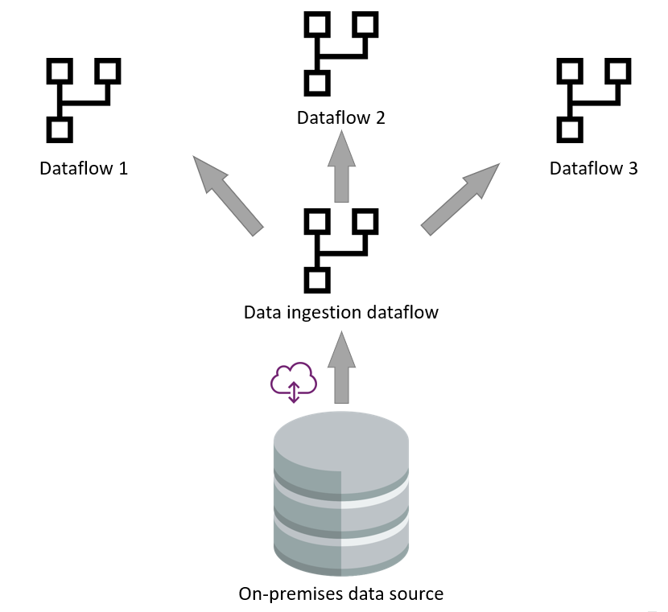

# Improve performance and reusability by separating data ingestion from data transformation dataflows

One of the best practices for dataflow implementations is separating the responsibilities of dataflows into two layers: data ingestion and data transformation. This pattern is specifically helpful when dealing with multiple queries of slower data sources in one dataflow, or multiple dataflows querying the same data sources. Instead of getting data from a slow data source again and again for each query, the data ingestion process can be done once, and the transformation can be done on top of that process. This article explains the process.

## On-premises data source

In many scenarios, the on-premises data source is a slow data source. Especially considering that the gateway exists as the middle layer between the dataflow and the data source.

> [!div class="mx-imgBorder"]
> 

Using analytical dataflows for data ingestion minimizes the get data process from the source and focuses on loading data to Azure Data Lake Storage. Once in storage, other dataflows can be created that leverage the ingestion dataflow's output. The dataflow engine can read the data and do the transformations directly from the data lake, without contacting the original data source or gateway.

> [!div class="mx-imgBorder"]
> 

## Slow data source

The same process is valid when a data source is slow. Some of the software as a service (SaaS) data sources perform slowly because of the limitations of their API calls.

## Separation of the data ingestion and data transformation dataflows

The separation of the two layers&mdash;data ingestion and transformation&mdash;is helpful in the scenarios where the data source is slow. It helps to minimize the interaction with the data source.

This separation isn't only useful because of the performance improvement, it's also helpful for the scenarios where an old legacy data source system has been migrated to a new system. In those cases, only the data ingestion dataflows need to be changed. The data transformation dataflows remain intact for this type of change.

> [!div class="mx-imgBorder"]
> 

## Reuse in other tools and services

Separation of data ingestion dataflows from data transformation dataflows is helpful in many scenarios. Another use case scenario for this pattern is when you want to use this data in other tools and services. For this purpose, it's better to use analytical dataflows and use your own Data Lake Storage as the storage engine. More information: [Analytical dataflows](understanding-differences-between-analytical-standard-dataflows.md#analytical-dataflows)

## Optimize the data ingestion dataflow

Consider optimizing the data ingestion dataflow whenever possible. As an example, if all the data from the source isn't needed, and the data source supports query folding, then filtering data and getting only a required subset is a good approach. To learn more about query folding, go to [Power Query query folding](../power-query-folding.md).

## Create the data ingestion dataflows as analytical dataflows

Consider creating your data ingestion dataflows as analytical dataflows. This especially helps other services and applications to use this data. This also makes it easier for the data transformation dataflows to get data from the analytical ingestion dataflow. To learn more, go to [Analytical dataflows](understanding-differences-between-analytical-standard-dataflows.md#analytical-dataflows).
