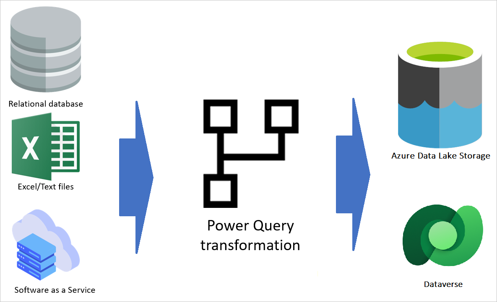

# How Power Platform Dataflows and Azure Data Factory Wrangling Data Flows relate to each other?

Power Platform dataflows and Azure Data Factory dataflows are often considered to be doing the same thing; Extraction of the data from source systems, transforming it, and loading it into destinations. However, there are differences in these two types of dataflows, and you can have a solution implemented working with a combination of these technologies. This article is about that.

## Power Platform dataflows

Power Platform dataflows are data transformations services empowered by the Power Query engine and hosted in the cloud. They get data from different data sources, and after applying transformations, they store it either in the Common Data Service, or in Azure Data Lake storage gen 2.

## Azure Data Factory wrangling dataflows

Azure Data Factory is an ETL service, which is cloud based, and supports many different sources and destinations. There are two types of dataflows under this technology; mapping dataflows, and wrangling dataflows. Wrangling dataflows are empowered by the Power Query engine for the data transformation.

## What is in common?

Both technologies above are useful for getting data from one or more sources, applying transformations on it using Power Query, and loading it into destinations (Extract, Transform, Load, in short ETL). 

- both empowered using Power Query data transformation
- both are cloud-based technologies

## What is the difference?

The main point is knowing their differences, because then you can think about scenarios to use each.

|                            | Power Platform dataflows                                     | Azure Data Factory wrangling dataflows                       |
| -------------------------- | ------------------------------------------------------------ | ------------------------------------------------------------ |
| Destinations               | Common Data Services or Azure Data Lake Storage gen 2        | Many destinations, listed [here](https://azure.microsoft.com/blog/new-connectors-available-in-azure-data-factory-v2/) |
| Power Query transformation | all Power Query functions are supported                      | A limited list of functions supported, here is the [list](https://docs.microsoft.com/azure/data-factory/wrangling-data-flow-functions) |
| Sources                    | many sources supported here                                  | only a few sources, here is the [list](https://docs.microsoft.com/azure/data-factory/wrangling-data-flow-functions) |
| Scalability                | Depends on the Premium capacity and the use of the enhanced compute engine | highly scalable, the query folding into spark code for cloud scale execution |

## What persona of the user?

If you are a citizen application developer or citizen data analyst with a small to medium scale data to be integrated and transformed, you will find the Power Platform dataflows more convenient. The large amount of transformations available, and the ability to work with it without having developer knowledge, and the fact that it can be authored, monitored, and edited inside the Power BI or Power Platform portal, are all reasons that makes Power Platform dataflows a great data integration solution for this type of developer.

If you are a data developer, who is dealing with big data and huge datasets, and the large scale of rows to be ingested every time, you will find the Azure Data Factory wrangling dataflows better tool for the job. The ability to have the spark code for the cloud scale execution can handle huge amount of data ingestion, and the other part of the dataflow can help with transforming the data. Working with the Azure portal to author, monitor and edit wrangling dataflows is requiring more developer learning curve than the experience in the Power Platform dataflows. Wrangling dataflows are best suited for this type of audience. 