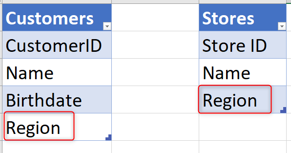

# Mapping fields with relationships in standard dataflows

[!INCLUDE [CDS note](../includes/cc-data-platform-banner.md)]

In the standard dataflow, you can easily map fields from the dataflow query into Dataverse tables. However, if the Dataverse table has lookup or relationship fields, additional consideration is required to make sure this process works.

## What is the relationship and why do you need that?

If you're coming from a database development background, you're familiar with the concept of a relationship between tables. However, many users of Microsoft Power Platform services aren't coming from that background. You might wonder what the relationship is, or why you should create a relationship between tables.

The tables and their relationship are fundamental concepts of designing a database. To learn everything about relationships is beyond the scope of this article. However, we'll discuss it in a general way here. 

Let's say you want to store information about customers and their details, including region, in Dataverse. You can keep everything in one table. Your table can be called Customers, and it can contain fields, such as CustomerID, Name, Birthdate, and Region. Now imagine that you have another table that also has the store's information. This table can have fields, such as Store ID, Name, and Region. As you can see, the region is repeated in both tables. There's no single place where you can get all regions; some of the region's data is in the Customers table, and some of it's in the Stores table. If you ever build an application or a report from this information, you always have to combine the two regions' information into one.

> [!div class="mx-imgBorder"]
> 

What's done in the database design practice is to create a table for Region in scenarios like the one described above. This Region table would have a Region ID, Name, and other information about the region. The other two tables (Customers and Stores) will have links to this table using a field (which can be Region ID if we have the ID in both tables, or Name if it's unique enough to determine a region). This means having a relationship from the Stores and Customers table to the Region table.

> [!div class="mx-imgBorder"]
> 

In Dataverse, there are a number of ways to create a relationship. One way is to create a table, and then create a field in one table that's a relationship (or lookup) to another table, as described in the next section.

## What are lookup or relationship fields?

In Dataverse, you can have a field defined as a lookup field, which points to another table. 

> [!div class="mx-imgBorder"]
> 

In the preceding image, the Region field is a lookup field to another table named Region Lookup. To learn more about different types of relationships, go to [Create a relationship between tables](/powerapps/maker/common-data-service/data-platform-entity-lookup).

## When the field mapping doesn't show the relationship fields

If you've created a lookup field in one table that points to another table, that field might not appear in the mapping of the dataflow. That's because each entity requires a Key field. This best practice would then make sure that the field is mappable in the table mappings of the dataflow.

## Setting the Key field in the table

To set the key field in the table, go to the **Keys** tab, and add a key to a field that has unique values.

> [!div class="mx-imgBorder"]
> 

After setting the key field, you can see the field in the mapping of the dataflow.

> [!div class="mx-imgBorder"]
> 

## Known limitations
 
- Mapping to [polymorphic lookup](/powerapps/maker/canvas-apps/working-with-references#polymorphic-lookups) fields is currently not supported.
- Mapping to a multi-level lookup field&mdash;a lookup that points to another tables' lookup fields is currently not supported.
