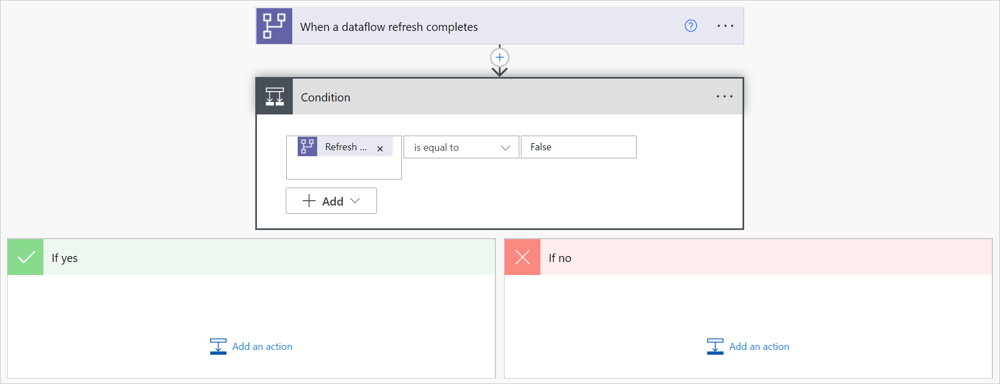

# Send a notification when a dataflow refresh completes

When your dataflow refresh completes, you or others who manage or depend on the dataflow might want to receive a notification to alert you of the dataflow refresh status. This way, you know your data is up to date and you can start getting new insights. Another common scenario addressed by this tutorial is notification after a dataflow fails. A notification allows you to start investigating the problem and alert people that depend on the data being successfully refreshed.

To set up a Power Automate notification that will be sent when a dataflow fails:

1. Navigate to [Power Automate](https://flow.microsoft.com).
2. Select **Create** > **Automated cloud flow**.
3. Enter a flow name, and then search for the "When a dataflow refresh completes" connector. Select this connector from the list, and then select **Create**.
4. Customize the connector. You need to enter the following information on your dataflow:

   * **Group Type**: Select *Environment* when connecting to Power Apps and *Workspace* when connecting to Power BI.
   * **Group**: Select the Power Apps environment or the Power BI workspace your dataflow is in.
   * **Dataflow**: Select your dataflow by name.

5. Select **New step** to add an action to your flow.
6. Search for the **Condition** connector, and then select it.
7. Customize the **Condition** connector. You need to enter the following information:

   1. In the first cell, add **Refresh Status** from the dataflow connector.
   2. Leave the second cell as **is equal to**.
   3. In the third cell, enter **False**.

   

8. In the **If Yes** section, select **Add an action**.
9. Search for the "Send an email notification (V3)" connector, and then select it.
10. Enter the email address and subject information.
11. Inside the body of the email, use **Add dynamic content** to add dataflow information to the content of your email.

