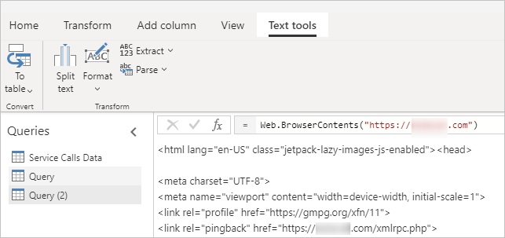
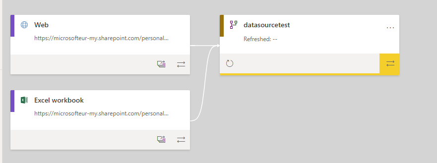
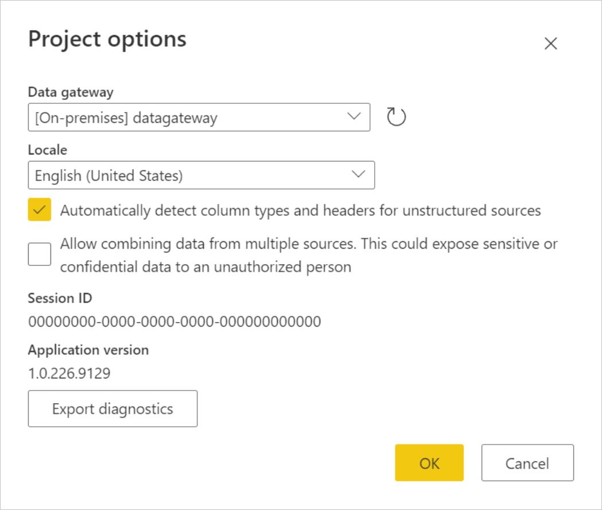

# Troubleshooting dataflow issues: Connection to the data source

When you create a dataflow, sometimes you get an error connecting to the data source. This error can be caused by the gateway, credentials, or other reasons. This article explains the most common connection errors and problems, and their resolution.

## Error: An on-premises data gateway is required to connect

This problem can happen when you move a query from Power Query in desktop tools to Power Query in the dataflow, and you get the error "An on-premises data gateway is required to connect."

**Reason:**

When your entity in the dataflow gets data from an on-premises data source, a gateway is needed for the connection, but the gateway hasn't been selected.

**Resolution:**

Select **Select gateway**. If the gateway hasn't been set up yet, go to [Install an on-premises data gateway](/data-integration/gateway/service-gateway-install).

## Error: Please specify how to connect

This problem happens when you're connected to a data source, but haven't set up the credentials or connection details yet. It can happen when you migrate queries into a dataflow.

**Reason:**

The connection details aren't set up correctly.

**Resolution:**

Select **Configure connection**. Set up the connection details and credentials.

## Expression.Error: The module named 'xyz' has been disabled in this context

Sometimes, when you migrate your queries from Power Query in desktop tools to the dataflow, you get an error saying that a module is disabled in this context. One example of this situation is when your query uses functions such as `Web.Page` or `Web.BrowserContents`.

**Reason:**

Disabled modules are related to functions that require an on-premises data gateway connection to work. Even if the function is getting data from a webpage, because of some security compliance requirements, it needs to go through a gateway connection.

**Resolution:**

First, [install and set up an on-premises gateway](/data-integration/gateway/service-gateway-install). Then add a web data source for the web URL you're connecting to.

After adding the web data source, you can select the gateway in the dataflow from **Options** > **Project options**.

You might be asked to set up credentials. When you've set up the gateway and your credentials successfully, the modules will no longer be disabled."

## Deleted or old data sources still show up

Sometimes when you delete a data source from your dataflow, it still shows up on your credentials overview or lineage overview. This doesn't impact the refresh or authoring of your dataflow.

**Reason:**

A dataflow maintains its association with deleted dataflow data sources and doesn't delete them automatically. This requires a trim initiated by the user.

**Resolution:**

In order to trim the data sources, you'll need to take the following steps:

1. Open your dataflow.

1. Select **Options**.

1. Select **Project options**.

   

1. Change the gateway to another gateway. It doesn't matter which one, as long as it's a different gateway.

   

1. After you apply the change by selecting **OK**, repeat steps 1 through 4 to select the original gateway again.

These steps essentially delete all the data source bindings for the dataflow. After finishing these steps, you might be asked to set up credentials. When you've set up the gateway and your credentials successfully, you effectively "trimmed" the data source bindings for the dataflow to just the ones that the dataflow is actually using.

> [!NOTE] 
> For dataflows with cloud data sources without an on-premises data gateway, when the data source name changes, an old data source connection still exists. To remove this connection, in the Power BI service, select the settings icon, go to **Manage Connections and Gateways** > **Connections**, select the ellipsis menu by the connection name, then select **Remove** to remove the old/unused data source connection. Then go to the **Home** page, select the workspace, select the dataflow to open it, and then in the **Table name** page, select **Edit tables**. Then in the Power Query editor, select **Save & Close** for the dataflows to be updated to the current data source connection and to remove the older connection. 
