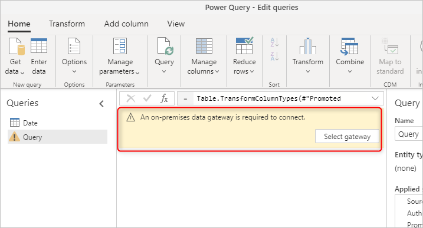

# Troubleshooting dataflow issues: connection to the data source

When you create a dataflow, sometimes you get an issue connecting to the data source. This issue can be because of the gateway, the credentials, or many other reasons. In this article, you'll see the most common errors and issues in this category and their resolution.

## Problem: An on-premises data gateway is required to connect

This problem can happen when you move a query from Power Query in desktop tools to Power Query in the dataflow, and you get the following error.

**Reason:**

When your entity in the dataflow gets data from an on-premises data source, a gateway is needed for the connection. The gateway isn't selected.

**Resolution:**

Select the gateway using the **Select gateway** button. Sometimes, however, you might not have a gateway set up yet. For information about how to install and set up a gateway, see [Install an on-premises data gateway](https://docs.microsoft.com/data-integration/gateway/service-gateway-install).

## Problem: Please specify how to connect

This problem happens when you're connected to a data source, but haven't set up the credential or connection details yet. It can happen when you migrate queries into a dataflow.

**Reason:**

The connection details aren't set up correctly.

**Resolution:**

Select **Configure connection**. Set up the connection details and credentials.

## Problem: Expression.Error: The module named 'xyz' has been disabled in this context

Sometimes, when you migrate your queries from Power Query in desktop tools to the dataflow, you get an error saying that a module is disabled in this context. One example of this situation is when your query is using functions such as `Web.Page` or `Web.BrowserContents`, and so on.

**Reason:**

Disabled modules are related to functions that require an on-premises gateway connection to work. Even if the function is getting data from a web page, because of some security compliance, they need to go through a gateway connection.

**Resolution:**

First, [install and setup an on-premises gateway](https://docs.microsoft.com/data-integration/gateway/service-gateway-install). Then add a web data source for the web URL you're connecting to.

After adding the web data source, you can select the gateway in the dataflow from **Project Options**.

You might be asked to set up credentials. After the successful setup, you should see the queries working fine.

