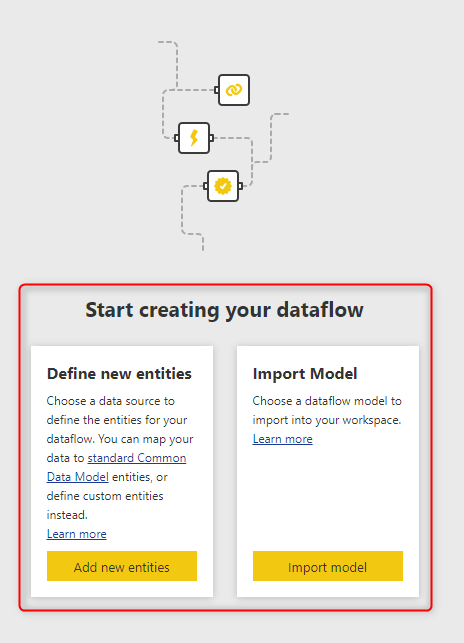
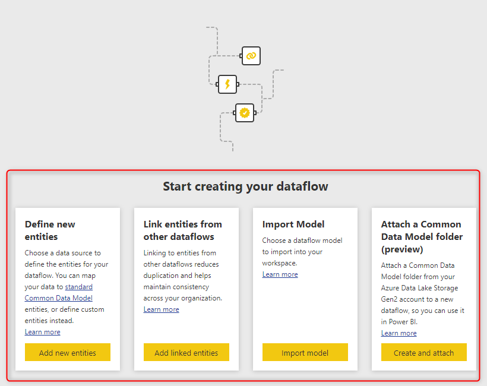
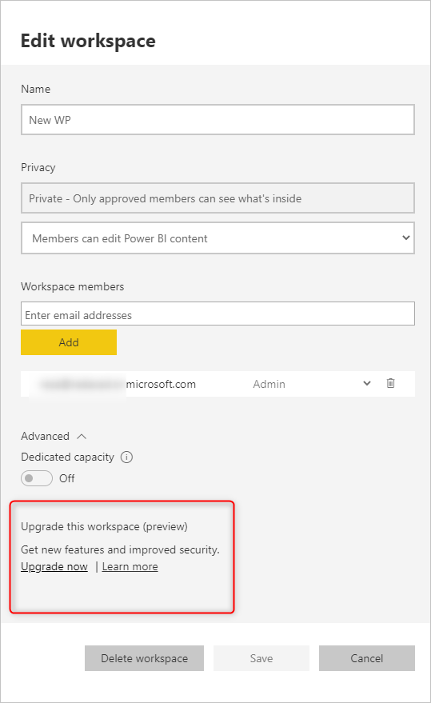

# Troubleshoot dataflow issues: Creating dataflows

This article explains some of the most common errors and issues you might get when you want to create a dataflow, and how to fix them.

## I can't create a dataflow in My workspace

This problem happens when you try to create a dataflow in **My workspace** in Power BI.

**Reason:**

Creating dataflows in **My workspace** isn't supported.

**Resolution:**

Create your dataflows in [organizational workspaces](/power-bi/collaborate-share/service-create-the-new-workspaces). To learn how to create an organizational workspace, go to [Create the new workspaces in Power BI](/power-bi/collaborate-share/service-create-the-new-workspaces).

## I can't create a dataflow in an organizational workspace where I have read-only rights

If you're a member of an organization workspace and you still can't create a dataflow, it might be because of your access rights in that workspace.

**Reason:**

You don't have edit rights in the workspace.

**Resolution:**

Ask the workspace administrators or members to give you an Admin, Member, or Contributor [role](/power-bi/collaborate-share/service-new-workspaces#roles-in-the-new-workspaces).

## I can't create a dataflow in a workspace where I have edit rights

This problem happens when you're in an organizational workspace that you've created, or someone else has created and you have Admin, Member, or Contributor access. You want to create a dataflow in this scenario, but you can't.

**Reason:** 

The access to dataflow creation was disabled by the Power BI administrator.

**Resolution:**

Ask the Power BI tenant administrator to enable access for you by following these steps:

1. On the **Settings** menu in the Power BI service, select **Admin portal**.

   

2. On the left pane, select **Tenant settings**, and in the **Dataflow settings** section, turn on the toggle for **Enabled**. Then select **Apply**.

   

## I only see limited options when I create a dataflow

When creating a dataflow, sometimes you don't see all the options that are available. For example, you might see only the options shown in the following image.

However, more options are actually available, as shown in the following image.

**Reason:**

You're creating the dataflow in an old version of the Power BI workspace, called V1.

**Resolution:**

Upgrade your Power BI workspace to the new version (v2). More information: [Upgrade classic workspaces to the new workspaces in Power BI](/power-bi/collaborate-share/service-upgrade-workspaces)

