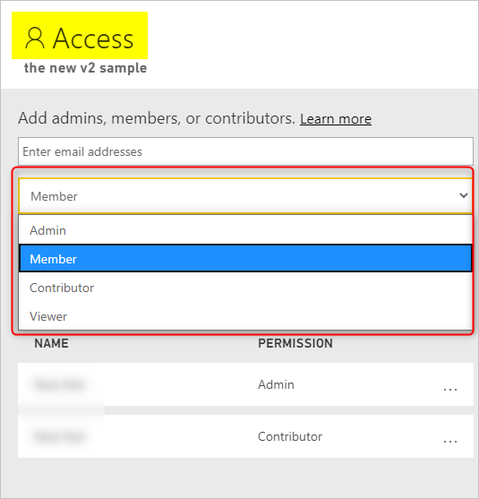

# Troubleshooting dataflows issues: creating dataflows

This article reveals some of the most common errors and issues you might get when you want to create a dataflow, and how to fix them.

## Problem: Can't create a dataflow in "My Workspace"

This problem happens when you try to create a dataflow in "My Workspace" in Power BI.

**Reason:**

Creating dataflows in "My Workspace" is not supported.

**Resolution:**

Create your dataflows in [organizational workspaces](https://docs.microsoft.com/power-bi/collaborate-share/service-create-the-new-workspaces). To learn how to create an organizational workspace, see [Create the new workspaces in Power BI](https://docs.microsoft.com/power-bi/collaborate-share/service-create-the-new-workspaces).

## Problem: Can't create a dataflow in an organizational workspace with read-only rights

If you are a member of an organization workspace and you still can't create a dataflow, it might be because of your access rights in that workspace.

**Reason:**

You don't have EDIT rights in the workspace.

**Resolution:**

Ask the workspace Administrators or Members to give you the "Administrator", "Member", or "Contributor" [roles](https://docs.microsoft.com/power-bi/collaborate-share/service-new-workspaces#roles-in-the-new-workspaces).

## Problem: Can't create a dataflow in a workspace with edit rights

If you're in an organizational workspace that either you've created, or someone else has created and you have either "Administrator", "Member", or "Contributor" access. You want to create a dataflow in this scenario, but you can't.

**Reason:** 

The access to dataflow creation was disabled by the Power BI administrator.

**Resolution:**

Ask the Power BI administrator to enable the access for you. The steps to do so are:

1. The Power BI tenant administrator should open the Power BI **Admin Portal** in the Power BI service.

   

2. Under **Tenant Settings**, in **Dataflow settings**, change to **Enable**, and then select **Apply**.

   

## Problem: Dataflow creation has limited options

When you can create a dataflow, all of the options for creating the dataflow may not appear. For example, when you create a dataflow, you might see only the options shown below.

However, the full options are shown below.

**Reason:**

You're creating a dataflow in an old version of the Power BI workspace, called version one.

**Resolution:**

Upgrade your Power BI workspace to the new version (version two). For more information about upgrading to the new version, see [Upgrade classic workspaces to the new workspaces in Power BI](https://docs.microsoft.com/power-bi/collaborate-share/service-upgrade-workspaces).

