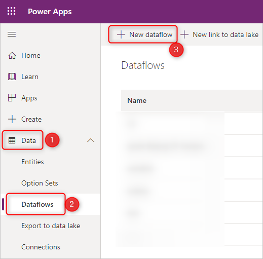
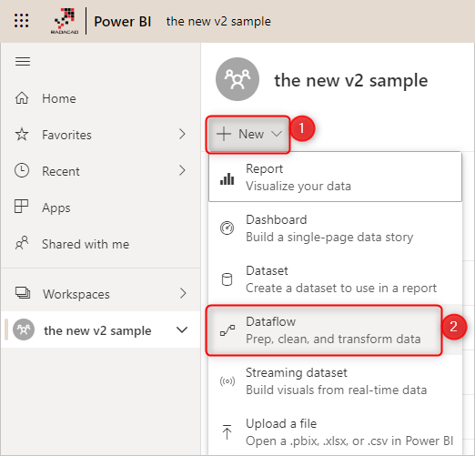
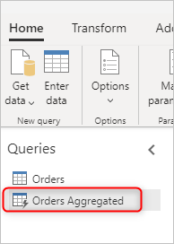

# Understanding the differences between standard and analytical dataflows

You can categorize dataflows in many ways. One of those ways is the difference between standard and analytical dataflows. Understanding this concept helps you create a dataflow for the right requirement. Dataflows create entities, and entities are of two types: standard and analytical. Based on the type of entity produced by the dataflow, we call the dataflow either a standard dataflow or an analytical dataflow.

## Standard dataflow

A dataflow by the standard definition is a service to extract, transform, and load the data in a destination. A standard dataflow supports Power Query transformations and can get data from any Power Query compatible data sources. The entities of this type of dataflow store their data in Common Data Service.

Standard dataflows can be created by Power Platform dataflows when created through the Power Apps portal. 

One benefit of this type of dataflow is that any application that can connect to Common Data Service can work with the data, such as Power BI, Power Apps, Power Automate, Power Virtual Agent, Dynamics, and other applications.

## Analytical dataflow

An analytical dataflow, in addition to the transformation, is also capable of extra analytical features. These features can be AI functions in the dataflow, and even the use of computed entities. Analytical entities in the analytical dataflow store their data in Azure Data Lake Storage Gen2.

You can create analytical dataflows using Power BI dataflows, regardless of whether it's an external dataflow (a dataflow connected to a customer's Azure Data Lake Storage Gen2) or a normal dataflow created in Power BI.

You can also create analytical dataflows in Power Platform dataflows. When you are creating a Power Platform dataflow through the Power Apps portal, you can choose the option to make it an analytical dataflow.

### AI functionalities

Depending on the requirement, sometimes you might need to apply some AI and machine learning functions to the data through the dataflow. These functionalities are possible when the dataflow is analytical. 

The following articles discuss how to use AI functions in a dataflow:

- [Azure Machine Learning integration in Power BI](https://docs.microsoft.com/power-bi/service-machine-learning-integration)
- [Cognitive Services in Power BI](https://docs.microsoft.com/power-bi/service-cognitive-services)
- [Automated Machine Learning in Power BI](https://docs.microsoft.com/power-bi/service-machine-learning-automated)

Note that the features listed above aren't available in a standard dataflow.

### Computed entity

One of the reasons to use a computed entity is the ability to process large amounts of data. The computed entity helps in those scenarios. If you have an entity in a dataflow, and another entity in the same dataflow uses the first entity's output, this will create a computed entity.

The computed entity helps with the performance of the data transformations. Instead of re-doing the transformations needed in the first entity multiple times, the transformation will be done only once in the computed entity. Then the result will be used multiple times in other entities.

To learn more about computed entities, see [Using computed entities on Power BI Premium](https://docs.microsoft.com/power-bi/service-dataflows-computed-entities-premium).

Computed entities are available only in an analytical dataflow.

## Standard vs. analytical dataflows

The following table lists some differences between a standard entity and an analytical entity.

|                                   | Standard             | Analytical                            |
| --------------------------------- | --- | ------------------------------------------------------------ |
| How to create                     | Power Platform dataflows | Power BI dataflows Power Platform dataflows by selecting the **Analytical Entity** checkbox when creating the dataflow |
| Storage options                   | Common Data Service      | Azure Data Lake Storage Gen2 internal for the Power BI dataflows Azure Data Lake Storage Gen2 external attached to the Power BI or Power Platform dataflows |
| Power Query transformations       | Yes             |Yes                                                          |
| AI functions                      | No              | Yes                                                          |
| Computed entity                   | No              | Yes                                                          |
| Can be used in other applications | Yes, through Common Data Service | Power BI dataflows: Only in Power BI Power Platform dataflows or Power BI external dataflows: Yes, through Azure Data Lake Storage Gen2 |
| Mapping to standard Entity        | Yes              | Yes                                                         |
| Incremental load                  | Default incremental-load Possible to change using the **Delete rows that no longer exist in the query output** checkbox at the load settings | Default full-load  Possible to set up incremental refresh by setting up the incremental refresh in the dataflow settings |
| Scheduled Refresh                 | Yes              | Yes, the possibility of notifying the dataflow owners upon the failure |
| | | |

## Scenarios to use each dataflow type

Here are some sample scenarios and best practice recommendations for each type of dataflow.

### Cross-platform usage&mdash;standard dataflow

If your plan for building dataflows is to use the stored data in multiple platforms (not only Power BI, but also other Power Platform services, Dynamics, and so on), a standard dataflow is a great choice. Standard dataflows store the data in Common Data Service, which you can access through many other platforms and services.

### Heavy data transformations on large data tables&mdash;analytical dataflow

Analytical dataflows are an excellent option for processing large amounts of data. Analytical dataflows also enhance the computing power behind the transformation. Having the data stored in Azure Data Lake Storage Gen2 increases the writing speed to a destination. Compared to Common Data Service (which might have many rules to check at the time of data storage), Azure Data Lake Storage Gen2 is faster for read/write transactions on a large amount of data.

### AI features&mdash;analytical dataflow

If you're planning to use any AI functionalities through the data transformation stage, then analytical dataflow is helpful, because you can use all the supported AI features with this type of dataflow.
