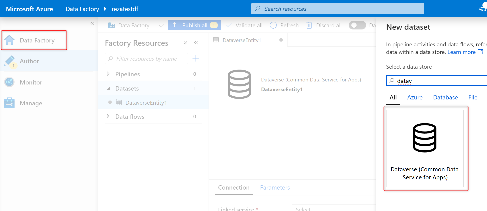

# Using the output of Power Platform dataflows from other Azure Data workloads

[!INCLUDE [CDS note](../includes/cc-data-platform-banner.md)]

Depending on the storage for the output of the Power Platform dataflows, you can use that output in other Azure services.

## The benefits of working with the output of Power Platform dataflows

Using Power Platform dataflows, you can reshape data, clean the data, and prepare the data for further analysis and consumption. There are many other Azure data services that work with data as an input and provide actions. 

- Azure Machine Learning can consume the output of dataflows and use it for machine learning scenarios (for example, predictive analysis).
- Azure Data Factory can get the output of dataflows in a much larger scale, combined with the data from big data sources, for advanced data integration solutions.
- Azure Databricks can consume the output of dataflows for applied data science algorithms and further AI with the big data scale in the Apache Spark backend.
- Other Azure data services can use the output of Power Platform dataflows to do further actions on that data.

## Dataflows with external Azure Data Lake Storage

If you've connected an external Azure Data Lake Storage storage to the Power Platform dataflows, you can connect to it using any Azure services that have Azure Data Lake Storage as a source. These services could be Azure Machine Learning, Azure Data Factory, Azure Databricks, Azure Analysis Services, and so on.

In any of these services, use Azure Data Lake Storage as the source. You'll be able to enter the details of your storage and connect to the data in it. The data is stored in CSV format, and is readable through any of these tools and services. The following screenshot shows how Azure Data Lake Storage is a source option for Azure Data Factory.

## Dataflows with Dataverse

If you're using standard dataflows that store the data in Dataverse, you can still connect to Dataverse from many Azure services. The following screenshot shows that in Azure Data Factory the output of a dataflow from Dataverse can be used as a source.

## Dataflows with internal Azure Data Lake Storage

If you're using the internal Azure Data Lake Storage that is provided by Power Platform dataflows, then that storage is exclusively limited to the Power Platform tools, and isn't accessible from other Azure data workloads.

