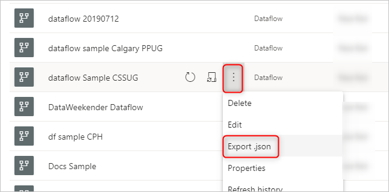

# What is the Common Data Model storage structure for analytical dataflows?

An analytical dataflow stores data in Azure Data Lake Storage Gen2. The structure in which the dataflow stores the data is in the standard of the Common Data model. In this article, you'll learn the structure of this storage behind the scenes.

## When the dataflow is analytical, storage needs a structure

If the [dataflow is standard](understanding-differences-between-analytical-standard-dataflows.md), then the data is stored in Common Data Services. Common Data Services is like a database system; it has the concept of tables, views, and so on. Common Data Services is a structured data storage option for the standard dataflow.

However, when the dataflow is [analytical](understanding-differences-between-analytical-standard-dataflows.md), the data is stored in Azure Data Lake Storage Gen2. The structure the data is stored in is folders and subfolders of workspaces (or environments), dataflows, and entities under the dataflow. This structure follows the standards defined for the Common Data Model.

## What is the Common Data Model storage structure

[Common Data Model](https://docs.microsoft.com/common-data-model/) is a metadata structure defined to bring conformity and consistency to using data across multiple platforms. Common Data Model defines how the data is stored. Common Data Model is not data storage. In fact, it is the way that data is stored and defined.

Inside Azure Data Lake Storage Gen2, the data is stored inside folders. Each folder represents a workspace or environment. Under that folder, there will be subfolders for each dataflow.

## What's inside a dataflow folder?

Inside each dataflow folder, there are subfolders for each entity, and a metadata file named model.json. 

### The metadata file: Model.json

The "model.json" file is the metadata definition of the dataflow. This is the one file that contains all the metadata about the dataflow. It includes a list of entities, their transformations, the columns and their data types in each entity, the relationship between entities, and so on. This is the file that you can export from a dataflow easily, even if you don't have access to the Common Data Model folder structure.

This JSON file is the file that you can use to migrate (or import) your dataflow into another workspace or environment.

To learn more about what the model.json metadata file includes, see [The metadata file (model.json) for the Common Data Model](https://docs.microsoft.com/common-data-model/model-json).

### Data files

In addition to the metadata file, inside the dataflow folder there are other subfolders. A dataflow stores the data of each entity inside a subfolder with the entity's name on it, and it might split the data stored in CSV format into multiple CSV files under that folder.

## How can you see or access Common Data Model folders?

If you're using dataflows with the internal Azure Data Lake Storage Gen2 provided by Power BI or Power Platform, you won't be able to see those folders. Your only way of seeing the content of the Common Data Model folders is to use **Get Data** from Power BI or Power Platform dataflows in the Power BI Desktop, or from other dataflows, use get data from the dataflow.

For an explanation of how dataflows and the internal Azure Data Lake integration works, see [Dataflows and Azure Data Lake integration (Preview)](https://docs.microsoft.com//power-bi/transform-model/service-dataflows-azure-data-lake-integration).

If you're using your own Azure Data Lake Storage Gen2 and have connected it to the dataflow, you can access the folder structure even outside of Power Platform tools and services. Access to the structure of Common Data Model folders is then possible through the Azure portal or Microsoft Azure Storage Explorer.

For an explanation of how to connect the external Azure Data Lake storage account to dataflows in your environment, see [Connect Azure Data Lake Storage Gen2 for dataflow storage](https://docs.microsoft.com/power-bi/transform-model/service-dataflows-connect-azure-data-lake-storage-gen2).

## Next Steps

- [Use the Common Data Model to optimize Azure Data Lake Storage Gen2](https://docs.microsoft.com/common-data-model/data-lake
  )
- [The metadata file (model.json) for the Common Data Model](https://docs.microsoft.com/common-data-model/model-json
  )
- [Add a CDM folder to Power BI as a dataflow (Preview)](https://docs.microsoft.com/power-bi/service-dataflows-add-cdm-folder
  )
- [Connect Azure Data Lake Storage Gen2 for dataflow storage](https://docs.microsoft.com/power-bi/service-dataflows-connect-azure-data-lake-storage-gen2
  )
- [Dataflows and Azure Data Lake Integration (Preview)](https://docs.microsoft.com/power-bi/transform-model/service-dataflows-azure-data-lake-integration)
- [Configure workspace dataflow settings (Preview)](https://docs.microsoft.com/power-bi/service-dataflows-configure-workspace-storage-settings
  )

