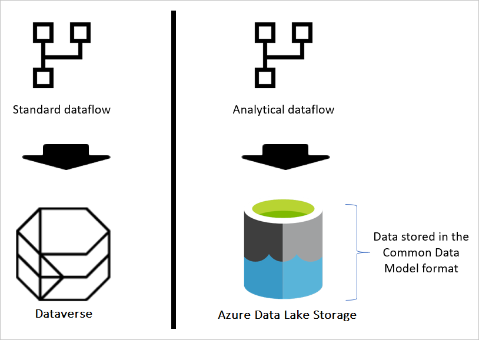
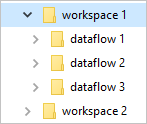
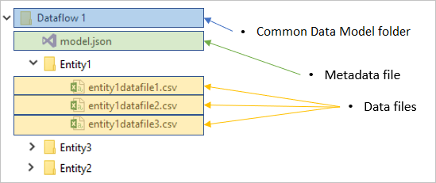

# What is the storage structure for analytical dataflows? 

[!INCLUDE [CDS note](../includes/cc-data-platform-banner.md)]

Analytical dataflows store both data and metadata in Azure Data Lake Storage. Dataflows leverage a standard structure to store and describe data created in the lake, which is called Common Data Model folders. In this article, you'll learn more about the storage standard that dataflows use behind the scenes. 

## Storage needs a structure for an analytical dataflow 

If the [dataflow is standard](understanding-differences-between-analytical-standard-dataflows.md#standard-dataflows), then the data is stored in Dataverse. Dataverse is like a database system; it has the concept of tables, views, and so on. Dataverse is a structured data storage option used by standard dataflows. 

However, when the dataflow is [analytical](understanding-differences-between-analytical-standard-dataflows.md#analytical-dataflows), the data is stored in Azure Data Lake Storage. A dataflow’s data and metadata is stored in a Common Data Model folder. Since a storage account might have multiple dataflows stored in it, a hierarchy of folders and subfolders has been introduced to help organize the data. Depending on the product the dataflow was created in, the folders and subfolders may represent workspaces (or environments), and then the dataflow’s Common Data Model folder. Inside the Common Data Model folder, both schema and data of the dataflow entities are stored. This structure follows the standards defined for Common Data Model.

 

## What is the Common Data Model storage structure?

[Common Data Model](https://docs.microsoft.com/common-data-model/) is a metadata structure defined to bring conformity and consistency for using data across multiple platforms. Common Data Model isn't data storage, it's the way that data is stored and defined. 

Common Data Model folders define how an entity's schema and its data should be stored. In Azure Data Lake Storage, data is organized in folders. Folders can represent a workspace or environment. Under those folders, subfolders for each dataflow are created. 

 
 

## What's in a dataflow folder? 

Each dataflow folder contains a subfolder for each entity and a metadata file named `model.json`.  

 

### The metadata file: model.json 

The `model.json` file is the metadata definition of the dataflow. This is the one file that contains all the dataflow metadata. It includes a list of entities, the columns, and their data types in each entity, the relationship between entities, and so on. You can export this file from a dataflow easily, even if you don't have access to the Common Data Model folder structure.

 

You can use this JSON file to migrate (or import) your dataflow into another workspace or environment.

 

To learn exactly what the model.json metadata file includes, go to [The metadata file (model.json) for Common Data Model](https://docs.microsoft.com/common-data-model/model-json).

### Data files

In addition to the metadata file, the dataflow folder includes other subfolders. A dataflow stores the data for each entity in a subfolder with the entity's name. Data for an entity might be split into multiple data partitions, stored in CSV format. 

## How to see or access Common Data Model folders

If you're using dataflows that use storage provided by the product they were created in, you won't have access to those folders directly. In such cases, getting data from the dataflows requires using the Power Platform dataflow connector available in the **Get data** experience in the Power BI service, Power Apps, and Dynamics 35 Customer Insights products, or in Power BI Desktop.

 

To learn how dataflows and the internal Data Lake Storage integration work, go to [Dataflows and Azure Data Lake integration (Preview)](https://docs.microsoft.com/power-bi/transform-model/service-dataflows-azure-data-lake-integration). 

If your organization enabled dataflows to take advantage of its Data Lake Storage account and was selected as a load target for dataflows, you can still get data from the dataflow by using the Power Platform dataflow connector as mentioned above. But you can also access the dataflow's Common Data Model folder directly through the lake, even outside of Power Platform tools and services. Access to the lake is possible through the Azure portal, Microsoft Azure Storage Explorer, or any other service or experience that supports Azure Data Lake Storage. More information: [Connect Azure Data Lake Storage Gen2 for dataflow storage](https://docs.microsoft.com/power-bi/transform-model/service-dataflows-connect-azure-data-lake-storage-gen2)

 

## Next steps 

- [Use the Common Data Model to optimize Azure Data Lake Storage Gen2](https://docs.microsoft.com/common-data-model/data-lake) 

- [The metadata file (model.json) for the Common Data Model](https://docs.microsoft.com/common-data-model/model-json) 

- [Add a CDM folder to Power BI as a dataflow (Preview)](https://docs.microsoft.com/power-bi/service-dataflows-add-cdm-folder) 

- [Connect Azure Data Lake Storage Gen2 for dataflow storage](https://docs.microsoft.com/power-bi/service-dataflows-connect-azure-data-lake-storage-gen2) 

- [Dataflows and Azure Data Lake Integration (Preview)](https://docs.microsoft.com/power-bi/transform-model/service-dataflows-azure-data-lake-integration) 

- [Configure workspace dataflow settings (Preview)](https://docs.microsoft.com/power-bi/service-dataflows-configure-workspace-storage-settings) 
