# Diagram view

Diagram view offers a visual way to prepare data in the Power Query editor. With this interface, you can easily create queries and visualize the data preparation process. Diagram view simplifies the experience of getting started with data wrangling. It speeds up the data preparation process and helps you quickly understand the dataflow, both the "big picture view" of how queries are related and the "detailed view" of the specific data preparation steps in a query.

This article provides an overview of the capabilities provided by diagram view.

This feature is enabled by selecting **Diagram view** in the **View** tab on the ribbon. With diagram view enabled, the steps pane and queries pane will be collapsed.  

>[!Note]
>Currently, diagram view is only available in Power Query Online.

## Authoring queries using diagram view

Diagram view provides you with a visual interface to create, view, or modify your queries. In diagram view, you can connect to many different types of data sources using the ["Get Data" experience](get-data-experience.md).

Diagram view is also connected to the Data Preview and the ribbon so that you can select columns in the Data Preview.

You can add a new step within a query, after the currently selected step, by selecting the **+** button, and then either search for the transform or choose the item from the shortcut menu. These are the same transforms you'll find in the Power Query editor ribbon.

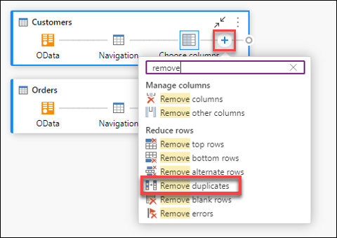

By searching and selecting the transform from the shortcut menu, the step gets added to the query, as shown in the following image.

>[!NOTE]
> To learn more about how to author queries in the Query editor using the Power Query editor ribbon or data preview, go to [Power Query Quickstart](/power-query/power-query-ui).

## Query level actions

You can perform two quick actions on a query&mdash;*expand/collapse* a query and *highlight related queries*. These quick actions show up on an active selected query or when hovering over a query.

You can perform more query level actions such as duplicate, reference, and so on, by selecting the query level context menu (the three vertical dots). You can also right-click in the query and get to the same context menu. 

 

### Expand or collapse query

To expand or collapse a query, right-click in the query and select **Expand/Collapse** from the query's context menu. You can also double-click in the query to expand or collapse a query.

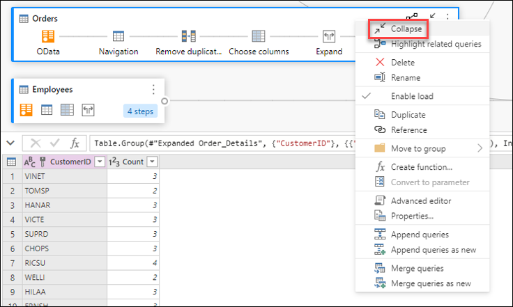

### Highlight related queries

To view all the related queries for a given query, right-click in a query and select **Highlight related queries**. You can also select the highlight related queries button on the top-right of a query.

For example, if you select the highlight related queries button in the **Top US Customers** query, you can see that the **Customers** and **Orders** queries are highlighted.  

### Delete query

To delete a query, right-click in a query and select **Delete** from the context menu. There will be an additional pop-up to confirm the deletion.

### Rename query

To rename a query, right-click in a query and select **Rename** from the context menu.

### Enable load

To ensure that the results provided by the query are available for downstream use such as report building, by default **Enable load** is set to true. In case you need to disable load for a given query, right-click in a query and select **Enable load**. The queries where **Enable load** is set to false will be displayed with a grey outline.

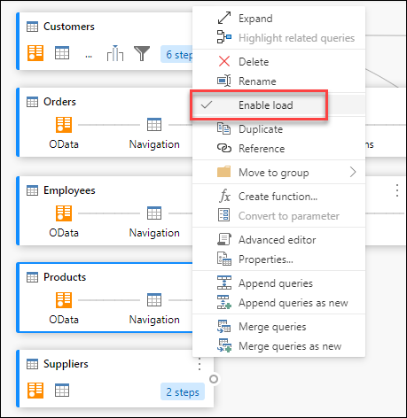

### Duplicate

To create a copy of a given query, right-click in the query and select **Duplicate**. A new duplicate query will appear in the diagram view.

### Reference

Referencing a query will create a new query. The new query will use the steps of the previous query without having to duplicate the query. Additionally, any changes on the original query will transfer down to the referenced query. To reference a query, right-click in the query and select **Reference**.

### Move to group

You can make folders and move the queries into these folders for organizational purposes. These folders are called *groups*. To move a given query to a Query group, right-click in a query and select **Move to group**. You can choose to move the queries to an existing group or create a new query group.

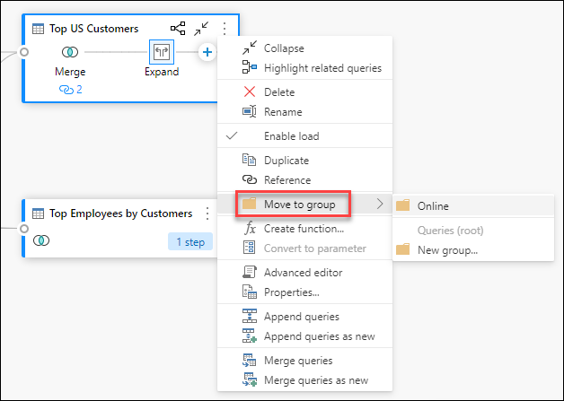 

You can view the query groups above the query box in the diagram view.

 

### Create function

When you need to apply the same set of transformations in different queries or values, creating custom Power Query *functions* can be valuable. To learn more about custom functions, go to [Using custom functions](./custom-function.md). To convert a query into a reusable function, right-click in a given query and select **Create function**.

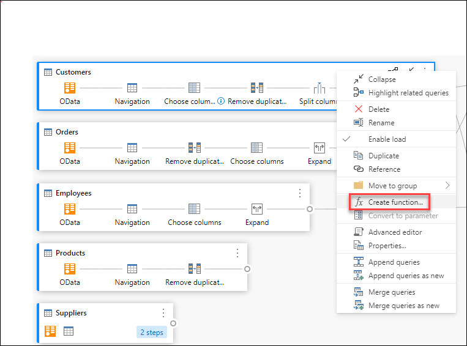

### Convert to parameter

A parameter provides the flexibility to dynamically change the output of your queries depending on their value and promotes reusability. To convert a non-structured value such as date, text, number, and so on, right-click in the query and select **Convert to Parameter**.

>[!NOTE]
> To learn more about parameters, go to [Power Query parameters](power-query-query-parameters.md).

### Advanced editor

With the advanced editor, you can see the code that Power Query editor is creating with each step. To view the code for a given query, right-click in the query and select **Advanced editor**.

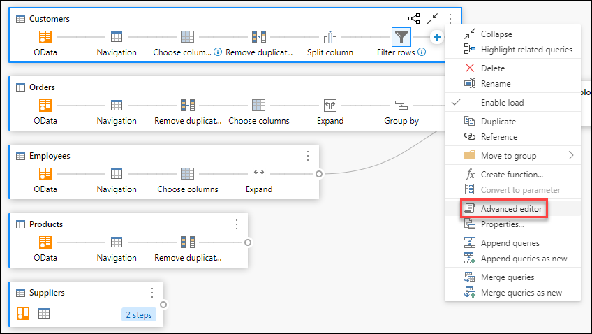

>[!NOTE]
> To learn more about the code used in the advanced editor, go to [Power Query M language specification](/powerquery-m/power-query-m-language-specification).

### Edit query name and description

To edit the name of a query or add a description, right-click in a query and select **Properties**.

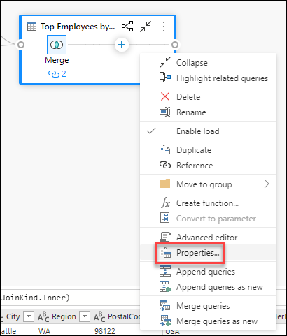

This action will open a dialog box where you can edit the name of the query or add to or modify the query description.

Queries with query description will have an affordance (***i*** icon). You can view the query description by hovering near the query name.

### Append queries/Append queries as new

To append or perform a UNION of queries, right-click in a query and select **Append queries**. This action will display the **Append** dialog box where you can add more tables to the current query. **Append queries as new** will also display the **Append** dialog box, but will allow you to append multiple tables into a new query.

>[!NOTE]
> To learn more about how to append queries in Power Query, go to [Append queries](append-queries.md).

### Merge queries/Merge queries as new

To merge or JOIN queries, right-click in a query and select **Merge queries**. This action will display the **Merge** dialog box, with the selected query as the left table of the merge operation. **Merge queries as new** will also display the **Merge** dialog box but will allow you to merge two tables into a new query.

>[!NOTE]
> To learn more about how to merge queries in Power Query, go to [Merge queries overview](merge-queries-overview.md).

## Step level actions

By right-clicking a step, you can perform step level actions such as *Edit settings*, *Rename*, and so on.

You can also perform step level actions by hovering over the step and selecting the ellipsis (three vertical dots).

### Edit settings

To edit the step level settings, right-click the step and choose **Edit settings**. Instead, you can double-click the step (that has step settings) and directly get to the settings dialog box. In the settings dialog box, you can view or change the step level settings. For example, the following image shows the settings dialog box for the **Split column** step.

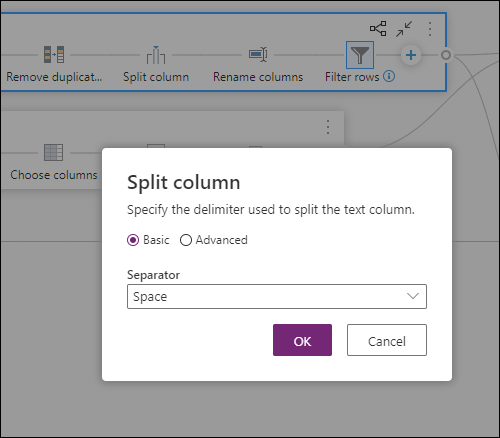

### Rename step

To rename a step, right-click the step and select **Rename**. This action opens the **Step properties** dialog. Enter the name you want, and then select **OK**.

### Delete step

To delete a step, right-click the step and select **Delete**. To delete a series of steps until the end, right-click the step and select **Delete until end**.

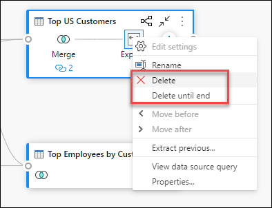

### Move before/Move after

To move a step one position before, right-click a step and select **Move before**. To move a step one position after, right-click a step and select **Move after**.

### Extract previous  

To extract all previous steps into a new query, right-click the first step that you do *not* want to include in the query and then select **Extract previous**.

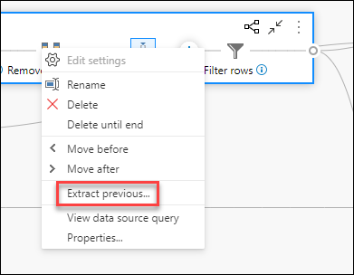

### Edit step name and description

To add step descriptions, right-click a step in a query and then choose **Properties**.

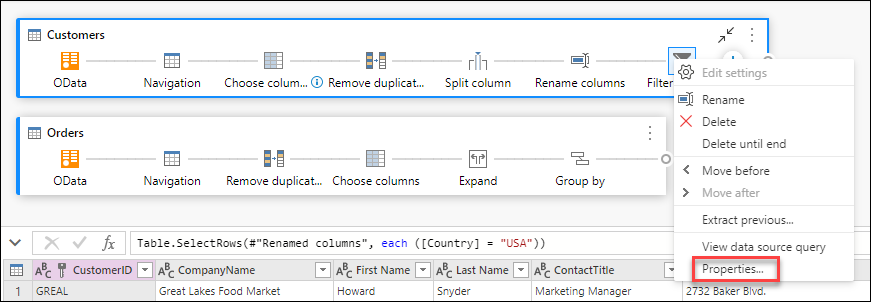

You can also get to the step level context menu by hovering over the step and selecting the ellipsis (three vertical dots).

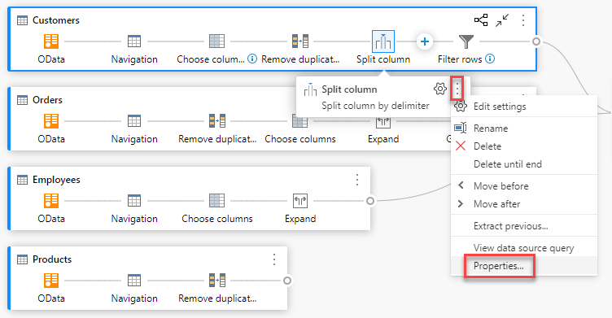

This action will open a dialog box where you can add the step description. This step description will come handy when you come back to the same query after a few days or when you share your queries or dataflows with other users.

By hovering over each step, you can view a call out that shows the step label, step name, and step descriptions (that were added).

By selecting each step, you can see the corresponding data preview for that step. 

## Expand and collapse queries

To ensure that you can view your queries in the diagram view, you can collapse the ones that you aren't actively working on and expand the ones that you care about. Expand or collapse queries by selecting the **Expand/Collapse** button on the top-right of a query. Alternatively, double-clicking an expanded query will collapse the query and vice-versa.

You can also expand or collapse a query by selecting the query level actions from the query’s context menu.

To expand all or collapse all queries, select the **Expand all/Collapse all** button next to the layout options in the diagram view pane.

You can also right-click any empty space in the diagram view pane and see a context menu to expand all or collapse all queries.

In the collapsed mode, you can quickly look at the steps in the query by hovering over the number of steps in the query. You can select these steps to navigate to that specific step within the query.  

## Layout Options

There are four layout options available in the diagram view: zoom out, zoom in, full screen, fit to view, and reset.

### Zoom out/zoom in

With this option, you can adjust the zoom level and zoom out or zoom in to view all the queries in the diagram view.

### Full screen

With this option, you can view all the queries and their relationships through the *Full screen* mode. The diagram view pane expands to full screen and the data preview pane, queries pane, and steps pane remain collapsed.

### Fit to view

With this option, you can adjust the zoom level so that all the queries and their relationships can be fully viewed in the diagram view.

### Reset

With this option, you can reset the zoom level back to 100% and also reset the pane to the top-left corner.

## View query relationships

To view all the related queries for a given query, select the **Highlight related queries** button. For instance, by selecting the highlight related queries button in the **Top US Customers** query, the **Customers** and **Orders** queries are highlighted, as shown in the following image.  

You can also select the dongle on the left of a given query to see the direct and indirect referenced queries.

Similarly, you can select the right dongle to view direct and indirect dependent queries.

You can also hover on the link icon below a step to view a callout that shows the query relationships.

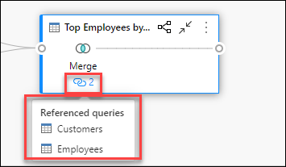

## Diagram view settings

There are two ways to modify diagram view settings. The first way is to select the lower half of the **Diagram View** button inside the **View** tab in the ribbon.

The second way to modify diagram view settings is to right-click over a blank part of the diagram view background.

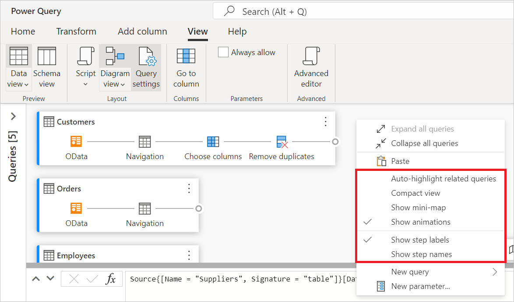

### Step labels and step names

We show **step labels** by default within the diagram view.

You can change diagram view settings to show **step names** to match the **applied steps** within the **query settings** pane.

### Auto-highlight related queries

By selecting **Auto-highlight related queries** within diagram view settings, related queries are always highlighted so that you can visually see the query dependencies better

### Compact view

When you have queries with multiple steps, it can be challenging to scroll horizontally to view all your steps within the viewport.

To address this, diagram view offers **Compact view**, which compresses the steps from top to bottom instead of left to right. This view can be especially useful when you have queries with multiple steps, so that you can see as many queries as possible within the viewport.

To enable this view, navigate to diagram view settings and select **Compact view** inside the **View** tab in the ribbon.

### Show mini-map

Once the number of queries begin to overflow the diagram view, you can use the scroll bars at the bottom and right side of the diagram view to scroll through the queries. One other method of scrolling is to use the diagram view mini-map control. The mini-map control lets you keep track of the overall dataflow "map", and quickly navigate, while looking at an specific area of the map in the main diagram view area.

To open the mini-map, select **Show mini-map** from the diagram view menu.

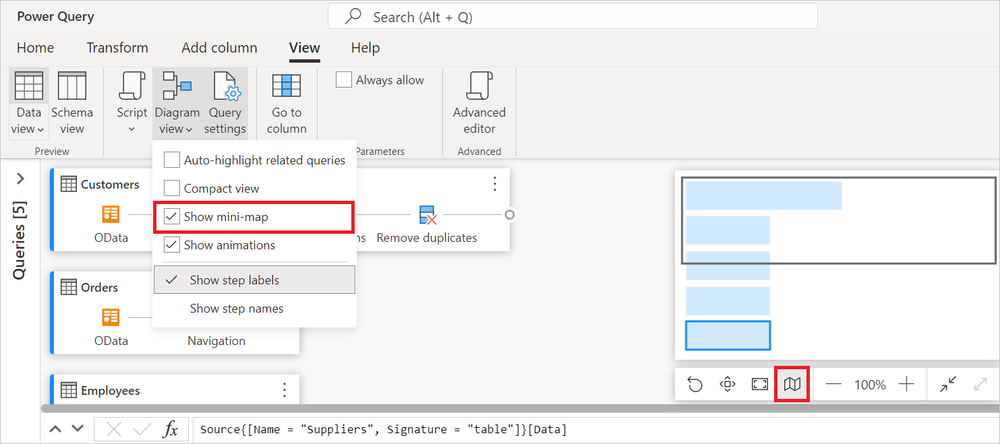

Right-click and hold the rectangle on the mini-map, then move the rectangle to move around in the diagram view.

### Show animations

When the **Show animations** menu item is selected, the transitions of the sizes and positions of the queries is animated. These transitions are easiest to see when collapsing or expanding the queries or when changing the dependencies of existing queries. When cleared, the transitions will be immediate. Animations are turned on by default.

:::image type="content" source="images/show-animations.gif" alt-text="Animation showing the difference between Show animations being selected or being cleared.":::

## Maximize data preview

You may want to see more data within the data preview to understand and analyze the data. To do so, expand the data preview so that you can see as much data as before within the data preview without leaving diagram View.

## Expand or collapse all queries

By default, the queries within diagram view are collapsed. There are options to expand or collapse each query in a single click.

You can also expand or collapse related queries from the query level context menu.

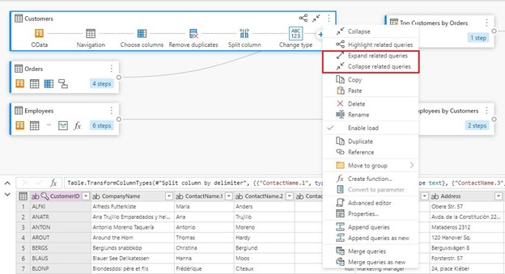

## Multi-select queries

You select multiple queries within the diagram view by holding down the Ctrl key and clicking queries. Once you multi-select, right-clicking will show a context menu that allows performing operations such as merge, append, move to group, expand/collapse and more.

## Inline rename

You can double-click the query name to rename the query.

Double-clicking the step name allows you to rename the step, provided the diagram view setting is showing step names.

When step labels are displayed in diagram view, double-clicking the step label shows the dialog box to rename the step name and provide a description.

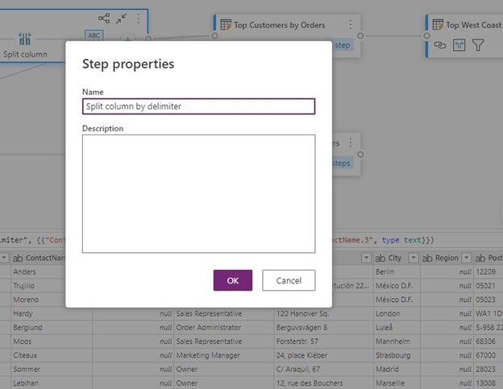

## Accessibility

Diagram view supports accessibility features such as keyboard navigation, high-contrast mode, and screen reader support. The following table describes the keyboard shortcuts that are available within diagram view. To learn more about keyboard shortcuts available within Power Query Online, see [keyboard shortcuts in Power Query](keyboard-shortcuts.md).

| Action | Keyboard shortcut|
| --- | --- |
| Expand selected query | Ctrl+Right arrow key |
| Collapse selected query | Ctrl+Left arrow key |
| Move focus from query level to step level | Alt+Down arrow key |
| Move focus from step level to query level | Esc |
| Expand all queries | Ctrl+Shift+Right arrow key |
| Collapse all queries | Ctrl+Shift+Left arrow key |
| Insert new step using+button (after selected step) | Ctrl+Alt+N |
| Highlight related queries | Ctrl+Alt+R |
| Select all queries | Ctrl+A |
| Copy queries | Ctrl+C |
| Paste queries | Ctrl+V |