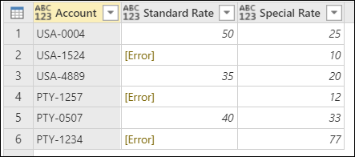
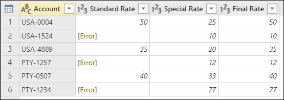
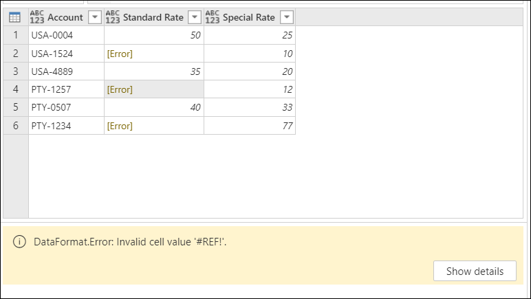
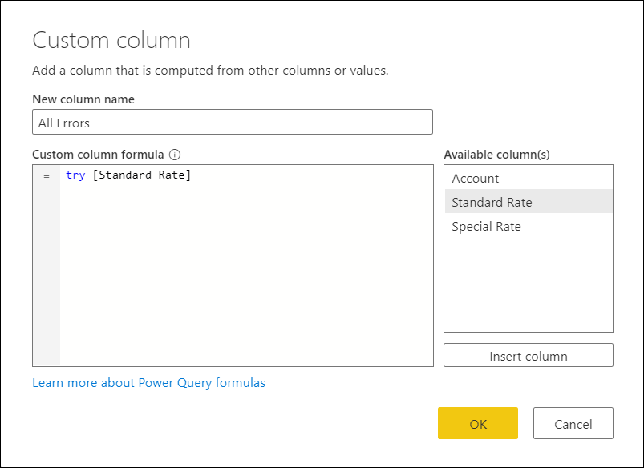
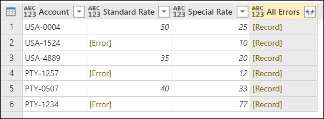
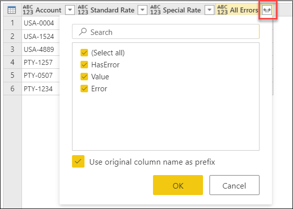
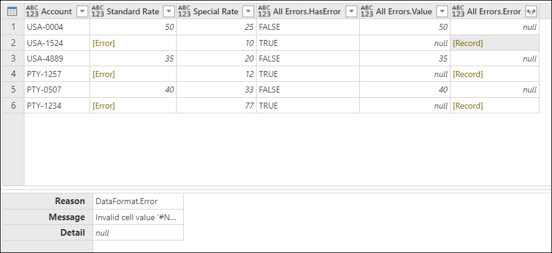
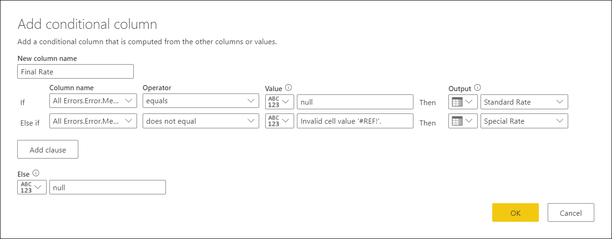

# Error handling
Similar to how Excel and the DAX language have an `IFERROR` function, Power Query has its own syntax to test and catch errors. 

As mentioned in the article on [dealing with errors in Power Query](dealing-with-errors.md), errors can appear either at the step or cell level. This article will focus on how you can catch and manage errors based on our own specific logic.

>[!Note]
> To demonstrate this concept, this article will use an Excel Workbook as its data source. The concepts showcased here apply to all values in Power Query and not only the ones coming from an Excel Workbook. 

## Applying conditional logic based on errors
The sample data source for this demonstration is an Excel Workbook with the following table:

This table from an Excel Workbook has Excel errors such as **#NULL!**, **#REF!**, and **#DIV/0!** in the **Standard Rate** column. When you import this table into the Power Query Editor, the following image shows how it will look.

Notice how the errors from the Excel workbook are shown with the `[Error]` value in each of the cells. 

In this case, the goal is to create a new **Final Rate** column that will use the values from the **Standard Rate** column. If there are any errors, then it will use the value from the correspondent **Special Rate** column.

### Add custom column with `try` and `otherwise` syntax

To create a new custom column, go to the **Add column** menu and select **Custom column**. In the **Custom column** window, enter the formula `try [Standard Rate] otherwise [Special Rate]`. Name this new column **Final Rate**.

The formula above will try to evaluate the **Standard Rate** column and will output its value if no errors are found. If errors are found in the **Standard Rate** column, then the output will be the value defined after the `otherwise` statement, which in this case is the **Special Rate** column.

After adding the correct data types to all of the columns in the table, the following image shows how the final table looks.

## Catching an error with `try` and applying custom conditional logic

Using the same sample data source as the previous section, the new goal is to create a new column for the **Final Rate**. If the value from the **Standard Rate** exists, then that value will be used. Otherwise the value from the **Special Rate** column will be used, except for the rows with any `#REF!` error. 

>[!Note]
> The sole purpose of excluding the `#REF!` error is for demonstration purposes. With the concepts showcased in this article, you can target any error reasons, messages, or details of your choice.

When you select any of the whitespace next to the error value, you get the details pane at the bottom of the screen. The details pane contains both the error reason, `DataFormat.Error`, and the error message, `Invalid cell value '#REF!'`:

You can only select one cell at a time, so you can effectively only see the error components of one error value at a time. This is where you'll create a new custom column and use the `try` expression.

### Add custom column with `try` syntax
To create a new custom column, go to the **Add column** menu and select **Custom column**. In the **Custom column** window, enter the formula `try [Standard Rate]`. Name this new column **All Errors**.

The `try` expression converts values and errors into a record value that indicates whether the `try` expression handled an error or not, as well as the proper value or the error record.

You can expand this newly created column with record values and look at the available fields to be expanded by selecting the icon next to the column header.

This operation will expose three new fields:

* **All Errors.HasError**&mdash;displays whether the value from the **Standard Rate** column had an error or not.
* **All Errors.Value**&mdash;if the value from the **Standard Rate** column had no error, this column will display the value from the **Standard Rate** column. For values with errors this field won't be available, and during the expand operation this column will have `null` values.
* **All Errors.Error**&mdash;if the value from the **Standard Rate** column had an error, this column will display the error record for the value from the **Standard Rate** column. For values with no errors, this field won't be available, and during the expand operation this column will have `null` values.

For further investigation, you can expand the **All Errors.Error** column to get the three components of the error record:
* Error reason
* Error message
* Error detail

After doing the expand operation, the **All Errors.Error.Message** field displays the specific error message that tells you exactly what Excel error each cell has. The error message is derived from the **Error Message** field of the error record.

### Add a conditional column

Now with each error message in a new column, you can create a new conditional column with the name **Final Rate** and the following clauses:
* If the value in the **All Errors.Errors.Message** column equals `null`, then the output will be the value from the **Standard Rate** column.
* Else, if the value in the **All Errors.Errors.Message** column equals `Invalid cell value '#REF!'.`, then the output will be the value from the **Special Rate** column.
* Else, null.

After keeping only the **Account**, **Standard Rate**, **Special Rate**, and **Final Rate** columns, and adding the correct data type for each column, the following image what the final table looks like.

## More resources

* [Understanding and working with errors in Power Query](Dealing-with-errors.md)
* [Add a Custom column in Power Query](add-custom-column.md)
* [Add a Conditional column in Power Query](add-conditional-column.md)
