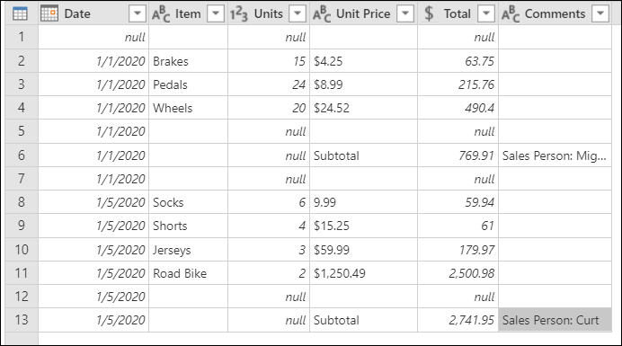

# Fill Down / Up

The operation to fill up / down is an operation that can happen from row to row in a single column. 

For example, imagine the following table where we would like to fill down on the Date column and fill up on the Comments column:

The outcome that we're expecting is the following:

## To Fill Down

The fill down operation takes a column and traverses through the values in it to fill any null values in the next rows until it finds a new value. This process continues on a row by row basis until there are no more values in that column

In our example, we want to fill down on the Date column. To do that, you can right click on the Date column and select the option to Fill and Down:

The result of that operation will look like this:

## To Fill Up

Similarly to the Fill down operation, the fill up works on a column, but it finds the last value of the column and fills any null values in the previous rows until it finds a new value and then the same process occurs for that value until. This process continues until there are no more values in that column.

In our example, we want to fill up on the Comments column. You'll notice that our Comments column doesn't have null values, but instead it has what appears to be empty cells. Before we can do the fill up operation, we need transform those empty spaces into null values. To make that happen, we simply select the column, go to the transform tab and select the option to Replace values. 

In the replace values window, we'll leave the "Value to find" completely blank and in the "Replace with" we'll type null:

>[!NOTE] 
>You can learn more about the Replace values operation [here](/replace-values.md).

Once all of our empty values are replaced for null values, we select the Comments column, go to the Transform tab and select the Fill up operation from the Any Column group:

The result of that operation will look like this:

## Cleaning our table

To finish our table, we will perform the following transformations:

1. Filter the Units column to only have rows that are not equal to *null* 

   

2. Rename the Comments column to be Sales Person

3. Replace the values inside the Sales Person column from 'Sales Person: ' to '' so we only get the names of the Sales Persons.

And this gives us exactly the table that we were looking for:

