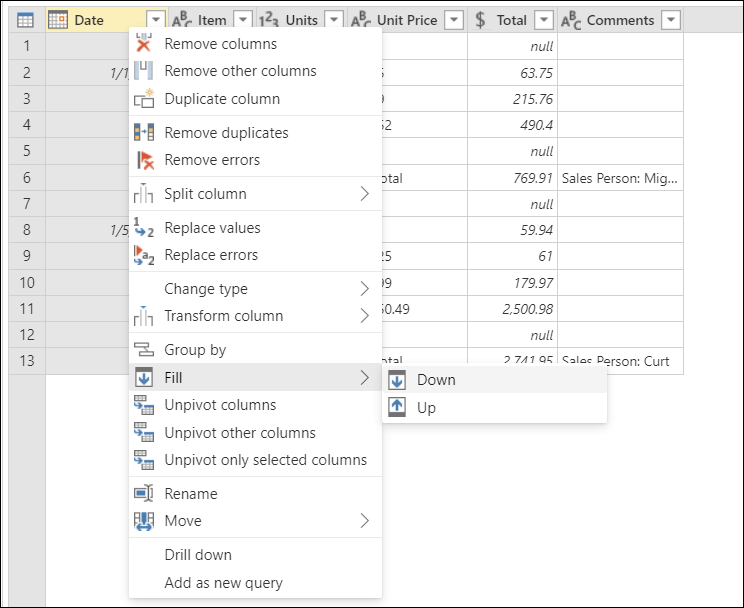
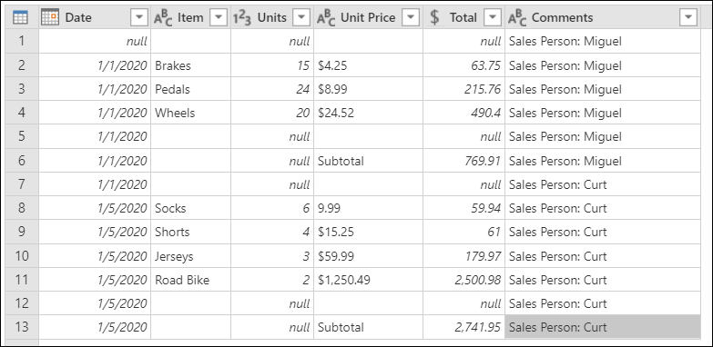
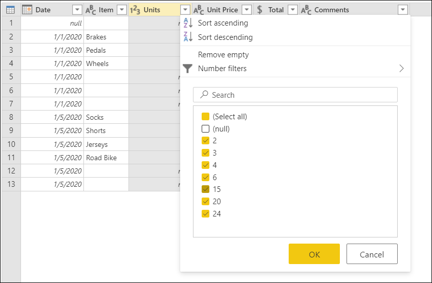

# Fill values in a column

You can use fill up and fill down to replace null values with the last non-empty value in a column. For example, imagine the following table where you'd like to fill down in the **Date** column and fill up in the **Comments** column.

The outcome that you'd expect is shown in the following image.

## Fill down

The fill down operation takes a column and traverses through the values in it to fill any null values in the next rows until it finds a new value. This process continues on a row-by-row basis until there are no more values in that column.

In the following example, you want to fill down on the **Date** column. To do that, you can right-click to select the **Date** column, and then select **Fill** > **Down**.

The result of that operation will look like the following image.

## Fill up

In the same way as the fill down operation, fill up works on a column. But by contrast, fill up finds the last value of the column and fills any null values in the previous rows until it finds a new value. Then the same process occurs for that value. This process continues until there are no more values in that column.

In the following example, you want to fill the **Comments** column from the bottom up. You'll notice that your **Comments** column doesn't have null values. Instead it has what appears to be empty cells. Before you can do the fill up operation, you need to transform those empty cells into null values: select the column, go to the **Transform** tab, and then select **Replace values**.

In the **Replace values** dialog box, leave **Value to find** blank. For **Replace with**, enter **null**.

More information: [Replace values](replace-values.md)

After all empty cells are replaced with **null**, select the **Comments** column, go to the **Transform** tab, and then select **Fill** > **Up**.

The result of that operation will look like the following image.

## Cleaning up your table

1. Filter the **Units** column to show only rows that aren't equal to **null**.

   

2. Rename the **Comments** column as **Sales Person**. 

   

3. Remove the **Sales Person:** values from the **Sales Person** column so you only get the names of the salespeople.

   

Now you should have exactly the table you were looking for.

### See also

[Replace values](replace-values.md)
