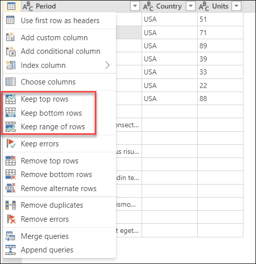
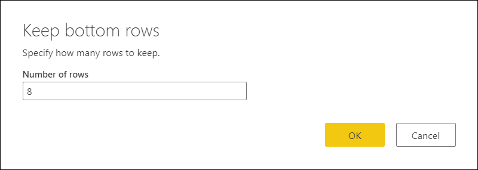
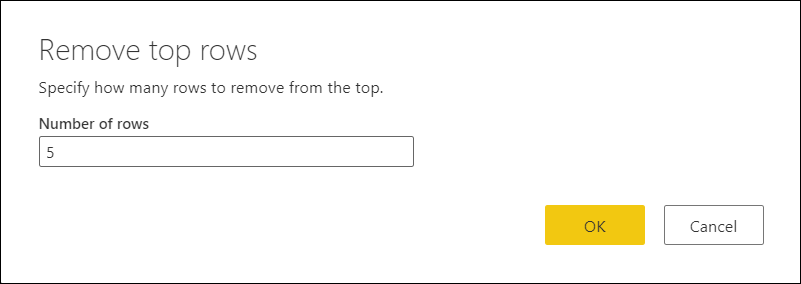

# Filter a table by Row Position

In Power Query, we have multiple options to filter a table based on the positions of its rows either by keeping or removing those rows. In this article we'll cover all of the methods available in Power Query to filter a table by row position.

## Keep Rows

These set of functions will select a set of rows from the table and will remove any other rows that do not meet the criteria.

We have 2 places where we can find the Keep Rows buttons:

1. **Home tab** - under the reduce rows group as the Keep rows button.
2. **Table contextual menu** - inside the data preview section. 

### Keep Top Rows

Imagine the following table that comes out of a system with a fixed layout:

This report will always contain 7 rows of data, and after that it'll have a section for comments with an unknown number of rows. We want to only keep those first 7 rows of data. To do that, we select the 'Keep top rows' from the table contextual menu and inside the Keep top rows window we input the number 7 in the 'Number of rows' textbox:

The result of that will give us the output table that we're looking for. After we set the data types to our columns, our table will look like this:

### Keep Bottom Rows

Imagine the following table that comes out of a system with a fixed layout:

This report will always contain 7 rows of data right at the end of the report page. Before that, the report holds a section for comments with an unknown number of rows. We want to only keep those last 7 rows of data and the header row. 

To do that, we select the 'Keep bottom rows' option from the table contextual menu and inside the Keep bottom rows window we input the number 8 in the 'Number of rows' textbox:

The result of that operation will give us 8 rows, but our column header is part of the table. 

We need to promote the column headers from the first row of our table. We can do this by selecting the 'Use first row as headers' option from the table contextual menu and the result of that will be our table with the correct column headers. After we set the data types to our columns, our table will look like this:

> !Note
>
> You can read more about the operations to promote and demote headers from this article (url).

### Keep Range of Rows

Imagine the following table that comes out of a system with a fixed layout:

This report will always contain 5 rows for the Header, 1  row of column headers after that, 7 rows of data right after that and then an unknown number of rows for its comments section. Our goal is to get the 8 rows after the header section of the report and only those 8 rows. 

To do that, we select the 'Keep range of rows' option from the table contextual menu and inside the Keep range of rows window we input the number 6 in the 'First row' textbox and the number 8 in the 'Number of rows' textbox:

Similar to the previous example for 'Keep bottom rows', the result of that operation will give us 8 rows, but our column header is part of the table:

We can perform the same operation to promote the column headers from the first row of our table. After we set the data types to our columns, our table will look like this:

## Remove Rows

These set of functions will select a set of rows from the table to remove them and only keep the rest of the rows from the table. 

We have 2 places where we can find the Remove Rows buttons:

1. **Home tab** - under the reduce rows group as the Keep rows button.
2. **Table contextual menu** - inside the data preview section. 

### Remove Top Rows

Imagine the following table that comes out of a system with a fixed layout:

This report will always contain a fixed section or header that will go from row 1 until row 5 of the table. We want to remove the first 5 rows of the table and only keep the rest of the data.

To do that, we select the 'Remove top rows' option from the table contextual menu and inside the Remove top rows window we input the number 5 in the 'Number of rows' textbox:

Similarly to the previous example for 'Keep bottom rows' and 'Keep range of rows', the result of that operation will give us 8 rows, but our column header is part of the table:

We can perform the same operation to promote the column headers from the first row of our table. After we set the data types to our columns, our table will look like this:

### Remove Bottom Rows

Imagine the following table that comes out of a system with a fixed layout:

This report will always contain a fixed section or footer that will always be the last 5 rows of the table. We want to remove those last 5 rows of the table and only keep the rest of the data.

To do that, we select the 'Remove bottom rows' option from the table contextual menu and inside the Remove top rows window we input the number 5 in the 'Number of rows' textbox:

The result of that will give us the output table that we're looking for. After we set the data types to our columns, our table will look like this:

### Remove Alternate Rows

Imagine the following table that comes out of a system with a dynamic layout:

The way that this report is structured is that we have elements in pairs. Every odd row (1,3,5...) contain the data that we need and right underneath each of those rows, the even rows, there are comments for each of those records. We do not need the comments and we want to remove all of them.

To do that, we select the 'Remove alternate rows' option from the table contextual menu and inside the Remove alternate rows window we input:

* **First row to remove:** 2
  * We want to start counting from the second row
* **Number of rows to remove:** 1
  * We start defining the pattern to remove rows. After we find the second row, we only want to remove that specific row, so we say that we only need to remove 1 row.
* **Number of rows to keep:** 1
  * After we remove 1 row, we keep the next row and the process starts again for the next row

The result of that will give us the output table that we're looking for. After we set the data types to our columns, our table will look like this:

