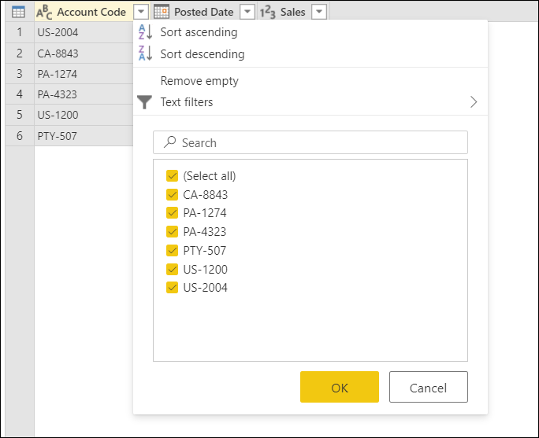
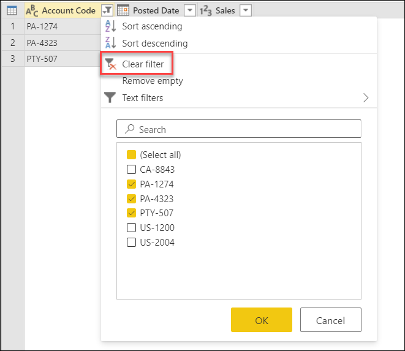
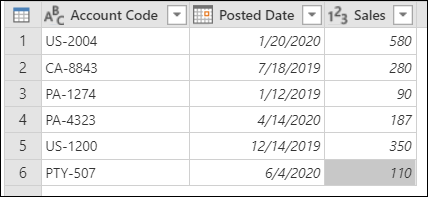

# Filter by values in a column
<!--Edit to title suggested, to match filter-row-position.-->
In Power Query, you can include or exclude rows according to a specific value in a column. You can choose from two methods to filter the values in your column:
<!--These introduction should be rewritten to mention that type-specific filters are also covered. The two ways of accessing the filters aren't as interesting. This is another example of how describing the UI and describing what the reader wants to know are often at odds with each other.-->
* [Sort and filter menu](#sort-and-filter-menu)
* [Cell shortcut menu](#right-click)

After you apply a filter to a column, a small filter icon appears in the column heading, as shown in the following illustration.

## Sort and filter menu

In the column header, you'll see an icon with an inverse triangle. When you select this icon, the sort and filter menu is displayed. With this menu, you can apply or remove any filters to or from your column.

> [!NOTE]
> In this article, we'll focus on aspects related to filtering data. To learn more about the sort options and how to sort columns in Power Query, go to [Sort columns](sort-columns.md).  

### Remove empty

The **Remove empty** command applies two filter rules to your column: The first rule gets rid of any null values, the second rule gets rid of any blank values. For example, imagine a table with just one text column with five rows, where you have one null value and one blank cell.

> [!NOTE]
> A null value is a specific value in the Power Query language that represents no value.

You then select **Remove empty** from the sort and filter menu, as shown in the following image.

<!-- You don't need to document every way to do something, every time. Suggest deleting the following:
You can also select this option from the **Home** tab in the **Reduce Rows** group in the **Remove Rows** drop-down options, as shown in the next image.

-->
The result of the **Remove empty** operation gives you the same table without the empty values.

### Clear filter

When a filter is applied to a column, the **Clear filter** command appears on the sort and filter menu.

### Auto filter

The list in the sort and filter menu is called the *auto filter* list, which shows the unique values in your column. You can manually select or deselect which values to include in the list. Any selected values will be taken into consideration by the filter; any values that aren't selected will be ignored.<!--Edit okay? I don't know what "taken into consideration" means here. If you mean that the filter will operate only on the values with check marks, it seems misleading to say that the unselected values will be "filtered out."-->

This auto filter section also has a search bar to help you find any values from your list.

> [!NOTE]
> When you load the auto filter list, only the top 1,000 distinct values in the column are loaded. If there are 1,000 or more<!--This is ambiguous; what happens if this first load is exactly 1,000? Should the previous sentence say "only the top 999 distinct values"?--> values in the column in Power Query Editor that you're filtering, a message will appear indicating that the list of values in the filter list might be incomplete, and the **Load more** link appears. Select the **Load more** link to load another 1,000 distinct values.
>
> * If exactly 1,000 distinct values are found again, the list is displayed with a message stating that the list might still be incomplete.
> * If fewer than 1,000 distinct values are found, the full list of values is shown.

## Cell shortcut menu

You can right-click a particular cell in a column to open the shortcut menu for that value. From the small filter icon<!--Should this be "Point to the small filter icon, and then select..."?-->, you can then select the filter option you want to use.

> [!NOTE]
> Power Query displays a type-specific filter based on the data type of the column.

## Type-specific filters

Depending on the data type of your column, you'll see different commands in the sort and filter menu. The following images show examples for a date, text, and numeric columns.

### Filter rows

When selecting any of the type-specific filters, you'll use the **Filter rows** dialog box to specify filter rules for the column. This dialog box is shown in the following image.

The **Filter rows** dialog box has two modes: **Basic** and **Advanced**.

##### Basic

With basic mode, you can implement up to two filter rules based on type-specific filters. In the preceding image, notice that the name of the selected column is displayed after the label **Keep rows where**, to let you know which column these filter rules are being implemented on.

For example, imagine that in the following table, you want to filter the **Account Code** by all values that start with either **PA** or **PTY**.

To do that, you can go to the **Filter rows** dialog box for the **Account Code** column and specify the set of filter rules you want.

The result of that operation will give you the set of rows that you're looking for.

##### Advanced

With advanced mode, you can implement as many type-specific filters as necessary from all the columns in the table.

For example, imagine that instead of applying the previous filter in basic mode, you wanted to implement a filter to **Account Code** to show all values that end with **4**. Also, you want to show values over $100 in the **Sales** column. The following image shows what that will look like in advanced mode.

The result of that operation will give you just one row that meets both criteria.

> [!NOTE]
> You can add as many clauses to as you'd like by selecting **Add clause**. All clauses act at the same level, so you might want to consider creating multiple filter steps if you need to implement filters that rely on other filters.
