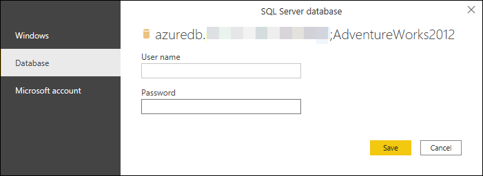
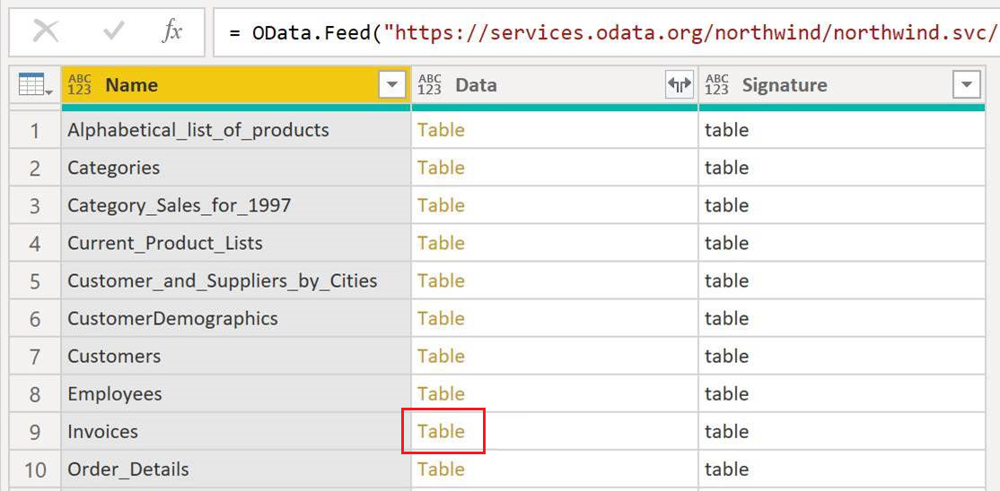

# Getting data

## Power Query Online experience

## Power Query Desktop experience

Power Query can connect to many different data sources so you can work with the data you need. This article walks you through the steps for bringing in data to Power Query.

Connecting to a data source with Power Query follows a standard set of stages before landing the data at a destination. This article describes each of these stages.

>[!NOTE]
>In some cases, a connector might have all of these stages, and in other cases a connector might have just a few of them. For more information about the experience of a specific connector, go to the documentation available for the specific connector.

The stages are:

1. Connection settings

2. Authentication

3. Data preview

4. Query destination

### 1. Connection settings

Most connectors initially require at least one parameter to initialize a connection to the data source. For example, the SQL Server connector requires at least the host name to establish a connection to the SQL Server database.

In comparison, when trying to connect to an Excel file, Power Query requires that you use the file path to find the file you want to connect to.

The connector parameters are commonly used to establish a connection to a data source, and they&mdash;in conjunction with the connector used&mdash;define what's called a *data source path*.

>[!Note] 
>Some connectors don't require you to enter any parameters at all. These are called *singleton connectors* and will only have one data source path available per environment. Some examples are Adobe Analytics, MailChimp, and Google Analytics.

### 2. Authentication

Every single connection that's made in Power Query has to be authenticated. The authentication methods vary from connector to connector, and some connectors might offer multiple methods of authentication.

The currently available methods of authentication for Power Query are:

* **Anonymous**: Commonly used when connecting to a data source that doesn't require user authentication, such as a webpage or a file available over public HTTP.
* **Basic**: A **username** and **password** sent in base64 encoding are accepted for authentication.
* **API Key**: A single API key is accepted for authentication.
* **Organizational account** or **Microsoft account**: This method is also known as **OAuth 2.0**.
* **Windows**: Can be implicit or explicit.
* **Database**: This is only available in some database connectors.

For example, the available authentication methods for the SQL Server database connector are Windows, Database, and Microsoft account.

### 3. Data preview

The goal of the data preview stage is to provide you with a user-friendly way to preview and select your data.

Depending on the connector that you're using, you can preview data by using either:

* Navigator window
* Table preview dialog box

#### Navigator window (navigation table)

The **Navigator** window consists of two main sections:

* The object selection pane is displayed on the left side of the window. The user can interact with and select these objects.

    >[!NOTE]
    >For Power Query in Excel, select the **Select multiple items** option from the upper-left corner of the navigation window to select more than one object at a time in the object selection pane.

    >[!NOTE]
    >The list of objects in Power Query Desktop is limited to 10,000 items. This limit does not exist in Power Query Online. For a workaround in Power Query Desktop, see [Object limitation workaround](#object-limitation-workaround).
    
* The data preview pane on the right side of the window shows a preview of the data from the object you selected.

##### Object limitation workaround

There’s a fixed limit of 10,000 objects in the **Navigator** in Power Query Desktop. This limit does not occur in Power Query Online. Eventually, the Power Query Online UI will replace the one in the desktop.

In the interim, you can use the following workaround:

1. Right-click on the root node of the **Navigator**, and then select **Transform Data**.

    

2. Power Query Editor then opens with the full navigation table in the table preview area. This view doesn't have a limit on the number of objects, and you can use filters or any other Power Query transforms to explore the list and find the rows you want (for example, based on the **Name** column).

3. Upon finding the item you want, you can get at the contents by selecting the data link (such as the **Table** link in the following image).

    

#### Table preview dialog box

The table preview dialog box consists of only one section for the data preview. An example of a connector that provides this experience and window is the [Folder](connectors/folder.md) connector.

### 4. Query destination

This is the stage in which you specify where to load the query. The options vary from integration to integration, but the one option that's always available is loading data to the Power Query Editor to further transform and enrich the query.