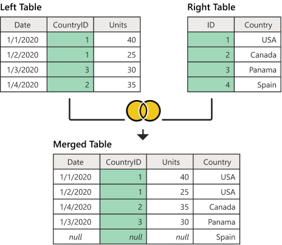
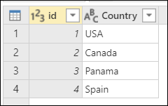
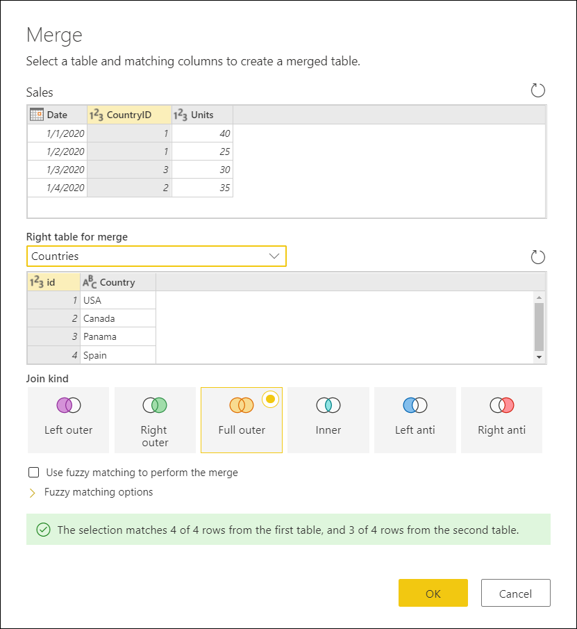
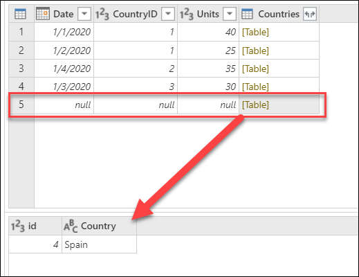
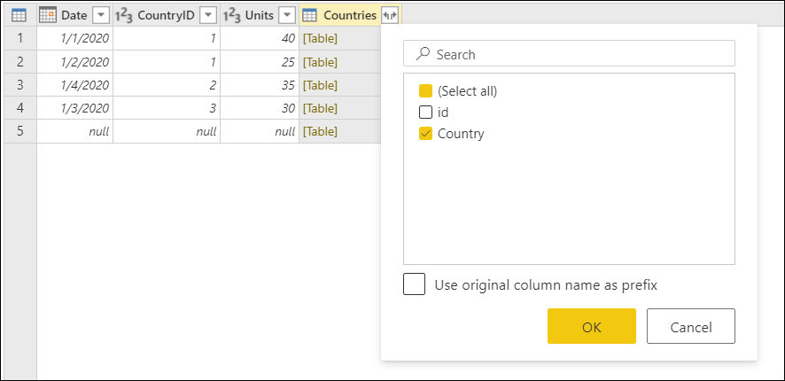

# Full outer join

A full outer join is one of the join kinds available inside the **Merge queries** window in Power Query. To read more about the merge operations in Power Query, see [Merge operations overview](merge-queries-overview.md).

A full outer join brings in all the rows from both the left and right table.

This article demonstrates, with a practical example, how to do a merge operation using the full outer join as the join kind.

>[!Note]
>Samples used in this article are only to showcase the concepts. The concepts showcased here apply to all queries in Power Query.

## Sample input and output tables

The sample source tables for this example are:

* **Sales**&mdash;with the fields **Date**, **CountryID**, and **Units**. The *CountryID* is a whole number value that represents the unique identifier from the **Countries** table.

   

* **Countries**&mdash;this table is a reference table with the fields **id** and **Country**. The *id* represents the unique identifier of each record.

   

The goal is to merge both tables, where the **Sales** table will be the left table and the **Countries** table the right one. The join will be made between the following columns:

|Field from Sales table| Field from Countries table|
|-----------|------------------|
|CountryID|id|

The goal is to reach the following table where the name of the country appears as a new **Country** column in the **Sales** table. Because of how the full outer join works, all rows from both the left and right table will be brought in, regardless of whether they only appear in one of the tables.

## Full outer join

To do a full outer join:

1. Select the **Sales** query, and then select **Merge queries** to create a new step inside the Sales query that will merge the **Sales** query with the **Countries** query.
2. Select **Countries** as the **Right table for merge**.
3. Select the **CountryID** column from the **Sales** table.
4. Select the **id** column from the **Countries** table.
5. From the **Join Kind** section, select the **Full outer** option.
6. Select **OK**.

>[!TIP]
>Take a closer look at the message at the bottom of the Merge window that reads *"The selection matches 4 of 4 rows from the first table, and 3 of 4 rows from the second table"* as this is crucial to understand the result that you get from this operation. 

In the **Countries** table, you have the **Country** Spain with **id** of 4, but there are no records for **CountryID** 4 in the **Sales** table. That's why only three of four rows from the right table found a match. All rows from the right table that didn't have matching rows from the left table will be grouped and shown in a new row in the output table with no values for the fields from the left table. 

From the newly created **Countries** column after the merge operation, expand the **Country** field without using the original column name as prefix.

After doing this operation, the desired result is reached.

