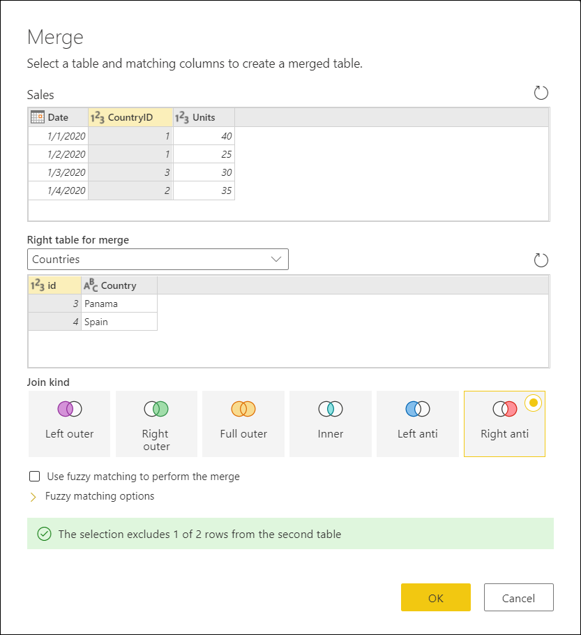
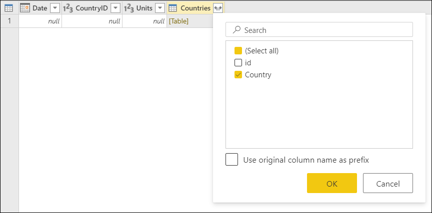

# Right anti join

One of the join kinds available in the **Merge** dialog box in Power Query is a *right anti join*, which brings in only rows from the right table that don't have any matching rows from the left table. More information: [Merge operations overview](merge-queries-overview.md)

:::image type="complex" source="images/right-anti-join-operation.png" alt-text="Right anti join example.":::
   Figure shows a table on the left with Date, CountryID, and Units columns. The emphasized CountryID column contains values of 1 in rows 1 and 2, 3 in row 3, and 2 in row 4. A table on the right contains ID and Country columns. The emphasized ID column contains values of 3 in row 1 (denoting Panama) and 4 in row 2 (denoting Spain). A table below the first two tables contains Date, CountryID, Units, and Country columns. The table has one row, with the Date, CountryID and Units set to null, and the Country set to Spain.
   :::image-end:::

This article uses sample data to show how to do a merge operation with the right anti join. The sample source tables for this example are:

* **Sales**: This table includes the fields **Date**, **CountryID**, and **Units**. **CountryID** is a whole number value that represents the unique identifier from the **Countries** table.

   

* **Countries**: This is a reference table with the fields **id** and **Country**. The **id** field represents the unique identifier for each record.

   

In this example, you'll merge both tables, with the **Sales** table as the left table and the **Countries** table as the right one. The join will be made between the following columns.

|Field from the Sales table| Field from the Countries table|
|-----------|------------------|
|CountryID|id|

The goal is to create a table like the following, where only the rows from the right table that don't match any from the left table are kept. As a common use case, you can find all the rows that are available in the right table but aren't found in the left table.

:::image type="complex" source="images/me-merge-operations-right-anti-final-table.png" alt-text="Table created from Right anti join.":::
   Right anti join final table with the Date, CountryID, Units, and Country header columns, containing one row with null in all columns except Country, which contains Spain.
:::image-end:::

<!--markdownlint-disable MD036-->
**To do a right anti join**
<!--markdownlint-enable MD036-->
1. Select the **Sales** query, and then select **Merge queries**.
2. In the **Merge** dialog box, under **Right table for merge**, select **Countries**.
3. In the **Sales** table, select the **CountryID** column.
4. In the **Countries** table, select the **id** column.
5. In the **Join kind** section, select **Right anti**.
6. Select **OK**.

>[!TIP]
>Take a closer look at the message at the bottom of the dialog box that reads "The selection excludes 1 of 2 rows from the second table." This message is crucial to understanding the result that you get from this operation. 

In the **Countries** table, you have the **Country** Spain with an **id** of 4, but there are no records for **CountryID** 4 in the **Sales** table. That's why only one of two rows from the right (second) table found a match. Because of how the right anti join works, you'll never see any rows from the left (first) table in the output of this operation.

From the newly created **Countries** column, expand the **Country** field. Don't select the **Use original column name as prefix** check box.

After performing this operation, you'll create a table that looks like the following image. The newly expanded **Country** field doesn't have any values. That's because the right anti join doesn't bring any values from the left table&mdash;it only keeps rows from the right table.

:::image type="complex" source="images/me-merge-operations-right-anti-final-table-2.png" alt-text="Right anti join final table.":::
   Final table with the Date, CountryID, Units, and Country header columns, containing one row with null in all columns except Country, which contains Spain.
:::image-end:::
