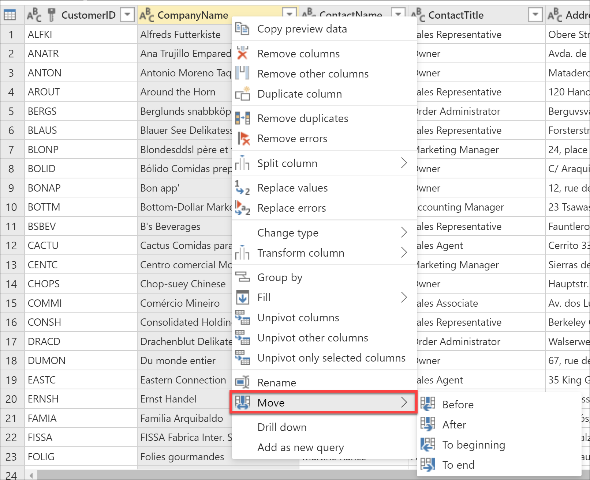

# Move columns

A common process when preparing data is to move columns in the dataset.

To accomplish this move, you can either select the **Move** option or *drag and drop* the column.

## Move option

The following example shows the different ways of moving columns. This example focuses on moving the Contact Name column.

You move the column using the **Move** option. This option located in the **Any column** group under the **Transform** tab. In the **Move** option, the available choices are:

* Before
* After
* To beginning
* To end

You can also find this option when you right-click a column.

If you want to move one column to the left, then select **Before**.

The new location of the column is now one column to the left of its original location.

If you want to move one column to the right, then select **After**.

The new location of the column is now one column to the right of its original location.

If you want to move the column to the most left space of the dataset, then select **To beginning**.

The new location of the column is now on the far left side of the table.

If you want to move the column to the most right space of the dataset, then select **To end**.

The new location of the column is now on the far right side of the table.

## Drag and drop

Another way to move a column through the dataset is to drag and drop the column.
Move the column to the place where you would like to place it.

## Go to column feature

If you want to find a specific column, then go to the **View** tab in the ribbon and select **Go to column**.

From there, you can specifically select the column you would like to view, which is especially useful if there are many columns.

