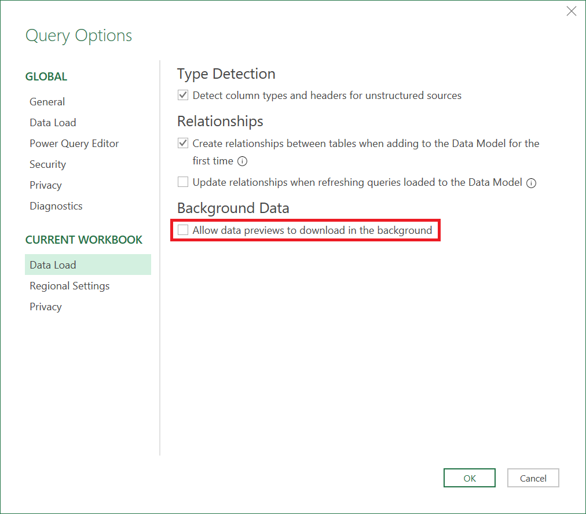
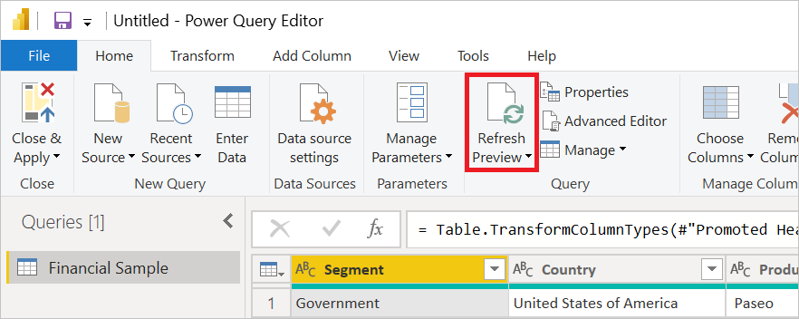

# Why does my query run multiple times?

When refreshing in Power Query, there's a lot done behind the scenes to attempt to give you a smooth user experience, and to execute your queries efficiently and securely. However, in some cases you might notice that multiple data source requests are being triggered by Power Query when data is refreshed. Sometimes these requests are normal, but other times they can be prevented.

## When multiple requests occur

The following sections describe a few instances when Power Query can send multiple requests to a data source.

### Connector design

Connectors can make multiple calls to a data source for various reasons, including metadata, caching of results, pagination, and so on. This behavior is normal and is designed to work that way.

### Multiple queries referencing a single data source

Multiple requests to the same data source can occur if multiple queries pull from that data source. These requests can happen even in a case where only one query references the data source. If that query is referenced by one or more other queries, then each query&mdash;along with all the queries it depends on&mdash;is evaluated independently.

In a desktop environment, a single refresh of all the tables in the data model is run using a single shared cache. Caching can reduce the likelihood of multiple requests to the same data source, since one query can benefit from the same request having already been run and cached for a different query. Even here, though, you can get multiple requests either because the data source isn't cached (for example, local CSV files), the request to the data source is different than a request that was already cached because of downstream operations (which can alter folding), the cache is too small (which is relatively unlikely), or because the queries are running at roughly the same time.

In a cloud environment, each query is refreshed using its own separate cache, so a query can’t benefit from the same request having already been cached for a different query.

### Folding

Sometimes Power Query’s folding layer may generate multiple requests to a data source, based on the operations being performed downstream. In such cases, you might avoid multiple requests by using `Table.Buffer`. More information: [Buffer your table](#buffer-your-table)

### Loading to the Power BI Desktop model

In Power BI Desktop, Analysis Services (AS) refreshes data by using two evaluations: one to fetch the schema&mdash;which AS does by asking for zero rows&mdash;and one to fetch the data. If computing the zero-row schema requires fetching the data, then duplicate data source requests can occur.

### Data privacy analysis

Data privacy does its own evaluations of each query to determine whether the queries are safe to run together. This evaluation can sometimes cause multiple requests to a data source. A telltale sign that a given request is coming from data privacy analysis is that it will have a “TOP 1000” condition (although not all data sources support such a condition). In general, disabling data privacy&mdash;assuming that's acceptable&mdash;would eliminate the "TOP 1000" or other data privacy-related requests during refresh. More information: [Disable the data privacy firewall](#disable-the-data-privacy-firewall)

### Background data downloads (also known as “background analysis”)

Similar to the evaluations performed for data privacy, the Power Query editor by default will download a preview of the first 1000 rows of each query step. Downloading these rows helps ensure the data preview is ready to display as soon as a step is selected, but it can also cause duplicate data source requests. More information: [Disable background analysis](#disable-background-analysis)

### Miscellaneous Power Query editor background tasks

Various Power Query editor background tasks can also trigger extra data source requests (for example, step folding analysis, column profiling, the automatic refresh of the 1000-row preview that Power Query triggers after loading results to Excel, and so on).

## Isolating multiple queries

You can isolate instances of multiple queries by turning off specific parts of the query process to isolate where the duplicate requests are coming from. For example, if you start:

* In the Power Query editor
* With the firewall disabled
* With background analysis disabled
* With [column profiling](data-profiling-tools.md) and any other background tasks disabled
* \[Optional] Doing a `Table.Buffer`

In this example, you’ll have only a single M evaluation that happens when you refresh the Power Query editor preview. If the duplicate requests occur at this point, then they’re somehow inherent in the way the query is authored. If not, and if you enable the settings above one-by-one, you can then observe at what point the duplicate requests start occurring.

The following sections describe these steps in more detail.

### Set up Power Query editor

You don't need to reconnect or recreate your query, just open the query you want to test in the Power Query editor. You can [duplicate the query](queries-pane.md#duplicating-a-query) in the editor if you don't want to mess with the existing query.

### Disable the data privacy firewall

The next step is to disable the data privacy firewall. This step assumes you aren't concerned about data leakage between sources, so disabling the data privacy firewall can be done using the **Always ignore Privacy Level settings** described in [Set Fast Combine option](https://support.microsoft.com/office/set-privacy-levels-power-query-cc3ede4d-359e-4b28-bc72-9bee7900b540) in Excel or using the **Ignore the Privacy levels and potentially improve performance** setting described in [Power BI Desktop privacy levels](/power-bi/admin/desktop-privacy-levels) in Power BI Desktop.

Be sure to undo this step before resuming normal testing.

### Disable background analysis

The next step is to disable background analysis. Background analysis is controlled by the **Allow data preview to download in the background** setting described in [Disable Power Query background refresh](/power-bi/guidance/power-query-background-refresh) for Power BI. You can also disable this option in Excel.

### Buffer your table

Optionally, you can also use `Table.Buffer` to force all the data to be read, which imitates what happens during a load. To use `Table.Buffer` in the Power Query editor:

1. In the Power Query editor formula bar, select the **fx** button to add a new step.

   

2. In the formula bar, surround the name of the previous step with Table.Buffer(\<_previous step name goes here_>). For example, if the previous step was named `Source`, the formula bar will display `= Source`. Edit the step in the formula bar to say `= Table.Buffer(Source)`.

More information: [Table.Buffer](/powerquery-m/table-buffer)

### Run the test

To run the test, do a refresh in the Power Query editor.

