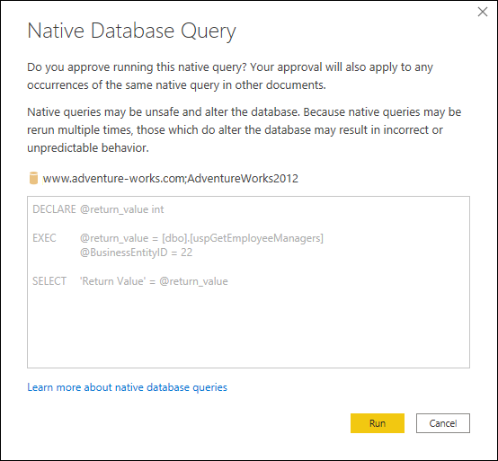
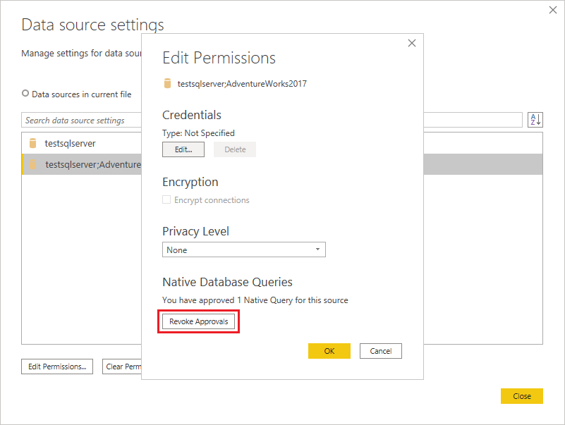

# Import data from a database using native database query

Power Query gives you the flexibility to import data from wide variety of databases that it supports. It can run native database queries, which can save you the time it takes to build queries using the Power Query interface. This feature is especially useful for using complex queries that already exist&mdash;and that you might not want to or know how to rebuild using the Power Query interface.

>[!Note]
> One intent of native database queries is to be non-side effecting. However, Power Query does not guarantee that the query will not affect the database. If you run a native database query written by another user, you will be prompted to ensure that you're aware of the queries that will be evaluated with your credentials. For more information, see [Native database query security](#native-database-query-security).

Power Query enables you to specify your native database query in a text box under **Advanced options** when connecting to a database. In the example below, you'll import data from a SQL Server database using a native database query entered in the **SQL statement** text box. The procedure is similar in all other databases with native database query that Power Query supports.

1. Connect to a SQL Server database using Power Query. Select the **SQL Server database** option in the connector selection.

2. In the **SQL Server database** popup window:

   1. Specify the **Server** and **Database** where you want to import data from using native database query.

   2. Under **Advanced options**, select the **SQL statement** field and paste or enter your native database query, then select **OK**.

      

3. If this is the first time you're connecting to this server, you'll see a prompt to select the authentication mode to connect to the database. Select an appropriate authentication mode, and continue.

   >[!Note]
   > If you don't have access to the data source (both Server and Database), you'll see a prompt to request access to the server and database (if access-request information is specified in Power BI for the data source). 

4. If the connection is established, the result data is returned in the Power Query Editor.

   Shape the data as you prefer, then select **Apply & Close** to save the changes and import the data.

## Connectors that support native database queries

The following Power Query connectors support native database queries.

| Connector | Type of native database query
| --- | --- |
| Azure Analysis Services database | MDX or DAX query |
| Azure Database for PostgreSQL | SQL statement |
| Azure Cosmos DB | SQL statement |
| Azure SQL Data Warehouse | SQL statement |
| Azure SQL database | SQL statement |
| DataWorld.Dataset | dwSQL |
| Dataverse | SQL statement |
| Essbase | MDX statement |
| FHIR | FHIR Search |
| IBM Db2 database | SQL statement |
| IBM Informix database (Beta) | SQL statement |
| MySQL database | SQL statement |
| ODBC | SQL statement |
| OLE DB | SQL statement |
| Oracle database | SQL statement |
| PostgreSQL | SQL statement |
| SAP HANA database | SQL statement |
| Snowflake | SQL statement |
| SQL Server Analysis Services database | MDX or DAX query |
| SQL Server database | SQL statement |
| TIBCO(R) Data Virtualization (Beta) | SQL statement |
| Vena (Beta) | Model Query (MQL) |
| | |

## Limitations and issues

Before using native database query, you should be aware of the limitations and issues that you may meet.

### Query folding

Query folding while using a native database query is limited to the PostgreSQL connector only. No other connectors support query folding if you use a native database query. Also, for folding to work in the PostgreSQL connector, the native database query you enter has to work as a subquery.

### Native database query security

Sometimes, when you attempt to use a query created by another user or through the Advanced Editor or formula bar&mdash;essentially any other path outside of the connector dialogs where the native query input box is shown&mdash;you may get a message that says:

If you see this message, select **Edit Permission**. This selection will open the **Native Database Query** dialog box. You'll be given an opportunity to either run the native database query, or cancel the query.

By default, if you run a native database query outside of the connector dialogs, you'll be prompted each time you run a different query text to ensure that the query text that will be executed is approved by you.

>[!Note]
> Native database queries that you insert in your get data operation won't ask you whether you want to run the query or not. They'll just run.

You can turn off the native database query security messages if the native database query is run in either Power BI Desktop or Excel. To turn off the security messages:

1. If you're using Power BI Desktop, under the **File** tab, select **Options and settings > Options**. 

   If you're using Excel, under the **Data** tab, select **Get Data > Query Options**.

2. Under **Global** settings, select **Security**.

3. Clear **Require user approval for new native database queries**.

4. Select **OK**.

You can also revoke the approval of any native database queries that you've previously approved for a given data source in either Power BI Desktop or Excel. To revoke the approval:

1. If you're using Power BI Desktop, under the **File** tab, select **Options and settings > Data source settings**.

   If you're using Excel, under the **Data** tab, select **Get Data > Data Source Settings**.

2. In the **Data source settings** dialog box, select **Global permissions**. Then select the data source containing the native database queries whose approval you want to revoke.

3. Select **Edit permissions**.

3. In the **Edit permissions** dialog box, under **Native Database Queries**, select **Revoke Approvals**.

   
