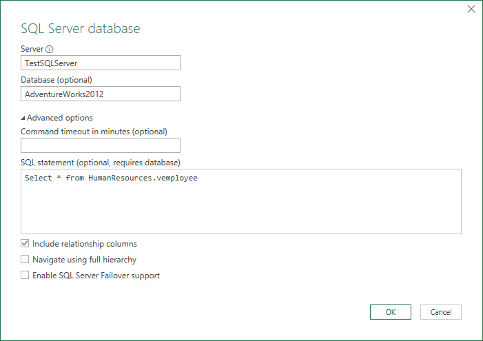

# Import data from a database using native database query

Power Query gives you the flexibility to import data from wide variety of databases that it supports. It can run native database queries, which can save you the time it takes to build queries using the Power Query interface. This feature is especially useful for using complex queries that already exist&mdash;and that you might not want to or know how to rebuild using the Power Query interface.

>[!Note]
> One intent of native database queries is to be non-side effecting. However, Power Query does not guarantee that the query will not affect the database. If you run a native database query written by another user, you will be prompted to ensure that you're aware of the queries that will be evaluated with your credentials.

Power Query enables you to specify your native database query in the **SQL statement** box when connecting to a database. In the example below, you'll import data from a SQL Server database using a native database query. The procedure is similar all other databases that Power Query supports.

1. Connect to a SQL Server database using Power Query. Select the **SQL Server database** option in the connector selection.

2. In the **SQL Server database** popup window:

   1. Specify the **Server** and **Database** from where you want to import data using native database query.

   2. Under **Advanced options**, select the **SQL statement** field and paste or enter your native database query, then select **OK**.

      

3. If this is the first time you're connecting to this server, you'll see a prompt to select the authentication mode to connect to the database. Select an appropriate authentication mode, and continue.

   >[!Note]
   > If you don't have access to the data source (both Server and Database), you'll see a prompt to request access to the server/database (if access-request information is specified in Power BI for the data source). 

4. If the connection is established, the result data is returned in the Query Editor.

   Shape the data as you prefer, then select **Apply & Close** to save the changes and import the data.

