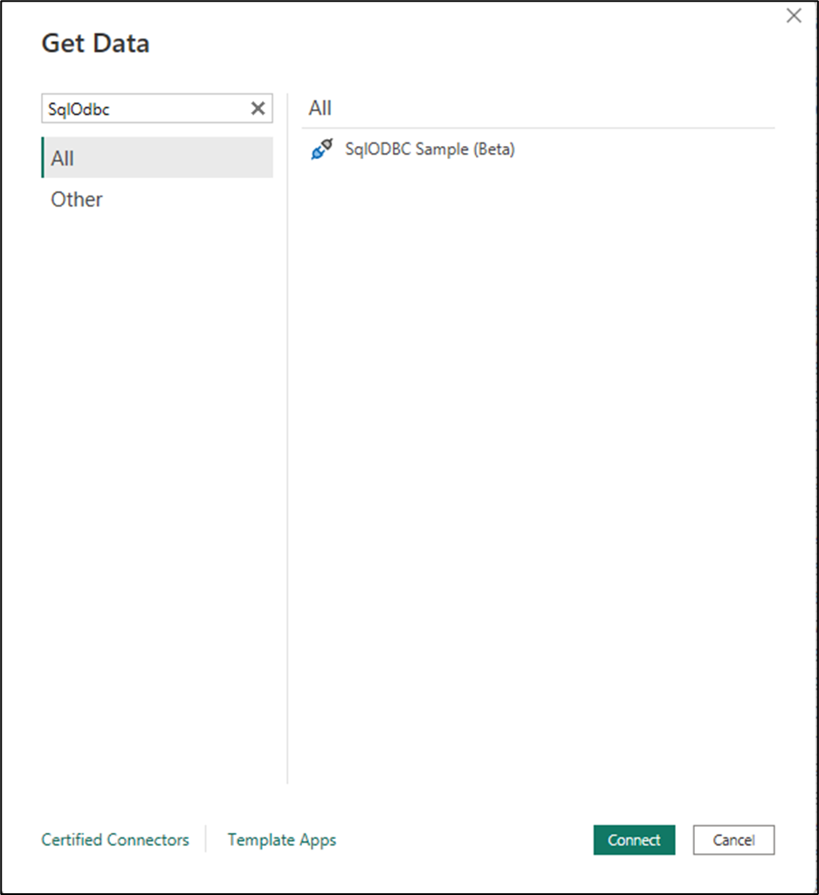
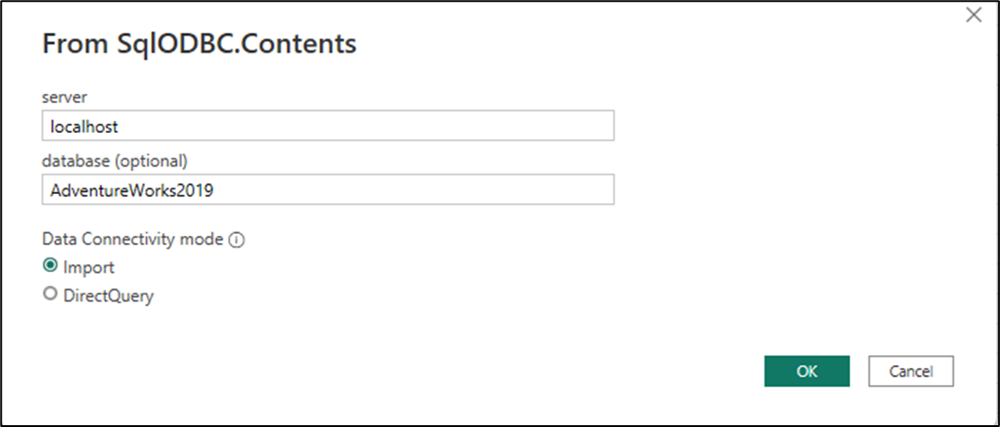
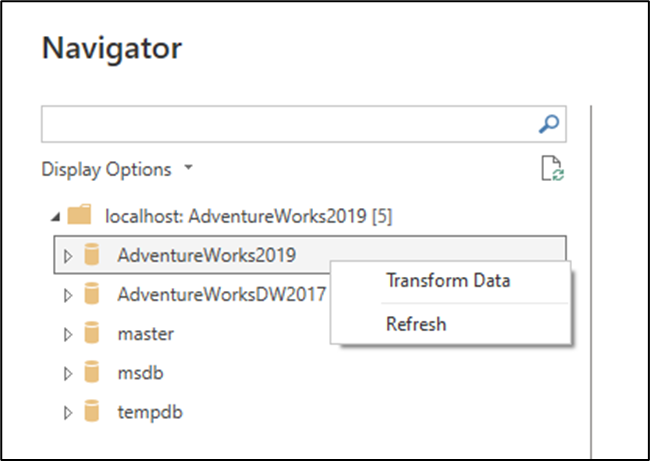
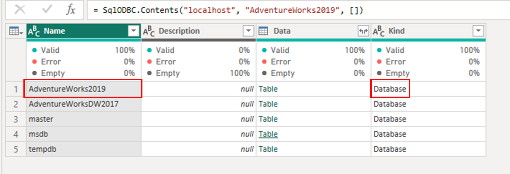
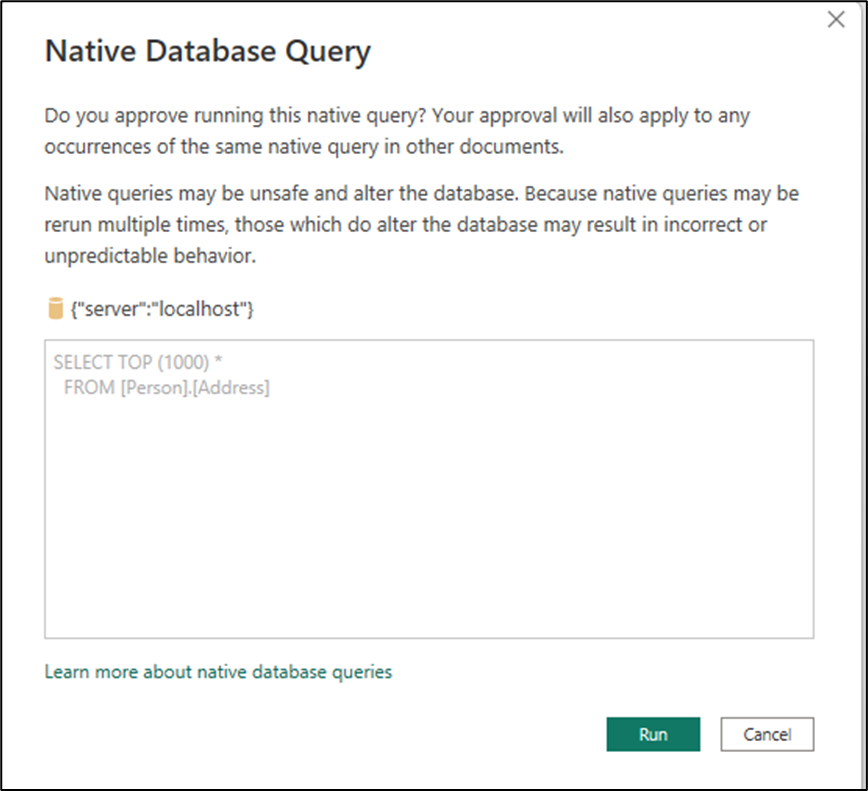

# Native query support in Power Query custom connectors 

>[!NOTE]
> This article covers advanced topics around the implementation of [native query](native-database-query.md) support for custom connectors as well as [query folding](query-folding-basics.md) on top of them. We suggest that you read the articles around these topics before reading any further.

In Power Query, you're able to execute custom native queries against your data source to retrieve the data that you're looking for. You can also enable the capability to maintain query folding throughout this and subsequent transformation processes done inside of Power Query. 

The goal of this article is to showcase how you can implement such capability for your custom connector.

>[!NOTE]
> This article will use as a starting point a [sample that uses the SLQ ODBC driver for its data source](https://github.com/microsoft/DataConnectors/tree/master/samples/NativeQuery/ODBC/SQL%20ODBC/Start). The implementation of the native query capability is currently only supported for ODBC connectors that adhere to the SQL-92 standard. 
>
>The sample connector uses the **SQL Server Native Client 11.0** driver. Make sure that you have this driver installed to follow along this tutorial
>
>You can also see the finished version of the sample connector from the [Finish folder in the GitHub Repository](https://github.com/microsoft/DataConnectors/tree/master/samples/NativeQuery/ODBC/SQL%20ODBC/Finish).

## Modify the SQLCapabilities of your connector

In the ```SqlCapabilities``` record of the sample connector, you can find a record field with the name ```Sql92Translation``` and the value "Passthrough" for it. This new field for the  is necessary for the native query to be passed using Power Query without any validation. 

```
        SqlCapabilities = Diagnostics.LogValue("SqlCapabilities_Options", defaultConfig[SqlCapabilities] & [
            // Place custom overrides here
            // The values below are required for the SQL Native Client ODBC driver, but might
            // not be required for your data source.
                SupportsTop = false,
                SupportsDerivedTable = true,
                Sql92Conformance = 8 /* SQL_SC_SQL92_FULL */,
                GroupByCapabilities = 4 /* SQL_GB_NO_RELATION */,
                FractionalSecondsScale = 3,
                Sql92Translation = "PassThrough"
        ]),
```

 Make sure that this field appears in your connector before moving forward or you'll face warnings and errors later on when it comes down to using a capability that isn't supported because it isn't declared by the connector.

 Build the connector file (as .mez or.pqx) and load it into Power BI Desktop for manual testing and to define the target for your native query.

## Manually test the Native Query capabilities of your connector

>[!NOTE]
>For this article, we will be using the [AdventureWorks2019 sample database](https://learn.microsoft.com/sql/samples/adventureworks-install-configure?view=sql-server-ver16&tabs=ssms), but you can follow along with any SQL Server database of your choice and make the necessary changes when it comes down to specifics of the database chosen.

The way that the native query support will be implemented in this article is that the user will be requested to enter three values:

* Server name
* Database name
* Native query at the database level 

Now inside Power BI Desktop, head over to the *Get Data* experience and find the connector with the name **SqlODBC Sample**.



For the connector dialog, enter the parameters for your server and your database name and hit OK.



A new navigator window should appear where you can see the native navigation behavior from the SQL driver that displays the hierarchical view of the server and the databases within it. Right select the **AdventureWorks2019** database and left select the option that reads *Transform data*.



This will bring you to the Power Query editor and a preview of what's effectively the target of your native query since all native queries should run at the database level. Inspect the formula bar of the last step to better understand how your connector should navigate to the target of your native queries before executing them. In this case the formula bar looks as follows:

```= Source{[Name="AdventureWorks2019",Kind="Database"]}[Data]```

**Source** is the name of the previous step that, in this case, is simply the published function of your connector with the parameters passed. 
The List and the record inside of it just helps navigate a table to a specific row, which is defined by the criteria from the record where the field *Name* has to be equal to **AdventureWorks2019** and the *Kind* field has to be equal to **Database**. Once such row is located, the [Data] outside of the list {} lets Power Query access the value inside of the **Data** field, which in this case is a table. You can go back to the previous step (Source) to better understand this navigation.



### Test native query

With the target now identified, create a custom step after the Navigation step by clicking the fx icon in the formula bar.


Replace the formula inside the formula bar with the formula below and hit Enter:

```
= Value.NativeQuery( AdventureWorks2019_Database, "SELECT TOP (1000) *
  FROM [Person].[Address]")
```

After applying this change, a warning should appear underneath the formula bar requesting permission to run the native query against your data source.


Select the *Edit Permission* button to see a new **Native Database Query** dialog that tries to warn you about the possibilities of running native queries. In this case, we know that this SQL Statement is safe and you can select the Run button to execute the command.



After executing your query, you'll be able to see the preview of your query in the Power Query editor, and this validates that your connector is capable of running native queries.


## Implement native query logic in your connector

With the information gathered from the previous paragraphs, the goal now is to translate such information into code for your connector.

The way that you can accomplish this is by adding a new **NativeQueryProperties** record field to your connector's Publish record, which in this case is the  *SqlODBC.Publish* record.

The new record field will consist of two fields:

* **navigationSteps**: This is a definition of how the navigation should be performed / handled by your connector and what parameters are required or needed in order for such navigation to reach your desired target for the **Value.NativeQuery** function.
* **nativeQueryOptions**: This helps identify how certain optional parameters should be included or added to the **Value.NativeQuery** options record.


### navigationSteps

Your navigation steps can be categorized into two groups. Those values that are entered by the end-user such as the name of the server or the database in this case and those that are derived by the specific connector implementation such as the name of fields that aren't displayed to the user during the get data experience such as ```Name```, ```Kind```, ```Data``` and others depending on your connector implementation.

For this case, there was only one navigation step that consisted of two fields:

* **Name** = This is the name of the database that was passed by the end-user. In this case it was AdventureWorks2019, but this should always be passed as-is from what the end-user entered during the get data experience. 
* **Kind** = This is information that isn't visible to the end-user and is specific to the connector / driver implementation. In this case, this value identifies what type of object should be accessed. For this implementation, this will be a fixed value that will consist of the string ``Database``.

Such information will be translated to the code below which should be added as a new field to your SqlODBC.Publish record.

```
    NativeQueryProperties = [
			navigationSteps = {
				[
					indices = {
						[
							value = "database",
							indexName = "Name"
						],
                        [
                            displayName = "Database",
                            indexName = "Kind"
                        ]
					},
					access = "Data"
				]
			}
]
```

For values that will be passed from what the user entered, you can use the pair value / indexName and for values that are fixed or static and that can't be passed by the end-user you can use the pair displayName / indexName. In this sense, the **navigationSteps** record consists of two fields: 
* **indices** = defines what fields and what values to use to navigate to the record that co ntains the target for the Value.NativeQuery function 
* **access** = defines what field holds the target, which is commonly a table

### nativeQueryOptions

// how this just passes the fields to use for the options record of the Value.NativeQuery function

```
    NativeQueryProperties = [
			navigationSteps = {
				[
					indices = {
						[
							value = "database",
							indexName = "Name"
						],
                        [
                            displayName = "Database",
                            indexName = "Kind"
                        ]
					},
					access = "Data"
				]
			},
		
			nativeQueryOptions = [
					EnableFolding = true
				]
			]
]
```

With these changes in place, build the connector and load it into Power BI Desktop for testing and validation.

## Test and validate the connector

///images